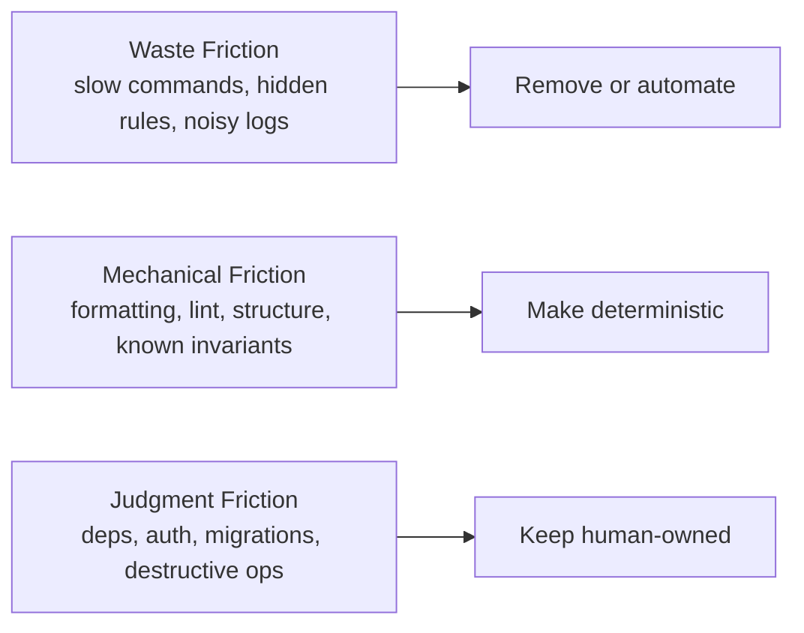

import {NextBestAction, StatusBadge} from "@site/src/components/docs";

# Friction Engineering

<StatusBadge status="Live" />

Green Goods does not want a frictionless agent workflow. It wants the right friction in the right place.

The useful distinction is:

- **waste friction** should be removed
- **mechanical friction** should be enforced automatically
- **judgment friction** should stay visible to humans

This framing is heavily informed by Armin Ronacher and Cristina Poncela's April 2026 AI Engineer talk, Earendil's published values and RFCs, and Armin's writing on agentic coding, review, and codebase legibility.

## Why This Matters Here

Green Goods is not a small library. It is a product monorepo with interacting contracts, shared types, offline-first state, indexer boundaries, multilingual UI, and an agent package that touches real users and external systems.

That is exactly the environment where agents tend to look locally reasonable while drifting globally:

- a shared type moves and three packages need to agree
- a permission check gets hidden behind convenience code
- a config fallback keeps the process alive when it should fail fast
- a reviewable 200-line change becomes a 2,000-line "it passes tests" bundle

The cost is not just technical debt. It is loss of judgment surface. Once the repo stops making important decisions obvious, humans review less effectively and agents duplicate, soften, or silently bypass intent.

## What We Took From Earendil

Earendil is a public benefit corporation founded by Armin Ronacher and Colin Daymond Hanna. Its published purpose is to **craft software and open protocols** and **strengthen human agency**. That matters because their agentic guidance is not "let the model do more." It is "design the repo so the model can only do some kinds of work well, and make the high-cost decisions impossible to miss."

Useful signals from their public material:

- the talk argues that the moments where engineers want to stop thinking are the moments where thinking matters most
- their review split distinguishes **immediately actionable mechanical fixes** from **human call-outs**
- Armin's writing repeatedly favors simple code, local checks, conservative dependency growth, and stable patterns over clever abstractions
- Earendil's public repos (`absurd`, `gondolin`, `pi-mono`) show a bias toward small cores, explicit behavior, and agent-usable tooling

## Repo Translation

### Remove Waste Friction

This is friction that makes people slower without improving judgment:

- unclear context loading
- noisy or slow validation loops
- duplicated patterns across packages
- hidden conventions that only exist in chat history

Green Goods already does some of this well through `CLAUDE.md`, `AGENTS.md`, package guides, builder docs, and the validation ladder. The job is to keep those surfaces current so agents do not need to rediscover the repo every session.

### Make Mechanical Friction Deterministic

These are rules the repo should enforce without asking a reviewer to remember them:

- design-token drift
- banned vocabulary
- source-structure growth
- hook boundaries
- barrel import discipline
- address typing and deployment artifact usage

This aligns directly with the active harness direction: deterministic guardrails should block regressions before an advisory reviewer even runs.

### Preserve Judgment Friction

Some changes should feel heavier on purpose. In Green Goods, that includes:

- new dependencies
- auth or permission changes
- contract deploy, upgrade, or migration paths
- indexer schema or boundary changes
- destructive data operations
- external-service trust changes
- public API shape changes in `packages/shared`

These are not "hard because the process is bad." They are hard because ownership is real.

## Judgment Routing

### Default to agent-owned

Let agents handle:

- formatting and style repair
- obvious lint and type issues
- deterministic test fixes
- reproduction cases
- refactors that stay inside an established module boundary
- wrapper adoption where the preferred primitive already exists
- docs synthesis from existing repo truth

### Default to human-owned

Require deliberate human review for:

- dependency introduction or replacement
- permissioning and role checks
- contract state transitions and upgrade scripts
- migrations, backfills, and irreversible writes
- new background jobs or retry behavior with user impact
- changes that alter trust boundaries, incident posture, or rollback shape

This is the practical version of "the friction is your judgment."

## An Agent-Legible Green Goods Codebase

For this repo, legibility is less about one ideology and more about a few recurring constraints:

1. **Stable entry points**
   - shared hooks live in `@green-goods/shared`
   - shared imports should prefer the barrel
   - chain defaults should flow through `getDefaultChain()` or `DEFAULT_CHAIN_ID`

2. **Visible critical checks**
   - keep permission checks close to handlers, mutations, and contract actions
   - avoid hiding important behavior in indirect helpers when a local guard is safer

3. **One obvious primitive per surface**
   - admin should prefer `Admin*` wrappers
   - frontend work should use tokenized theme surfaces instead of raw values
   - reviewers should not have to infer which UI primitive is canonical

4. **Searchable structure**
   - prefer grep-friendly naming
   - keep similar behavior routed through stable files and helpers
   - avoid duplication that makes the agent "find one of many"

5. **Small review units**
   - agents amplify code creation much faster than team review capacity
   - the repo should bias toward smaller PRs, narrower diffs, and explicit follow-on hubs

## Where Green Goods Should Move Fast

Use agents aggressively for:

- bug reproduction and failing-test setup
- docs synthesis and comparison research
- harness scaffolding with deterministic checks
- diff-scoped cleanup
- first drafts of narrow implementations inside a well-understood pattern

## Where Green Goods Should Go Slow

Go slower when touching:

- contracts and upgrade paths
- shared package exports consumed by many packages
- indexer boundaries
- offline queue semantics and retry behavior
- authentication, sessions, and role enforcement
- messaging-channel capability expansion in `packages/agent`

That is where local correctness is least predictive of global correctness.

## Current Repo Alignment

Green Goods already has several pieces that match this model:

- `docs/routines/gg-pr-review.md` already separates judgment-heavy review from automatic transformation
- `.plans/backlog/harness-hardening-wave-1/` already scopes deterministic guardrails, split advisory reviewers, source-structure ratchets, and explicit criticality
- `docs/docs/builders/quality/agentic-eval.mdx` already treats benchmark packs as secondary to targeted tests, acceptance cases, and review

The remaining work is mostly consistency work: keep the harness honest, keep judgment surfaces explicit, and avoid calling every bit of friction a process failure.

## Reading List

- [The Friction Is Your Judgment](https://mitsuhiko.github.io/talks/ai-engineer-talk/) - Armin Ronacher and Cristina Poncela
- [Earendil Purpose](https://earendil.com/purpose/)
- [Earendil Values](https://earendil.com/values/)
- [The High Ground](https://earendil.com/posts/the-high-ground/)
- [Agentic Coding Recommendations](https://lucumr.pocoo.org/2025/6/12/agentic-coding/)
- [Agentic Coding Things That Didn’t Work](https://lucumr.pocoo.org/2025/7/30/things-that-didnt-work/)
- [Pi: The Minimal Agent Within OpenClaw](https://lucumr.pocoo.org/2026/1/31/pi/)
- [Pi Licensing RFC](https://rfc.earendil.com/0015/)
- [Earendil Works on GitHub](https://github.com/earendil-works/)
- [TypeScript `erasableSyntaxOnly`](https://www.typescriptlang.org/tsconfig/erasableSyntaxOnly.html)

<NextBestAction
  title="Next best action"
  why="See how the repo turns these principles into guidance layers and machine-readable context."
  actionLabel="Context Engineering"
  actionHref="./context-engineering"
  alternatives={[
    {label: "Core Philosophies", href: "./core-philosophies"},
    {label: "Specification Engineering", href: "./spec-engineering"},
  ]}
/>
