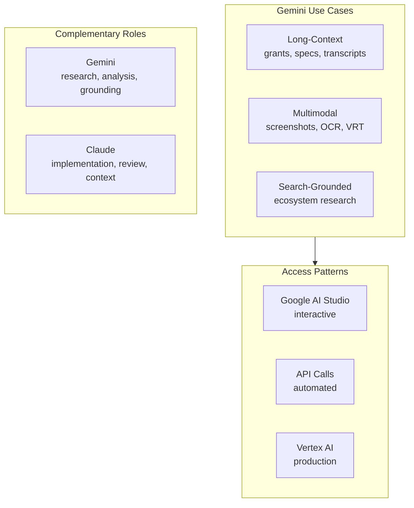

import {NextBestAction} from "@site/src/components/docs";

# Gemini

Google Gemini is used for specific tasks in the Green Goods ecosystem where its strengths complement the primary Claude-based toolchain. This page documents current integration points and usage patterns.

## Current Use Cases

### Long-Context Document Analysis

Gemini's large context window makes it suitable for analyzing lengthy documents that exceed Claude's context limits:

- **Grant application review** -- Full grant proposals with appendices can be processed in a single pass
- **Specification comparison** -- Comparing multiple large specification documents side-by-side
- **Transcript analysis** -- Processing lengthy meeting transcripts when the full context is needed at once

### Multimodal Tasks

Gemini's vision capabilities are used for:

- **Screenshot analysis** -- Evaluating UI screenshots against design specifications
- **Document OCR** -- Extracting structured data from scanned documents or images
- **Visual regression** -- Comparing before/after screenshots of component changes

### Search-Grounded Research

Gemini's integration with Google Search provides grounded research capabilities for:

- **Ecosystem research** -- Understanding the current state of protocols Green Goods integrates with (EAS, Hats Protocol, Hypercerts)
- **Dependency evaluation** -- Researching library updates, breaking changes, and migration paths
- **Standards tracking** -- Monitoring EIP/ERC proposals relevant to the protocol

## When to Use Gemini vs Claude

| Task | Recommended | Reason |
|------|-------------|--------|
| Code implementation | Claude | Deeper reasoning, TDD workflow integration |
| Code review | Claude | Better judgment, lower false-positive rate |
| Long document analysis | Gemini | Larger context window |
| Web-grounded research | Gemini | Search integration |
| Screenshot evaluation | Either | Both have strong vision |
| Architecture decisions | Claude | Access to full `.claude/` context |
| Mechanical transforms | Either | Both handle well |

## Integration Approach

Gemini is used as a standalone tool rather than integrated into the agent pipeline. Common access patterns:

- **Google AI Studio** -- For interactive exploration and prompt testing
- **API calls** -- For automated tasks in scripts or workflows
- **Vertex AI** -- For production workloads with SLA requirements

The project does not maintain Gemini-specific configuration files (unlike `.claude/` for Claude or `.codex/` for Codex). Gemini tasks use the project's `CLAUDE.md` and `AGENTS.md` as context input where applicable.

## Limitations in This Project

- No persistent memory or session continuity (unlike Claude Code's agent memory)
- No direct integration with the `.claude/skills/` system
- Cannot execute tools against the local codebase (use Claude Code for that)
- No path-scoped rule loading -- context must be manually provided

## Cost Considerations

Gemini is generally more cost-effective for high-volume, lower-complexity tasks. For the Green Goods project:

- Use Gemini for research and analysis where grounding matters
- Use Claude for implementation and review where codebase context matters
- Avoid using Gemini for tasks that require the full `.claude/` context stack

<NextBestAction
  title="Next best action"
  why="Understand how Model Context Protocol connects AI tools to the codebase."
  actionLabel="MCP Guide"
  actionHref="./mcp-guide"
  alternatives={[
    {label: "OpenClaw", href: "./openclaw"},
    {label: "Claude Code", href: "./claude-code"},
  ]}
/>
