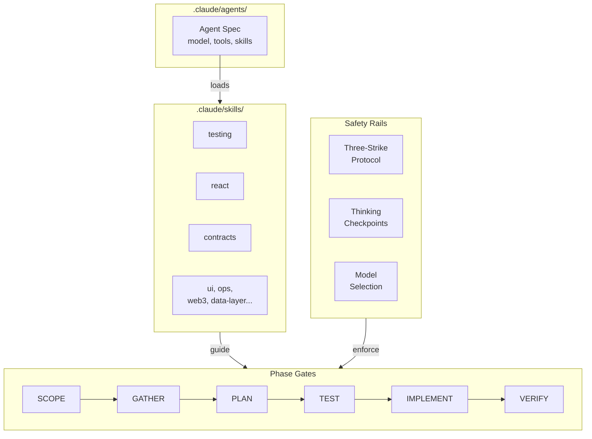

import {NextBestAction} from "@site/src/components/docs";

# Prompt Engineering



How Green Goods structures prompts to get reliable, codebase-aware outputs from AI agents. Prompt engineering here means crafting the instructions that control agent behavior within the development workflow.

## Agent Specifications

Each agent has a specification file in `.claude/agents/` that defines its identity and constraints:

```yaml
---
name: cracked-coder
description: Implements complex features using strict TDD workflow.
model: opus
tools: [Read, Glob, Grep, Edit, Write, Bash, Task]
memory: project
skills: [testing, react, contracts]
maxTurns: 50
---
```

The specification includes:
- **Model selection** -- Which Claude model to use (impacts reasoning quality)
- **Tool access** -- Which tools the agent can call
- **Skills** -- Domain-specific instruction sets loaded from `.claude/skills/`
- **Turn limit** -- Maximum interaction cycles before the agent must checkpoint

## Skill System

Skills are modular instruction sets in `.claude/skills/`. Each skill provides domain-specific patterns and constraints. The current repo has 19 active top-level skill directories, plus historical wrappers in `_archived/`, covering areas like:

- `testing` -- TDD workflow, test adequacy checklist
- `react` -- Hook patterns, component conventions
- `contracts` -- Solidity patterns, deployment scripts
- `ui` -- Storybook, Radix, Tailwind, accessibility, i18n, Mermaid guidance
- `ops` -- Deployment pipeline, CI/CD, git workflow, dependency management
- `data-layer` -- Offline storage, sync, service worker patterns

Skills are activated by listing them in an agent's `skills` array. Multiple skills compose additively.

## Prompt Patterns

### Cathedral Check

Before implementing anything, agents find the most similar existing file in the codebase and use it as a reference pattern. This ensures consistency without needing to enumerate every convention in the prompt.

### Phase Gates

Agent workflows have explicit phases (SCOPE, GATHER, PLAN, TEST, IMPLEMENT, VERIFY) with gates between them. A user asking for "just a plan" stops at PLAN and saves to `.plans/`. This prevents agents from executing prematurely.

### Thinking Checkpoints

Between phases, agents reflect on tool results before proceeding:

- After GATHER: "Do I have sufficient context? If I cannot explain the existing pattern in one sentence, I need to read more."
- After TEST failure: "Is this failing for the RIGHT reason?"
- After IMPLEMENT pass: "Am I testing the behavior or just the happy path?"

### Three-Strike Protocol

If an approach fails three times, the agent must stop and escalate rather than continuing to brute-force. This saves context window and prevents cascading errors.

## Anti-Patterns

Patterns that produce poor agent outputs in this codebase:

| Anti-Pattern | Why It Fails | Better Approach |
|-------------|--------------|-----------------|
| "Fix all the bugs" | Unbounded scope, no verification | "Fix the infinite re-render in CreateGarden.tsx:154" |
| "Review the codebase" | Produces noise, not signal | "Review the diff for packages/shared/src/hooks/" |
| Using Haiku for reviews | 95% false positive rate | Use Opus for any judgment task |
| Skipping GATHER phase | Agent makes assumptions | Always read target files before editing |

## Model-Specific Guidance

- **Opus** -- Required for architecture decisions, code reviews, security analysis, and TDD cycles. Can reason about cross-file dependencies and organizational intent.
- **Sonnet** -- Suitable for file lookups, mechanical transforms, straightforward bug fixes with clear reproduction steps.
- **Haiku** -- Limited to trivial queries. Not suitable for code generation or review in this codebase.

## Prompt Hygiene

- Always specify the target package scope ("in `packages/shared`")
- Reference specific files and line numbers when describing issues
- Use imperative voice for actions ("implement", "fix", "add test for")
- Include acceptance criteria that can be mechanically verified

<NextBestAction
  title="Next best action"
  why="Discover how to provide the right context for agent tasks."
  actionLabel="Context Engineering"
  actionHref="./context-engineering"
  alternatives={[
    {label: "Core Philosophies", href: "./core-philosophies"},
    {label: "Intent Engineering", href: "./intent-engineering"},
  ]}
/>
