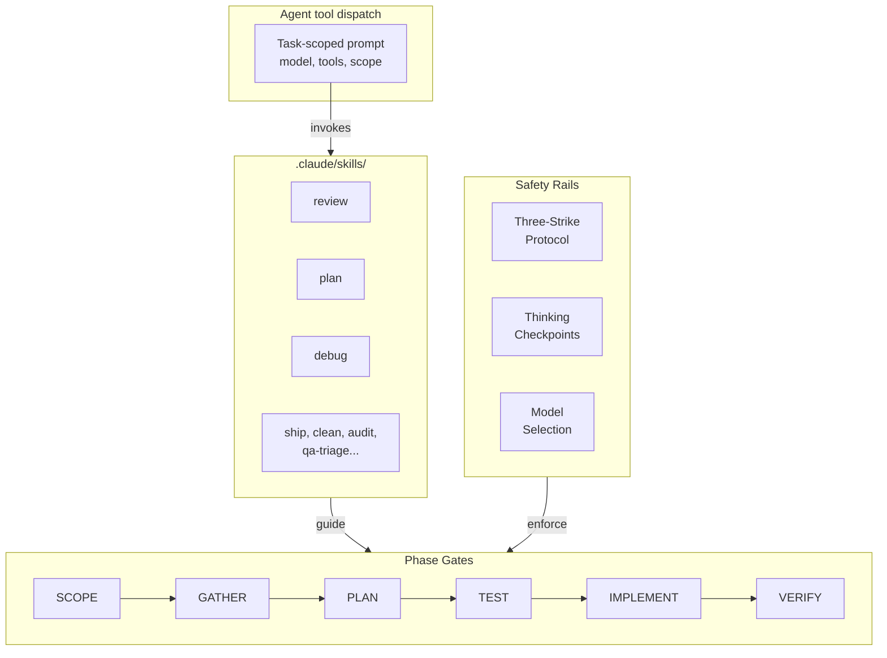

import {NextBestAction} from "@site/src/components/docs";

# Prompt Engineering


```mermaid
graph TB
    subgraph Dispatch["Agent tool dispatch"]
        Spec["Task-scoped prompt\nmodel, tools, scope"]
    end

    subgraph Skills[".claude/skills/"]
        S1["review"]
        S2["plan"]
        S3["debug"]
        S4["ship, clean, audit,\nqa-triage..."]
    end

    Spec -->|invokes| Skills

    subgraph Workflow["Phase Gates"]
        SCOPE["SCOPE"] --> GATHER["GATHER"] --> PLAN["PLAN"] --> TEST["TEST"] --> IMPLEMENT["IMPLEMENT"] --> VERIFY["VERIFY"]
    end

    Skills -->|guide| Workflow

    subgraph Guards["Safety Rails"]
        TS["Three-Strike\nProtocol"]
        TC["Thinking\nCheckpoints"]
        MC["Model\nSelection"]
    end

    Guards -->|enforce| Workflow
```

How Green Goods structures prompts to get reliable, codebase-aware outputs from AI agents. Prompt engineering here means crafting the instructions that control agent behavior within the development workflow.

## Subagent Dispatch

The repo no longer commits agent specification files. Specialist work is dispatched through the harness's built-in subagent types (read-only exploration, general-purpose implementation, planning) with a task-scoped prompt that carries the same constraints a spec used to:

```text
You are working in <worktree/path> on branch <branch>. This repo runs
concurrent agents — touch ONLY the files listed below.

Task: <one bounded unit of work, with acceptance criteria>
Constraints: repo invariants from CLAUDE.md + .claude/context/<pkg>.md
Validation: <the exact commands that prove the change>
Report: <what to return, in what shape>
```

The dispatch prompt controls:
- **Scope** -- Which paths the agent may touch (concurrent-agent safety)
- **Tool posture** -- Read-only research vs implementing
- **Validation** -- The exact proof commands for the lane
- **Report shape** -- What comes back to the orchestrator

## Skill System

Skills are modular instruction sets in `.claude/skills/`. The repo keeps a deliberately lean set of 11 — workflow and integration procedures only (`review`, `ship`, `status`, `plan`, `debug`, `clean`, `audit`, `qa-triage`, `doc-feedback`, `posthog-questions`, `design`). Domain knowledge (React patterns, testing conventions, contract rules, indexer patterns) lives in `.claude/context/*.md` per-package context files and `docs/`, not in skills — one home per fact.

Skills activate from their frontmatter descriptions: passively by intent (`plan`, `debug`, `ship`) or by slash command (`/review`, `/audit`, `/clean`, `/qa-triage`).

## Prompt Patterns

### Cathedral Check

Before implementing anything, agents find the most similar existing file in the codebase and use it as a reference pattern. This ensures consistency without needing to enumerate every convention in the prompt.

### Phase Gates

Agent workflows have explicit phases (SCOPE, GATHER, PLAN, TEST, IMPLEMENT, VERIFY) with gates between them. A user asking for "just a plan" stops at PLAN and saves to `.plans/`. This prevents agents from executing prematurely.

### Research, Plan, Implement

Use the research-plan-implement loop for ambiguous, multi-package, or high-risk work:

1. Research the existing system and record the source evidence.
2. Plan the smallest credible path, including out-of-scope items, human judgment points, and validation.
3. Implement from the accepted plan in a focused session.

If the context has accumulated wrong assumptions, stop and summarize only the useful findings for a fresh session.

### Thinking Checkpoints

Between phases, agents reflect on tool results before proceeding:

- After GATHER: "Do I have sufficient context? If I cannot explain the existing pattern in one sentence, I need to read more."
- After PLAN: "Did I record evidence, assumptions, and the human judgment points before editing?"
- After TEST failure: "Is this failing for the RIGHT reason?"
- After IMPLEMENT pass: "Am I testing the behavior or just the happy path?"

### Three-Strike Protocol

If an approach fails three times, the agent must stop and escalate rather than continuing to brute-force. This saves context window and prevents cascading errors.

## Anti-Patterns

Patterns that produce poor agent outputs in this codebase:

| Anti-Pattern | Why It Fails | Better Approach |
|-------------|--------------|-----------------|
| "Fix all the bugs" | Unbounded scope, no verification | "Fix the infinite re-render in CreateGarden.tsx:154" |
| "Review the codebase" | Produces noise, not signal | "Review the diff for packages/shared/src/hooks/" |
| Using Haiku for reviews | 95% false positive rate | Use Opus for any judgment task |
| Skipping GATHER phase | Agent makes assumptions | Always read target files before editing |

## Model-Specific Guidance

- **Opus** -- Required for architecture decisions, code reviews, security analysis, and TDD cycles. Can reason about cross-file dependencies and organizational intent.
- **Sonnet** -- Suitable for file lookups, mechanical transforms, straightforward bug fixes with clear reproduction steps.
- **Haiku** -- Limited to trivial queries. Not suitable for code generation or review in this codebase.

## Prompt Hygiene

- Always specify the target package scope ("in `packages/shared`")
- Reference specific files and line numbers when describing issues
- Use imperative voice for actions ("implement", "fix", "add test for")
- Include acceptance criteria that can be mechanically verified
- For plans, include research evidence and human judgment points before implementation steps

<NextBestAction
  title="Next best action"
  why="See the short, repo-specific prompt shape that maps cleanly to Green Goods workflows."
  actionLabel="Prompting Green Goods"
  actionHref="./prompting-green-goods"
  alternatives={[
    {label: "Context Engineering", href: "./context-engineering"},
    {label: "Core Philosophies", href: "./core-philosophies"},
  ]}
/>
