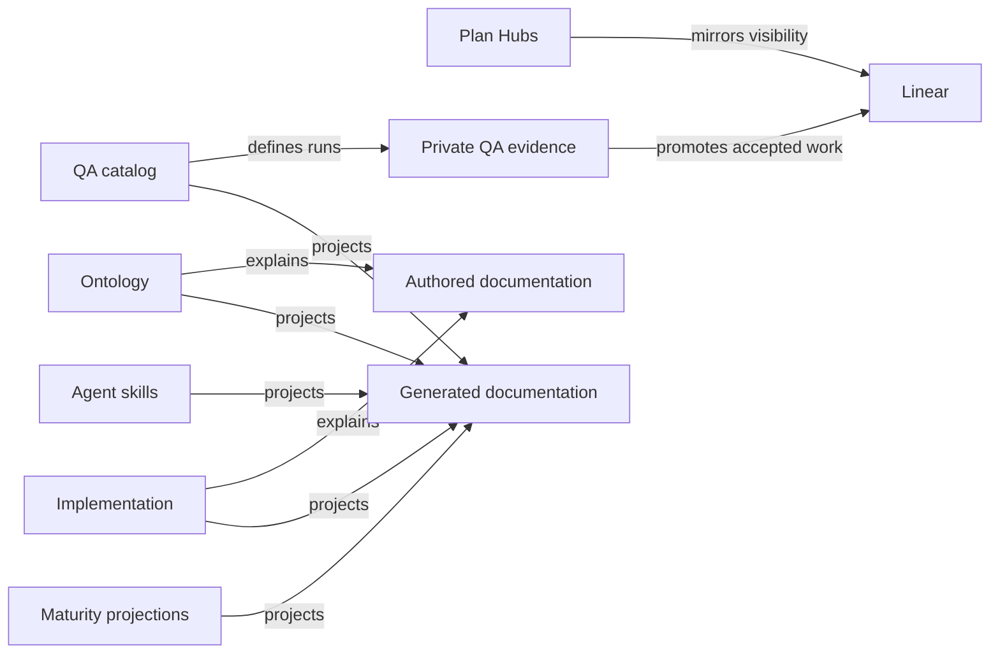

<!-- GENERATED FILE: do not edit. Run `bun run docs:generate` or `bun run docs:generate -- --scope <scope>`. -->
# Agent Task Routing

Use the smallest workflow that matches the task. Skill frontmatter decides activation; this projection explains the boundary, expected output, and handoff for each core task.

| Task | Skill | Mutation boundary | Output | Handoff |
|---|---|---|---|---|
| Simple lookup or bounded edit | No skill | `direct-bounded` | A sourced answer or the smallest verified edit. | Route unresolved factual synthesis to research and multi-step product choices to plan. |
| Research | `research` | `read-only-unless-persistence-requested` | Evidence, contradictions, confidence, and remaining human decisions. | Send accepted future decisions to plan; send observed failures to debug. |
| Planning | `plan` | `plan-artifacts-before-implementation` | Locked decisions, executable order, boundaries, and validation. | Send factual prerequisites to research and implementation only after scope lock. |
| Debugging | `debug` | `diagnose-first-fix-when-requested` | Reproduction, failing layer, root cause, bounded fix, and proof. | Route architectural redesign or unresolved product behavior to plan. |
| Change review | `review` | `read-only-pinned-diff` | Actionable regressions, remaining gaps, and readiness verdict. | Return fixes to the implementing task; use resolve-pr-comments for active PR feedback. |
| Architecture discovery | `plan` | `read-only-until-human-selection` | Ranked candidate cards and a selected interface only after human choice. | Send the selected candidate into the owning Plan Hub for implementation. |
| Architecture certification | `module-seams-review` | `read-only-pinned-proof` | Pinned proof of boundaries, exports, adapters, consumers, tests, and registry freshness. | Route uncertified design changes to plan and concrete regressions to the implementation owner. |
| Repository audit | `audit` | `read-only-numbered-findings` | Evidence-backed dead code, drift, dependency, guidance, and invariant findings. | Send approved cleanup-shaped findings to clean and architecture choices to plan. |
| Approved cleanup | `clean` | `approved-finding-ids-only` | The smallest implementation for the approved findings with residue checks. | Return new or uncertain findings to the user instead of expanding scope. |
| Live product QA | `qa-session` | `session-bounded-fix-and-revalidate` | Stable observations, bounded fixes, revalidation, and deferred handoff. | Send deferred backlog work to qa-triage and root-cause investigations to debug. |
| QA notes and backlog | `qa-triage` | `authorized-product-records-and-private-qa-rows` | Scoped Product records and private QA rows. | Send live product fixes to qa-session and unclear failures to debug. |
| PR feedback | `resolve-pr-comments` | `current-actionable-feedback-and-bounded-siblings` | Validated comment resolution, bounded sibling sweep, and fresh proof. | Return product or architecture decisions to the user or owning Plan Hub. |
| Pre-merge readiness | `ship` | `readiness-and-user-authorized-publish-actions` | Fresh gate evidence, branch/commit readiness, and explicit blockers. | Return failures to the owning implementation task; never redesign during the gate. |
| Design direction | `design` | `advisory-until-explicit-polish-scope` | A grounded paradigm, material, or layout decision, design review findings, or an AI design-tool prompt contract. | Send cross-surface token or dialect changes to planning; send implementation defects to debugging. |
| Doc review feedback | `doc-feedback` | `triage-then-scope-locked-edits` | A triaged feedback record and each accepted item addressed in the agreed in-repo or out-of-repo mode. | Route discovered product defects to debugging and net-new scope to planning. |

## Authority order

1. nearest AGENTS.md
2. code and checked-in configuration
3. packages/shared/src/ontology/green-goods-ontology.json
4. owning Plan Hub
5. task-specific skill

## Ownership and synchronization

The upstream surface owns truth. Public documentation explains or projects that truth; it does not publish live Plan Hub state, Linear status, or private QA evidence.

| Surface | Role | Owns | Visibility |
|---|---|---|---|
| Implementation | `authority` | Runtime behavior, routes, exports, endpoints, deployment state, and workflows. | `repository` |
| Ontology | `authority` | Cross-package entities, vocabulary, relationships, schemas, and lifecycle meaning. | `repository` |
| Maturity projections | `authority` | Derived feature maturity labels and projection rules. | `repository` |
| Agent skills | `authority` | Task activation, mutation boundaries, proof rules, and handoffs for agent workflows. | `repository` |
| Plan Hubs | `authority` | Accepted decisions, execution state, lane evidence, dependencies, and closeout rationale. | `repository` |
| QA catalog | `authority` | Stable QA case definitions, expected outcomes, and evidence requirements. | `repository` |
| Private QA evidence | `evidence` | Run-specific observations and private supporting evidence. | `private` |
| Linear | `coordination` | Stakeholder-visible priorities, accepted work, and delivery state mirrored from repository authorities. | `external` |
| Authored documentation | `projection` | Stable explanations, user flows, recovery guidance, and navigation. | `public` |
| Generated documentation | `projection` | Deterministic public inventories and diagrams projected from checked-in authorities. | `public` |

A routed skill must not absorb neighboring work. When the requested outcome changes, follow the task's handoff instead of expanding the active workflow.
