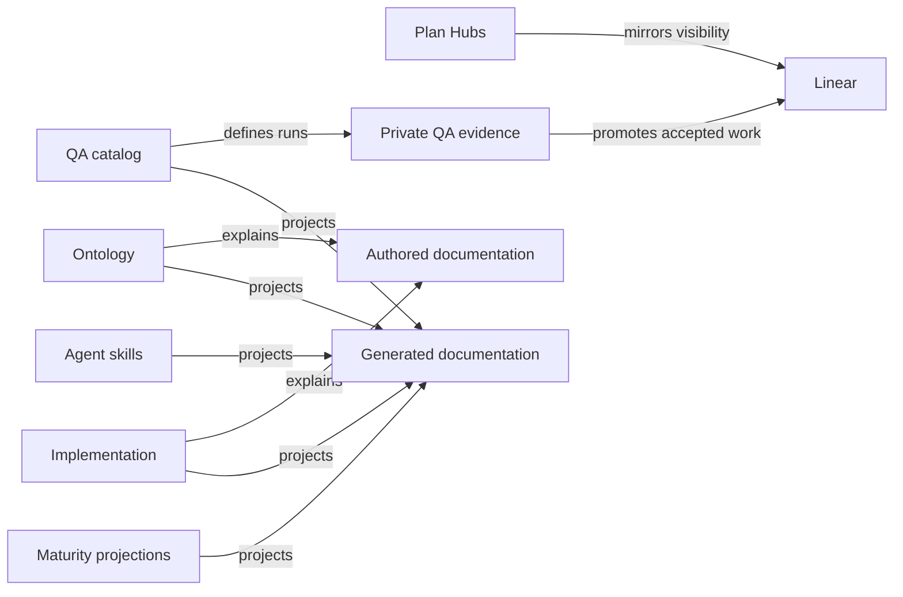

<!-- GENERATED FILE: do not edit. Run `node scripts/docs/generate.mjs` or `node scripts/docs/generate.mjs --scope <scope>`. -->
# Agent Task Routing

Routing is how a coding agent picks the right workflow for a request and stays inside it. Each core task below names the skill that handles it, what the agent may change while doing so (its mutation boundary), what it hands back, and where it sends work that turns out to be something else. The skills' own frontmatter decides activation; this page is the map.

## How an agent uses this

1. Match the request to one task below; the smallest workflow that fits wins.
2. Stay inside that task's mutation boundary. A read-only task reports; a bounded task edits only what the boundary names.
3. Produce the task's output, and route anything else through its handoff instead of absorbing it.

## Core tasks

### Everyday work

Where most sessions start: answer, research, plan, or debug.

| Task | Skill | What the agent may change | Output | Handoff |
|---|---|---|---|---|
| Simple lookup or bounded edit | No skill | Direct, bounded edits (`direct-bounded`) | A sourced answer or the smallest verified edit. | Route unresolved factual synthesis to research and multi-step product choices to plan. |
| Research | [`research`](/builders/agentic/skills#research) | Read only unless you ask it to persist (`read-only-unless-persistence-requested`) | Evidence, contradictions, confidence, and remaining human decisions. | Send accepted future decisions to plan; send observed failures to debug. |
| Planning | [`plan`](/builders/agentic/skills#plan) | Plan artifacts first; implementation after approval (`plan-artifacts-before-implementation`) | Locked decisions, executable order, boundaries, and validation. | Send factual prerequisites to research and implementation only after scope lock. |
| Debugging | [`debug`](/builders/agentic/skills#debug) | Diagnose first; fix when asked (`diagnose-first-fix-when-requested`) | Reproduction, failing layer, root cause, bounded fix, and proof. | Route architectural redesign or unresolved product behavior to plan. |

### Review and readiness

Getting a change reviewed, answering review feedback, and deciding whether it can ship.

| Task | Skill | What the agent may change | Output | Handoff |
|---|---|---|---|---|
| Change review | [`review`](/builders/agentic/skills#review) | Read only, pinned to the diff under review (`read-only-pinned-diff`) | Actionable regressions, remaining gaps, and readiness verdict. | Return fixes to the implementing task; use resolve-pr-comments for active PR feedback. |
| PR feedback | [`resolve-pr-comments`](/builders/agentic/skills#resolve-pr-comments) | Current, actionable review feedback plus bounded sibling fixes (`current-actionable-feedback-and-bounded-siblings`) | Validated comment resolution, bounded sibling sweep, and fresh proof. | Return product or architecture decisions to the user or owning Plan Hub. |
| Pre-merge readiness | [`ship`](/builders/agentic/skills#ship) | Readiness checks; publishes only what you authorize (`readiness-and-user-authorized-publish-actions`) | Fresh gate evidence, branch/commit readiness, and explicit blockers. | Return failures to the owning implementation task; never redesign during the gate. |

### Architecture and repository health

Larger questions about structure, and the audits and cleanups that keep the repository honest.

| Task | Skill | What the agent may change | Output | Handoff |
|---|---|---|---|---|
| Architecture discovery | [`plan`](/builders/agentic/skills#plan) | Read only until a person picks an option (`read-only-until-human-selection`) | Ranked candidate cards and a selected interface only after human choice. | Send the selected candidate into the owning Plan Hub for implementation. |
| Architecture certification | [`module-seams-review`](/builders/agentic/skills#module-seams-review) | Read only, pinned to the proof it certifies (`read-only-pinned-proof`) | Pinned proof of boundaries, exports, adapters, consumers, tests, and registry freshness. | Route uncertified design changes to plan and concrete regressions to the implementation owner. |
| Repository audit | [`audit`](/builders/agentic/skills#audit) | Read only; returns numbered findings (`read-only-numbered-findings`) | Evidence-backed dead code, drift, dependency, guidance, and invariant findings. | Send approved cleanup-shaped findings to clean and architecture choices to plan. |
| Approved cleanup | [`clean`](/builders/agentic/skills#clean) | Edits only the finding ids you approved (`approved-finding-ids-only`) | The smallest implementation for the approved findings with residue checks. | Return new or uncertain findings to the user instead of expanding scope. |

### Product QA

Walking the product with a tester and turning what they find into records.

| Task | Skill | What the agent may change | Output | Handoff |
|---|---|---|---|---|
| Live product QA | [`qa-session`](/builders/agentic/skills#qa-session) | Fixes bounded to the QA session, then revalidates (`session-bounded-fix-and-revalidate`) | Stable observations, bounded fixes, revalidation, and deferred handoff. | Send deferred backlog work to qa-triage and root-cause investigations to debug. |
| QA notes and backlog | [`qa-triage`](/builders/agentic/skills#qa-triage) | Writes only authorized product records and private QA rows (`authorized-product-records-and-private-qa-rows`) | Scoped Product records and private QA rows. | Send live product fixes to qa-session and unclear failures to debug. |

### Design and documents

Design direction and documentation feedback, both advisory until a scope is agreed.

| Task | Skill | What the agent may change | Output | Handoff |
|---|---|---|---|---|
| Design direction | [`design`](/builders/agentic/skills#design) | Advisory until you name a polish scope (`advisory-until-explicit-polish-scope`) | A grounded paradigm, material, or layout decision, design review findings, or an AI design-tool prompt contract. | Send cross-surface token or dialect changes to planning; send implementation defects to debugging. |
| Doc review feedback | [`doc-feedback`](/builders/agentic/skills#doc-feedback) | Triage first, then edits locked to the agreed scope (`triage-then-scope-locked-edits`) | A triaged feedback record and each accepted item addressed in the agreed in-repo or out-of-repo mode. | Route discovered product defects to debugging and net-new scope to planning. |

## Authority order

When sources disagree, the earlier one wins.

1. nearest AGENTS.md
2. code and checked-in configuration
3. packages/shared/src/ontology/green-goods-ontology.json
4. owning Plan Hub
5. task-specific skill

## Ownership and synchronization

The upstream surface owns truth. Public documentation explains or projects that truth; it does not publish live Plan Hub state, Linear status, or private QA evidence.

| Surface | Role | Owns | Visibility |
|---|---|---|---|
| Implementation | `authority` | Runtime behavior, routes, exports, endpoints, deployment state, and workflows. | `repository` |
| Ontology | `authority` | Cross-package entities, vocabulary, relationships, schemas, and lifecycle meaning. | `repository` |
| Maturity projections | `authority` | Derived feature maturity labels and projection rules. | `repository` |
| Agent skills | `authority` | Task activation, mutation boundaries, proof rules, and handoffs for agent workflows. | `repository` |
| Plan Hubs | `authority` | Accepted decisions, execution state, lane evidence, dependencies, and closeout rationale. | `repository` |
| QA catalog | `authority` | Stable QA case definitions, expected outcomes, and evidence requirements. | `repository` |
| Private QA evidence | `evidence` | Run-specific observations and private supporting evidence. | `private` |
| Linear | `coordination` | Stakeholder-visible priorities, accepted work, and delivery state mirrored from repository authorities. | `external` |
| Authored documentation | `projection` | Stable explanations, user flows, recovery guidance, and navigation. | `public` |
| Generated documentation | `projection` | Deterministic public inventories and diagrams projected from checked-in authorities. | `public` |

```mermaid
flowchart LR
  implementation["Implementation"]
  ontology["Ontology"]
  maturity_projections["Maturity projections"]
  skills["Agent skills"]
  plan_hubs["Plan Hubs"]
  qa_catalog["QA catalog"]
  private_qa_evidence["Private QA evidence"]
  linear["Linear"]
  authored_docs["Authored documentation"]
  generated_docs["Generated documentation"]
  implementation -->|projects| generated_docs
  ontology -->|projects| generated_docs
  maturity_projections -->|projects| generated_docs
  skills -->|projects| generated_docs
  qa_catalog -->|projects| generated_docs
  implementation -->|explains| authored_docs
  ontology -->|explains| authored_docs
  plan_hubs -->|mirrors visibility| linear
  qa_catalog -->|defines runs| private_qa_evidence
  private_qa_evidence -->|promotes accepted work| linear
```

A routed skill must not absorb neighboring work. When the requested outcome changes, follow the task's handoff instead of expanding the active workflow.
