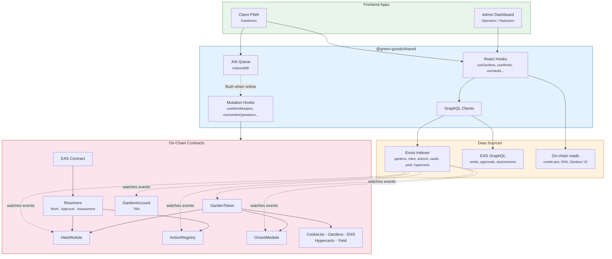

import {NextBestAction, StatusBadge} from "@site/src/components/docs";

# Architecture

<StatusBadge status="Live" />

Green Goods is an **offline-first, single-chain** platform for documenting regenerative work on-chain. The system is built as a Bun monorepo with six packages that communicate through clearly defined boundaries.

## Package boundaries

| Package | Responsibility |
| --- | --- |
| `packages/client` | Gardener-facing PWA UI |
| `packages/admin` | Operator-facing dashboard UI |
| `packages/shared` | Hooks, providers, stores, business logic |
| `packages/contracts` | Solidity modules + deployment scripts |
| `packages/indexer` | Envio event indexing and GraphQL surface |
| `packages/agent` | Automation/bot workflows |

## Architecture principles

- **DRY** for shared hooks, query keys, and deployment addresses.
- **KISS** for chain/environment model -- single chain set by `VITE_CHAIN_ID`.
- **YAGNI** for config surface and feature toggles.
- **Separation of concerns** across packages with strict import boundaries.
- **Offline-first** -- the client PWA works without internet and syncs when connected.
- **Graceful degradation** -- optional contract modules fail silently via `try/catch`.

## System context

How all packages connect end-to-end: contracts emit events, the indexer materializes them into GraphQL, and frontends read through shared hooks.

## Deep dives

| Page | What you will learn |
| --- | --- |
| [Local vs Global Balance](./architecture/local-vs-global) | How the offline-first job queue and two-indexer read path keep the PWA responsive while data settles on-chain. |
| [Entity Relationship Diagram](./architecture/erd) | Every domain entity, its fields, and how they relate -- from on-chain events through the indexer to the frontend. |
| [Modular Approach](./architecture/modular-approach) | The hub-and-spoke contract module system, package dependency graph, and Hats Protocol role tree. |
| [Sequence Diagrams](./architecture/sequence-diagrams) | Step-by-step flows for garden minting, work submission, vault deposits, passkey onboarding, and more. |

<NextBestAction
  title="Next best action"
  why="Start with the offline-first architecture that makes Green Goods unique."
  actionLabel="Local vs Global Balance"
  actionHref="./architecture/local-vs-global"
  alternatives={[
    {label: "Entity Relationships", href: "./architecture/erd"},
    {label: "Modular Approach", href: "./architecture/modular-approach"},
    {label: "Sequence Diagrams", href: "./architecture/sequence-diagrams"},
  ]}
/>
