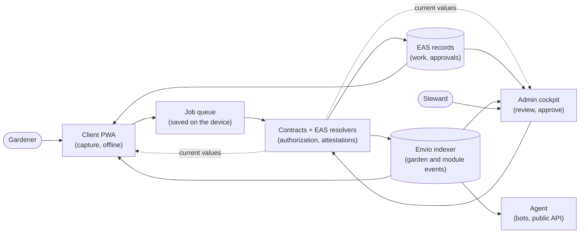

# Architecture

Green Goods carries one piece of work between two very different worlds. Regenerative work happens
in gardens, on phones, often without signal. Verification and funding happen on-chain, where
records are cheap to check and hard to fake. The whole architecture is the machinery for moving a
work submission from the first world to the second without losing truth along the way.

## One submission, end to end

```mermaid
flowchart LR
  gardener([Gardener]) --> client["Client PWA<br/>(capture, offline)"]
  client --> queue["Job queue<br/>(saved on the device)"]
  queue --> contracts["Contracts + EAS resolvers<br/>(authorization, attestations)"]
  contracts --> eas[("EAS records<br/>(work, approvals)")]
  contracts -. current values .-> client
  contracts -. current values .-> admin
  contracts --> indexer[("Envio indexer<br/>(garden and module events)")]
  eas --> client
  eas --> admin["Admin cockpit<br/>(review, approve)"]
  indexer --> client
  indexer --> admin
  indexer --> agent["Agent<br/>(bots, public API)"]
  steward([Steward]) --> admin
  admin --> contracts
```

Follow the arrows once and you have the system. A gardener documents work in the
[client PWA](./packages/client), offline if needed. The shared [job queue](./packages/shared)
keeps it on the device until the gardener is back online and taps Upload all. The submission then
lands in the [contracts](./packages/contracts) as an [EAS](./integrations/eas) attestation,
checked by a resolver at the moment it's written.

From there, apps read the data three ways:

- **Attestations**, meaning the work itself and every approval, come straight from EAS through the
  shared EAS data layer.
- **History**, like garden events, membership changes, and module activity, comes from the
  [indexer](./packages/indexer)'s GraphQL read models.
- **Current values**, like someone's roles in a garden or a vault's yield status, come from the
  contracts directly.

The client uses all three to show gardeners their status, the [admin cockpit](./packages/admin)
is where a steward reviews and approves, and the [agent](./packages/agent) serves bots and the
public API. An approval travels the same road as the work it approves.

Two consequences of this shape are worth knowing early. Apps don't dig through the chain's history
themselves, and EAS stays outside our indexer on purpose, so the attestation and history read
paths stay independent. And writes have exactly one door: everything that becomes protocol truth
goes through the contracts.

## Three ideas carry the protocol

The contract layer is small, and its elegance is that three ideas do most of the work.

### A garden is an account

Each garden is an ERC-721 token whose
[ERC-6551 token-bound account](./integrations/tokenbound) is the garden itself, on-chain: it holds
the garden's treasury, wears its role tree, and receives its attestations. Nothing about a garden
lives in an app database that could disappear. Transfer the token and you've transferred the
garden, assets and history included, when transfers are allowed: the protocol can open them, limit
them to its admin, or lock them. The [Garden account sources](./packages/contracts) and the
[deployment record](/builders/reference/deployments) show what this looks like per chain.

### A record is an attestation with enforced meaning

Work, approvals, and assessments are [EAS attestations](./integrations/eas), but not free-form
ones. Each schema is bound to a resolver contract that validates authorization at write time, so a
Work Approval signed by someone without steward authority simply cannot be recorded. That single
move relocates trust: you don't have to believe an app's database that a steward approved
something, because the record could not exist otherwise. The
[data model](./architecture/data-model) shows how these records relate.

### Authority is a hat

Roles are [Hats Protocol](./integrations/hats) tokens arranged in a small tree per garden: an
owner, stewards, evaluators, and gardeners. Gardeners submit work, evaluators attest assessments,
and stewards approve work. Roles stack, so a steward can also do what evaluators and gardeners do,
and the owner can do all of it. Because hats are on-chain tokens, the resolvers above can check
them directly, and because they're a tree, a garden's whole authority structure is inspectable at
once.

Everything else is a module a garden opts into per chain: vaults through
[Octant](./integrations/octant), distributions through [Cookie Jar](./integrations/cookie-jar),
impact certificates through [Hypercerts](./integrations/hypercerts), milestone reporting through
[Karma GAP](./integrations/karma), names through [ENS](./integrations/ens). A module exists where
its deployment artifact says it does, and nowhere else; the
[deployment status page](/builders/reference/deployments) is the canonical record, and no page in these docs
claims a module is live anywhere without it.

## The monorepo that serves it

| Package | What it owns | In production |
|---|---|---|
| [`contracts`](./packages/contracts) | Protocol state, authorization, attestation resolvers, deployment artifacts | [Arbitrum One and others](/builders/reference/deployments) |
| [`shared`](./packages/shared) | Cross-app hooks, providers, protocol modules, UI foundations | Inside every app bundle |
| [`indexer`](./packages/indexer) | Envio handlers projecting contract events into GraphQL read models | Envio hosted service |
| [`client`](./packages/client) | Public website and the installed PWA | [greengoods.app](https://greengoods.app) |
| [`admin`](./packages/admin) | The steward cockpit | [admin.greengoods.app](https://admin.greengoods.app) |
| [`agent`](./packages/agent) | Messaging bots and the public HTTP API | Hosted service |
| `qa` | The team's two-writer QA checklist app | [qa.greengoods.app](https://qa.greengoods.app) |

Dependencies point one way: `contracts → shared → client / admin / agent`, with `indexer` fed by
contract events. Apps import shared code only through its
[declared package exports](./packages/api-index), never `src/` paths, which is what keeps seven
packages refactorable by a small team (and its agents) without fear.

## Where data lives

The system deliberately splits state into two homes:

- **Local-first**: drafts, media being prepared, retry state, and install caches stay on the
  device. The shared job queue keeps captured work safe offline, and the gardener sends it with
  one tap on Upload all once they're back online.
- **Chain-global**: attestations, garden roles, approvals, and contract state form the durable
  coordination layer, scoped to a chain and shared by everyone.

One rule keeps the boundary honest: UI may explain that something is syncing or failed, but it
never presents unconfirmed work as protocol truth. If you're changing this boundary, start at the
shared job-queue and service-worker modules, and prove offline recovery before touching interface
copy.

## Design principles

Five tests guide the tradeoffs, in the spirit of the Ethereum ecosystem Green Goods builds on:

- **Verifiability.** Work, approvals, roles, and deployments all have inspectable sources of
  truth.
- **User agency.** A participant can keep their evidence and records without depending on any
  single interface vendor.
- **Least disclosure.** Public records carry only what coordination needs. Addresses, roles, and
  submitted evidence are public by design, and anything written on-chain or to IPFS stays public
  for good, so personal details stay out of them.
- **Open implementation.** Protocol and client behavior can be inspected, tested, and replaced.
- **Operational honesty.** A deployed address is never presented as a live, healthy feature
  without separate evidence.

## Next steps

- [Anatomy of a Work Submission](./architecture/anatomy) follows one real record through every stage.
- [Data Model & Ontology](./architecture/data-model) maps the entities and lifecycles, layer by layer.
- [Deployment Status](/builders/reference/deployments) shows what's actually deployed where.
