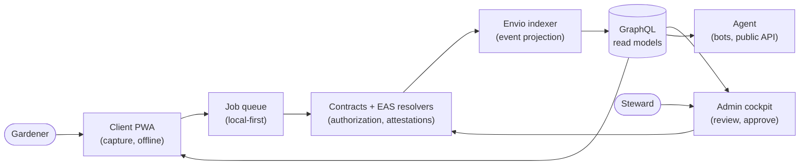

# System Overview

Green Goods turns community environmental work into verifiable on-chain records: gardeners capture
work in a mobile app that works offline, stewards review it, and approved work becomes an
[EAS](https://docs.attest.org/docs/welcome) attestation that funders and apps can trust. Everything
below exists to serve that loop.

## The shape of the system

```mermaid
flowchart LR
  gardener([Gardener]) --> client["Client PWA<br/>(capture, offline)"]
  client --> queue["Job queue<br/>(local-first)"]
  queue --> contracts["Contracts + EAS resolvers<br/>(authorization, attestations)"]
  contracts --> indexer["Envio indexer<br/>(event projection)"]
  indexer --> graphql[("GraphQL<br/>read models")]
  graphql --> client
  graphql --> admin["Admin cockpit<br/>(review, approve)"]
  graphql --> agent["Agent<br/>(bots, public API)"]
  steward([Steward]) --> admin
  admin --> contracts
```

Work flows left to right: capture happens in the client, becomes protocol truth in the contracts,
and comes back to every surface through the indexer. Nothing reads chain state directly in the
apps — the indexer's read models are the query layer.

## The packages

| Package | What it owns | In production |
|---|---|---|
| [`contracts`](./packages/contracts) | Protocol state, authorization, attestation resolvers, deployment artifacts | [Arbitrum One and others](./deployments/status) |
| [`shared`](./packages/shared) | Cross-app hooks, providers, protocol modules, UI foundations | Inside every app bundle |
| [`indexer`](./packages/indexer) | Envio handlers projecting contract events into GraphQL read models | Envio hosted service |
| [`client`](./packages/client) | Public website and the installed PWA | [greengoods.app](https://greengoods.app) |
| [`admin`](./packages/admin) | The steward cockpit | [admin.greengoods.app](https://admin.greengoods.app) |
| [`agent`](./packages/agent) | Messaging bots and the public HTTP API | Hosted service |
| `qa` | The team's two-writer QA checklist app | [qa.greengoods.app](https://qa.greengoods.app) |

Dependencies point one way: `contracts → shared → client / admin / agent`, with `indexer` fed by
contracts events. Apps import shared code only through its
[declared package exports](./packages/api-index) — never `src/` paths.

## Where data lives

The system deliberately splits state into two homes:

- **Local-first** — drafts, media being prepared, retry state, and install caches stay on the
  device. The shared job queue holds captured work safely offline and replays it when
  connectivity and authorization allow.
- **Chain-global** — attestations, Garden roles, approvals, and contract state are the durable
  coordination layer, scoped to a chain and shared by everyone.

The rule that keeps this honest: UI may explain that something is syncing or failed, but it never
presents unconfirmed work as protocol truth. If you're changing this boundary, start at the shared
job-queue and service-worker modules, and prove offline recovery before touching interface copy.

## The module boundary

Two contracts anchor the protocol: the **Garden token** (each garden is an on-chain account) and
the **Action registry** (what kinds of work exist). Everything else — roles via
[Hats](./integrations/hats), vaults via [Octant](./integrations/octant), distributions via
[Cookie Jar](./integrations/cookie-jar), certification via
[Hypercerts](./integrations/hypercerts) — is an optional module a garden may or may not have on a
given chain. A module's deployment artifact, not its source code, decides whether it exists
somewhere: the [deployment status page](./deployments/status) is the canonical record.

## Design principles

Five tests guide the tradeoffs, in the spirit of the Ethereum ecosystem Green Goods builds on:

- **Verifiability** — work, approvals, roles, and deployments all have inspectable sources of
  truth.
- **User agency** — a participant can keep their evidence and records without depending on any
  single interface vendor.
- **Least disclosure** — public records carry only what coordination requires; identities and
  private evidence stay off-chain.
- **Open implementation** — protocol and client behavior can be inspected, tested, and replaced.
- **Operational honesty** — a deployed address is never presented as a live, healthy feature
  without separate evidence.

## Next steps

- [Entity Relationships](./architecture/erd) — the data model, layer by layer.
- [API Index](./packages/api-index) — every public export and route, generated from the code.
- [Deployment Status](./deployments/status) — what's actually deployed where.
