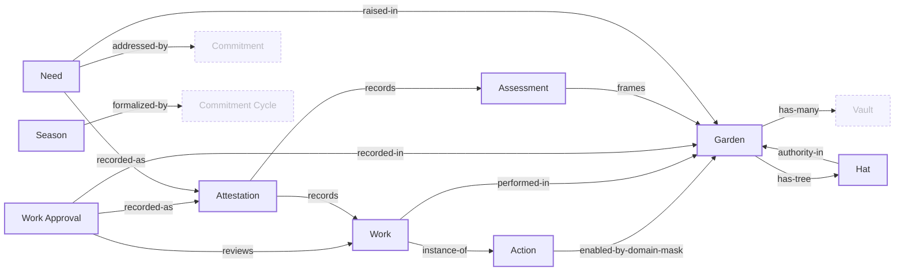
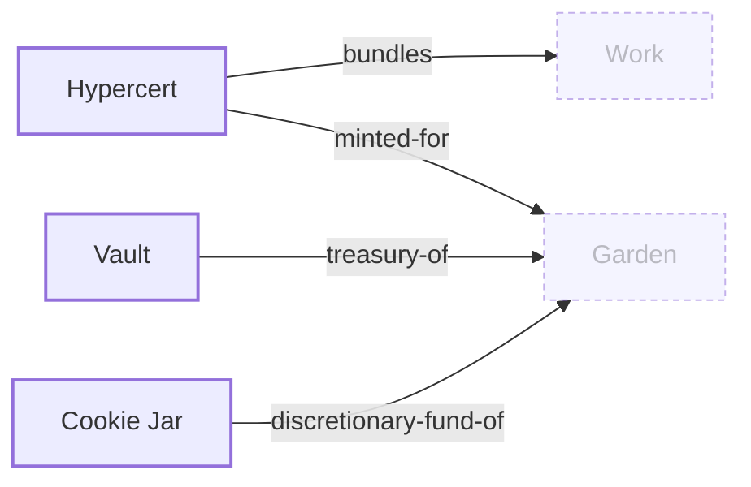
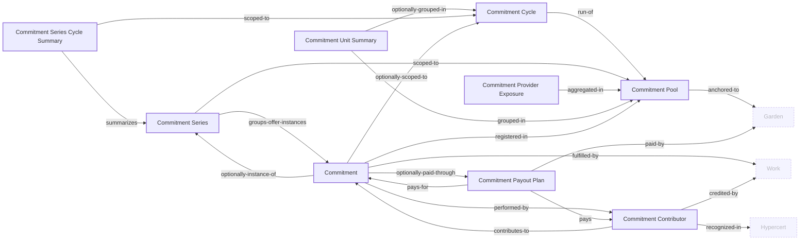
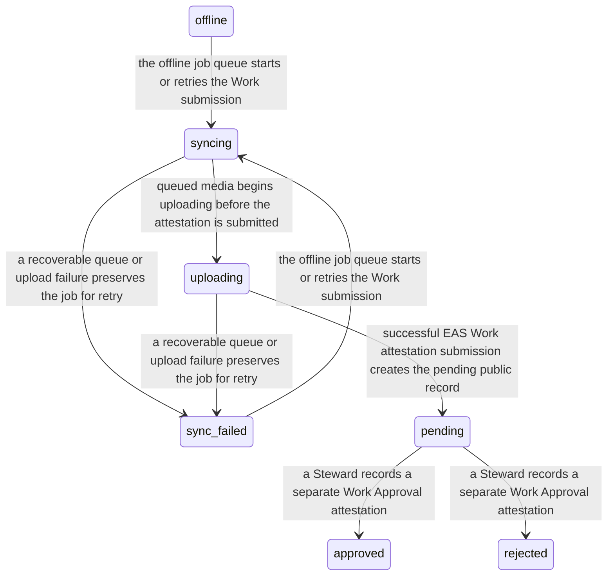

<!-- GENERATED FILE: do not edit. Run `bun run docs:generate` or `bun run docs:generate -- --scope <scope>`. -->
# Data Model & Ontology

This page projects the ontology: entity relationships in three layers, then the lifecycle state machines that govern how records change. Solid nodes belong to a layer; dashed nodes are context from another layer. Use a diagram's Expand control to open it full screen and zoom. Relationships here are semantic, not database foreign keys.

## Core protocol

Gardens, actions, and the attested work loop.



| Entity | Definition | Surfaces |
|---|---|---|
| Garden | A community of gardeners rooted in a place, represented on-chain as an ERC-721 garden token whose ERC-6551 token-bound account holds the garden's treasury, role Hats, and metadata. | admin, client, agent, public, docs |
| Action | A documented activity a gardener can perform — the unit of work template (e.g. "Plant native species", "Remove invasive growth"). | admin, client, agent, public, docs |
| Work | One documented instance of an Action performed by a gardener — media, notes, and metadata submitted as an EAS Work attestation for steward review; approval records a separate Work Approval attestation. | admin, client, agent, public, docs |
| Work Approval | The separate EAS attestation in which a garden steward records approval or rejection of a submitted Work, with feedback, confidence, and verification method. The Work record already exists; this decision never creates it. | admin, client, public, docs |
| Assessment | An up-front baseline and strategy for a garden — domain, diagnosis, SMART outcome targets, selected Actions, reporting period — authored by an evaluator or steward before work begins, mirrored to a Karma GAP milestone when that module is active; explicitly not a review of submitted Work (that is Work Approval). | admin, client, public, docs |
| Attestation | An EAS (Ethereum Attestation Service) record. Used for Work submissions, Assessment outcomes, and other off-chain-verifiable claims. | admin, client, public, docs |
| Hat | A Hats Protocol role token. Determines on-chain authority — steward hats can approve Work; gardener hats can submit Work; evaluator hats can attest. | admin, client, public, docs |
| Season | A bounded period (typically a quarter) during which a garden runs a coordinated set of Actions and Assessments. Pacing primitive — never a countdown. | admin, client, agent, public, docs |
| Need | A community-authored statement of a place-based problem paired with a desired outcome. A Need can gather signals, moderation, linked commitments, and verified funding attribution without becoming a commitment or payment itself. | community, admin, client, public, docs |

## Funding and recognition

How approved work connects to certificates, vaults, and distributions.



| Entity | Definition | Surfaces |
|---|---|---|
| Hypercert | An on-chain claim of impact bundling approved Work into a fractional impact certificate. Funders hold fractions; gardeners hold contribution credit. | admin, client, public, docs |
| Vault | The garden's treasury. Funders deposit; the garden's Tokenbound Account holds; yield splits flow to stewards / gardeners / community per configured ratios. | admin, client, public, docs |
| Cookie Jar | A garden-scoped emergency or discretionary fund with rate-limited withdrawals. Allowlisted members can claim within the configured cap. | admin, client, public, docs |

## Commitment pooling

The commitment subsystem: pools, cycles, series, and settlement records.



| Entity | Definition | Surfaces |
|---|---|---|
| Commitment Pool | A garden-anchored (or protocol root-garden) pool that registers, curates, and reconciles commitments under a charter. | admin, client, docs |
| Commitment Cycle | A bounded run of a pool — a Season or Campaign — seeded with timing and an immutable six-role allocation snapshot at open. | admin, client, docs |
| Commitment Series | The internal durable, pool-scoped identity for one Offer used over time. It groups ordinary Offer instances without creating obligations automatically, merging history across pools, or becoming a separate product noun. | admin, client, docs |
| Commitment Provider Exposure | The current count of open commitments held by one accountable lead provider in one pool, derived only from self-describing register unit events. | admin, client, docs |
| Commitment Unit Summary | Exact-label pool or cycle totals for expected, approved, fulfilled, and open commitment units; unlike label hashes are never combined. | admin, client, docs |
| Commitment Series Cycle Summary | Current lifecycle counts for the instances of one commitment series within one cycle. | admin, client, docs |
| Commitment | A module-native promise record (offer or request) with one accountable lead, an optional contributor roster, repeatable action requirements, direction-aware confirmation, unit accounting in a non-transferable register, and evidence/work linkage — deliberately not an EAS attestation. | admin, client, community, docs |
| Commitment Contributor | A person on a commitment's roster whose approved Work or confirmed evidence can earn Hypercert recognition and a contributor payout; one roster member is the accountable lead. | admin, client, community, docs |
| Commitment Payout Plan | A garden-managed split of a fulfilled commitment's declared support into an explicit garden-retained amount and contributor child payouts. Its complete recognition vector is hash-bound, payment weights derive from amounts, and explicit finalization freezes it before dispatch. | admin, client, docs |

## Lifecycles

These state machines project lifecycle transitions from the ontology. Mechanism labels point back to the code or configuration that enforces each transition.

### work-display-status {#work-display-status}

The union in types/domain.ts documents itself as the single source of truth: pending/approved/rejected reflect protocol state; syncing/uploading/sync_failed/offline are client-derived from the offline job queue.



### commitment-pool {#commitment-pool}

Every pool state is on-chain; transitions are rare steward-console actions.

```mermaid
stateDiagram-v2
  None --> NotReady: onGardenMinted (GardenToken-only, idempotent) or registerPool → PoolRegistered
  NotReady --> Ready: markPoolReady — requires non-empty charter CID and a non-zero provider open-commitment cap → PoolReady
  Ready --> Open: openPool → PoolOpened
  Open --> Paused: pausePool with mandatory reasonCID → PoolPaused; resumePool returns to Open
  Open --> Closed: closePool → PoolClosed
  Paused --> Closed: closePool → PoolClosed
  Closed --> Composted: compostPool → PoolComposted
  Composted --> Ready: reopenPool(toOpen) → PoolReopened
  Composted --> Open: reopenPool(toOpen) → PoolReopened
```



### commitment-cycle {#commitment-cycle}

One open Season per pool (openSeasonCycleId guard); Campaigns overlap freely. Succession between cycles is derived by pool ordering — no on-chain predecessor pointer.

```mermaid
stateDiagram-v2
  None --> Seeded: seedCycle(poolId, cycleType, startTime, endTime, metadataCID) → CycleSeeded; no allocation stored yet
  Seeded --> Open: openCycle(cycleId, allocation, recognitionPolicy) — six-role allocation bps and two-part recognition bps each sum to 10000, both store immutably → CycleOpened
  Open --> InProgress: first CommitmentAccepted for the cycle OR block time ≥ startTime
  InProgress --> Reviewing: block time > endTime, OR all cycle commitments terminal or ReadyForConfirmation; new evidence/work flips back
  Reviewing --> Reconciled: closeCycle (the reconcile act) requires liveCommitmentCount = 0 → CycleClosed; commitment-level Reconciled derives from this event
  Reconciled --> Composted: compostCycle → CycleComposted
  Seeded --> Cancelled: cancelCycle(reasonCID) requires liveCommitmentCount = 0 → CycleCancelled; Draft is discarded off-chain
  Open --> Cancelled: cancelCycle(reasonCID) requires liveCommitmentCount = 0 → CycleCancelled; Draft is discarded off-chain
```

### commitment {#commitment}

Direction-aware fulfillment: the party receiving the team's work confirms by default (Offer → receiver, Request → creator), or a named group may be set before acceptance. A current local-garden steward/owner may use PoolFallback. When explicitly selected before acceptance and no ordinary/local confirmer is reachable, a current steward/owner of the registered Green Goods protocol garden may use ProtocolFallback. The authority paths are not time-based; module ownership alone grants neither fallback; every lead/contributor is excluded. Evidence/Work credit records only while Accepted and unfrozen; the contributor roster and credit ledger freeze atomically on the transition to ReadyForConfirmation or before a direct Fulfilled dispute resolution; Ready requires pre-freeze totalVerifiedCredits > 0 and a structurally reachable confirmer, while recognition additionally requires Fulfilled plus an opened cycle policy or the immutable cycle-less 20/80 default; disputes restore an explicitly stored prior state.

```mermaid
stateDiagram-v2
  None --> Offered: createCommitment → CommitmentCreated (direction sets the initial state)
  None --> Requested: createCommitment → CommitmentCreated (direction sets the initial state)
  Offered --> Accepted: claimCommitment (runtime kind must equal immutable claimType; Open mode transitions immediately, ApprovalGated waits for steward acceptClaim) → CommitmentAccepted; register records committed units
  Requested --> Accepted: claimCommitment (runtime kind must equal immutable claimType; Open mode transitions immediately, ApprovalGated waits for steward acceptClaim) → CommitmentAccepted; register records committed units
  Accepted --> Active: first WorkLinked or EvidenceAttached after acceptance
  Active --> EvidenceSubmitted: any EvidenceAttached or WorkLinked event
  EvidenceSubmitted --> PartiallyApproved: ApprovedWorkCounted with some requirement counters below their required counts
  Accepted --> ReadyForConfirmation: automatic once every repeatable action requirement is met and any declared assessment attached; submitForConfirmation for evidence-only types requires evidenceCount ≥ 1; steward markReadyForConfirmation with reason; every path requires an Open cycle when scoped or the immutable cycle-less 20/80 policy, pre-freeze totalVerifiedCredits > 0, and either a reachable ordinary named/default confirmer threshold or an explicitly selected registered protocol-garden fallback; local-garden authority is confirmation-time PoolFallback provenance only and does not independently satisfy Ready reachability; contributor roster and credit ledger freeze atomically before the ready event
  Active --> ReadyForConfirmation: automatic once every repeatable action requirement is met and any declared assessment attached; submitForConfirmation for evidence-only types requires evidenceCount ≥ 1; steward markReadyForConfirmation with reason; every path requires an Open cycle when scoped or the immutable cycle-less 20/80 policy, pre-freeze totalVerifiedCredits > 0, and either a reachable ordinary named/default confirmer threshold or an explicitly selected registered protocol-garden fallback; local-garden authority is confirmation-time PoolFallback provenance only and does not independently satisfy Ready reachability; contributor roster and credit ledger freeze atomically before the ready event
  EvidenceSubmitted --> ReadyForConfirmation: automatic once every repeatable action requirement is met and any declared assessment attached; submitForConfirmation for evidence-only types requires evidenceCount ≥ 1; steward markReadyForConfirmation with reason; every path requires an Open cycle when scoped or the immutable cycle-less 20/80 policy, pre-freeze totalVerifiedCredits > 0, and either a reachable ordinary named/default confirmer threshold or an explicitly selected registered protocol-garden fallback; local-garden authority is confirmation-time PoolFallback provenance only and does not independently satisfy Ready reachability; contributor roster and credit ledger freeze atomically before the ready event
  PartiallyApproved --> ReadyForConfirmation: automatic once every repeatable action requirement is met and any declared assessment attached; submitForConfirmation for evidence-only types requires evidenceCount ≥ 1; steward markReadyForConfirmation with reason; every path requires an Open cycle when scoped or the immutable cycle-less 20/80 policy, pre-freeze totalVerifiedCredits > 0, and either a reachable ordinary named/default confirmer threshold or an explicitly selected registered protocol-garden fallback; local-garden authority is confirmation-time PoolFallback provenance only and does not independently satisfy Ready reachability; contributor roster and credit ledger freeze atomically before the ready event
  ReadyForConfirmation --> Fulfilled: confirmFulfillment by named confirmer or direction-aware default, or confirmFulfillmentAsFallback with reason by current local-garden authority (PoolFallback) or explicitly selected registered protocol-garden authority (ProtocolFallback); local authority wins for dual-role callers; threshold N → CommitmentFulfilled with actor/path/reason; register converts units; every lead/contributor on the already-frozen roster is excluded from every confirmation path
  Fulfilled --> Reconciled: CycleClosed for the commitment's cycle (or PoolClosed when cycle-less)
  Offered --> Cancelled: cancelCommitment(reasonCID) — creator or steward pre-acceptance, steward-only after; Accepted releases committed units
  Requested --> Cancelled: cancelCommitment(reasonCID) — creator or steward pre-acceptance, steward-only after; Accepted releases committed units
  Accepted --> Cancelled: cancelCommitment(reasonCID) — creator or steward pre-acceptance, steward-only after; Accepted releases committed units
  Offered --> Expired: expireCommitment — permissionless once past dueDate (or cycle endTime); releases still-committed units
  Requested --> Expired: expireCommitment — permissionless once past dueDate (or cycle endTime); releases still-committed units
  Accepted --> Expired: expireCommitment — permissionless once past dueDate (or cycle endTime); releases still-committed units
  ReadyForConfirmation --> Expired: expireCommitment — permissionless once past dueDate (or cycle endTime); releases still-committed units
  Accepted --> Disputed: raiseDispute(reasonCID) — module stores the exact prior state in preDisputeState → CommitmentDisputed
  ReadyForConfirmation --> Disputed: raiseDispute(reasonCID) — module stores the exact prior state in preDisputeState → CommitmentDisputed
  Expired --> Disputed: raiseDispute(reasonCID) — module stores the exact prior state in preDisputeState → CommitmentDisputed
  Disputed --> Accepted: resolveDispute steward-only; RestorePrevious replays preDisputeState; an Expired prior state can never resolve Fulfilled; a direct Fulfilled resolution requires an available recognition policy and verified contributor, then freezes an unfrozen roster before DisputeResolved
  Disputed --> ReadyForConfirmation: resolveDispute steward-only; RestorePrevious replays preDisputeState; an Expired prior state can never resolve Fulfilled; a direct Fulfilled resolution requires an available recognition policy and verified contributor, then freezes an unfrozen roster before DisputeResolved
  Disputed --> Fulfilled: resolveDispute steward-only; RestorePrevious replays preDisputeState; an Expired prior state can never resolve Fulfilled; a direct Fulfilled resolution requires an available recognition policy and verified contributor, then freezes an unfrozen roster before DisputeResolved
  Disputed --> Cancelled: resolveDispute steward-only; RestorePrevious replays preDisputeState; an Expired prior state can never resolve Fulfilled; a direct Fulfilled resolution requires an available recognition policy and verified contributor, then freezes an unfrozen roster before DisputeResolved
  Disputed --> Expired: resolveDispute steward-only; RestorePrevious replays preDisputeState; an Expired prior state can never resolve Fulfilled; a direct Fulfilled resolution requires an available recognition policy and verified contributor, then freezes an unfrozen roster before DisputeResolved
```

### commitment-loan {#commitment-loan}

Records-only pool credit (CreditRegistry). Default is not terminal — a defaulted loan can still be repaid, recorded as LoanRepaid(recoveredFromDefault = true). Registry pause blocks every mutation except markDefaulted and cancelLoan (wind-down). The G$ leg binds the loan to exactly one Confirmed DisbursementKind.LoanPrincipal settlement child; nothing in this machine moves value. Drawn as D30 in the commitment-pooling gallery.

```mermaid
stateDiagram-v2
  None --> Requested: requestLoan(params) → LoanRequested; pool member for self or steward onBehalfOf; pool Open + credit enabled; principal within remaining borrowerCap
  Requested --> Approved: approveLoan(loanId) → LoanApproved; steward, never the borrower (SelfApproval); re-checks authority and reserves cap exposure
  Requested --> Cancelled: cancelLoan(loanId, reasonCID) → LoanCancelled; borrower or steward
  Approved --> Disbursed: recordDisbursed(loanId, rail, executionRef) → LoanDisbursed; steward or pool executor; reservation becomes outstanding; the G$ rail requires the one field-matched Confirmed LoanPrincipal child
  Approved --> Cancelled: cancelLoan(loanId, reasonCID) → LoanCancelled; steward; any settlement child must already be Cancelled; releases the cap reservation
  Disbursed --> Repaid: recordRepayment(loanId, amount, executionRef) clearing principal + fee → RepaymentRecorded + LoanRepaid; steward or executor, never the borrower; Jar/Treasury only
  Disbursed --> Defaulted: markDefaulted(loanId, reasonCID) → LoanDefaulted; steward; past dueDate only (NotDue); callable while paused
  Defaulted --> Repaid: recordRepayment clearing the balance → LoanRepaid(recoveredFromDefault = true); default is not terminal
```
