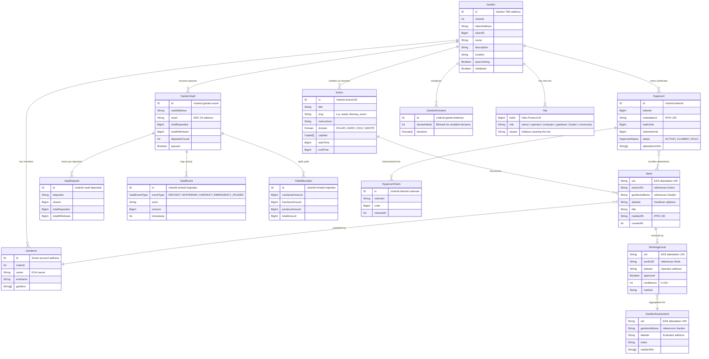
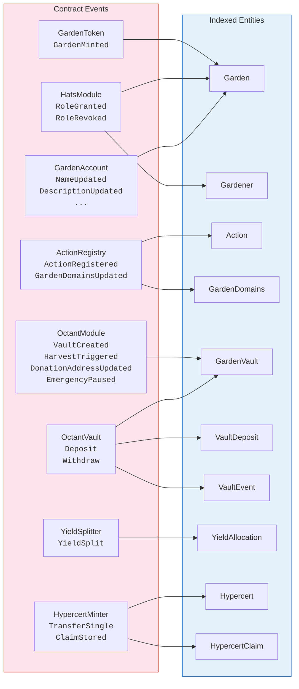

import {NextBestAction, StatusBadge} from "@site/src/components/docs";

# Entity Relationship Diagram

<StatusBadge status="Live" />

This page maps every domain entity in Green Goods, its key fields, and how entities relate to each other -- from on-chain events through the Envio indexer to the frontend GraphQL surface.

## Full entity relationship diagram

## Entity descriptions

### Core entities

| Entity | Source | Description |
| --- | --- | --- |
| **Garden** | Envio (GardenToken events) | A regenerative project with a tokenbound account (ERC-6551 TBA), role tree, and configured domains. Created when an operator calls `mintGarden()`. |
| **Action** | Envio (ActionRegistry events) | A template that defines what kind of work can be documented -- e.g., "Waste Cleanup Event". Actions belong to a domain (solar, agro, edu, waste) and have a time window. |
| **Gardener** | Envio (HatsModule events) | A person who participates in gardens. Identified by their smart account address. May have ENS identity and passkey credentials. |
| **Hat** | Envio (HatsModule events) | A role assignment from Hats Protocol. Each garden gets 6 roles: owner, operator, evaluator, gardener, funder, community. |

### Attestation entities (via EAS)

| Entity | Source | Description |
| --- | --- | --- |
| **Work** | EAS GraphQL | An attestation that a gardener performed a specific action. Contains a title, media URI (IPFS), and reference to the action. Validated by the WorkResolver. |
| **WorkApproval** | EAS GraphQL | An operator's review of a work submission. References the work UID with an approval boolean, confidence score, and method description. |
| **GardenAssessment** | EAS GraphQL | An evaluator's holistic assessment of a garden's progress. Contains notes and supporting media. |

### Financial entities

| Entity | Source | Description |
| --- | --- | --- |
| **GardenVault** | Envio (OctantModule events) | An ERC-4626 vault that holds ERC-20 deposits for a garden. One vault per supported asset per garden. |
| **VaultDeposit** | Envio (OctantVault events) | Per-depositor tracking of shares, total deposited, and total withdrawn for a specific vault. |
| **VaultEvent** | Envio (OctantVault events) | An immutable log entry for every deposit, withdrawal, harvest, or emergency pause event. |
| **YieldAllocation** | Envio (YieldSplitter events) | Records how harvested yield was split three ways: cookie jar (petty cash), hypercert fractions, and community endowment (Juicebox). |

### Impact entities

| Entity | Source | Description |
| --- | --- | --- |
| **Hypercert** | Envio (HypercertMinter events) | An impact certificate that bundles one or more approved work attestations. Fractionalizable into claims. |
| **HypercertClaim** | Envio (HypercertMinter events) | A fraction of a hypercert claimed by an address. Tracks units claimed and timestamp. |

## Contract-to-indexer event mapping

The Envio indexer watches specific contract events and materializes them into the GraphQL entities above. EAS attestations (works, approvals, assessments) are **not** re-indexed -- they are queried directly from easscan.org.

### Dynamic contract registration

When a garden is minted, its tokenbound account (TBA) address is dynamically registered for `GardenAccount` events. When a vault is created, its vault contract address is registered for `Deposit`/`Withdraw` events. This means the indexer discovers new contracts at runtime rather than requiring static configuration.

### Indexer boundary

The Envio indexer covers only **core Green Goods state**. Several modules have stub handler files that are explicitly externalized:

- **Cookie jars** -- read via direct RPC calls.
- **ENS lifecycle** -- resolved client-side.
- **Gardens V2 communities/pools** -- queried from external subgraph.
- **Marketplace orders** -- read from external API.
- **EAS attestations** -- queried from easscan.org.

<NextBestAction
  title="Next best action"
  why="See how the contract module system enables this entity model."
  actionLabel="Modular Approach"
  actionHref="./modular-approach"
  alternatives={[
    {label: "Sequence Diagrams", href: "./sequence-diagrams"},
    {label: "Back to Architecture", href: "../architecture"},
  ]}
/>
