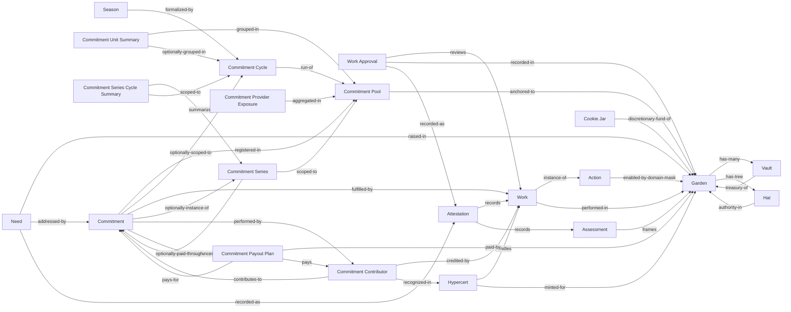

<!-- GENERATED FILE: do not edit. Run `bun run docs:generate` or `bun run docs:generate -- --scope <scope>`. -->
# Entity Relationship Diagram

The diagram projects the ontology's declared entity relationships. It explains semantic relationships, not database foreign keys.

```mermaid
flowchart LR
  garden["Garden"]
  action["Action"]
  work["Work"]
  work_approval["Work Approval"]
  assessment["Assessment"]
  hypercert["Hypercert"]
  vault["Vault"]
  cookie_jar["Cookie Jar"]
  attestation["Attestation"]
  hat["Hat"]
  season["Season"]
  need["Need"]
  commitment_pool["Commitment Pool"]
  commitment_cycle["Commitment Cycle"]
  commitment_series["Commitment Series"]
  commitment_provider_exposure["Commitment Provider Exposure"]
  commitment_unit_summary["Commitment Unit Summary"]
  commitment_series_cycle_summary["Commitment Series Cycle Summary"]
  commitment["Commitment"]
  commitment_contributor["Commitment Contributor"]
  commitment_payout_plan["Commitment Payout Plan"]
  garden -->|has-many| vault
  garden -->|has-tree| hat
  action -->|enabled-by-domain-mask| garden
  work -->|instance-of| action
  work -->|performed-in| garden
  work_approval -->|reviews| work
  work_approval -->|recorded-in| garden
  work_approval -->|recorded-as| attestation
  assessment -->|frames| garden
  hypercert -->|bundles| work
  hypercert -->|minted-for| garden
  vault -->|treasury-of| garden
  cookie_jar -->|discretionary-fund-of| garden
  attestation -->|records| work
  attestation -->|records| assessment
  hat -->|authority-in| garden
  season -->|formalized-by| commitment_cycle
  need -->|raised-in| garden
  need -->|addressed-by| commitment
  need -->|recorded-as| attestation
  commitment_pool -->|anchored-to| garden
  commitment_cycle -->|run-of| commitment_pool
  commitment_series -->|scoped-to| commitment_pool
  commitment_series -->|groups-offer-instances| commitment
  commitment_provider_exposure -->|aggregated-in| commitment_pool
  commitment_unit_summary -->|grouped-in| commitment_pool
  commitment_unit_summary -->|optionally-grouped-in| commitment_cycle
  commitment_series_cycle_summary -->|summarizes| commitment_series
  commitment_series_cycle_summary -->|scoped-to| commitment_cycle
  commitment -->|registered-in| commitment_pool
  commitment -->|optionally-scoped-to| commitment_cycle
  commitment -->|fulfilled-by| work
  commitment -->|optionally-instance-of| commitment_series
  commitment -->|performed-by| commitment_contributor
  commitment -->|optionally-paid-through| commitment_payout_plan
  commitment_contributor -->|contributes-to| commitment
  commitment_contributor -->|credited-by| work
  commitment_contributor -->|recognized-in| hypercert
  commitment_payout_plan -->|pays-for| commitment
  commitment_payout_plan -->|paid-by| garden
  commitment_payout_plan -->|pays| commitment_contributor
```

## Entity definitions

| Entity | Definition | Surfaces |
|---|---|---|
| Garden | A community of gardeners rooted in a place, represented on-chain as an ERC-721 garden token whose ERC-6551 token-bound account holds the garden's treasury, role Hats, and metadata. | admin, client, agent, public, docs |
| Action | A documented activity a gardener can perform — the unit of work template (e.g. "Plant native species", "Remove invasive growth"). | admin, client, agent, public, docs |
| Work | One documented instance of an Action performed by a gardener — media, notes, and metadata submitted as an EAS Work attestation for steward review; approval records a separate Work Approval attestation. | admin, client, agent, public, docs |
| Work Approval | The separate EAS attestation in which a garden steward records approval or rejection of a submitted Work, with feedback, confidence, and verification method. The Work record already exists; this decision never creates it. | admin, client, public, docs |
| Assessment | An up-front baseline and strategy for a garden — domain, diagnosis, SMART outcome targets, selected Actions, reporting period — authored by an evaluator or steward before work begins, mirrored to a Karma GAP milestone when that module is active; explicitly not a review of submitted Work (that is Work Approval). | admin, client, public, docs |
| Hypercert | An on-chain claim of impact bundling approved Work into a fractional impact certificate. Funders hold fractions; gardeners hold contribution credit. | admin, client, public, docs |
| Vault | The garden's treasury. Funders deposit; the garden's Tokenbound Account holds; yield splits flow to stewards / gardeners / community per configured ratios. | admin, client, public, docs |
| Cookie Jar | A garden-scoped emergency or discretionary fund with rate-limited withdrawals. Allowlisted members can claim within the configured cap. | admin, client, public, docs |
| Attestation | An EAS (Ethereum Attestation Service) record. Used for Work submissions, Assessment outcomes, and other off-chain-verifiable claims. | admin, client, public, docs |
| Hat | A Hats Protocol role token. Determines on-chain authority — steward hats can approve Work; gardener hats can submit Work; evaluator hats can attest. | admin, client, public, docs |
| Season | A bounded period (typically a quarter) during which a garden runs a coordinated set of Actions and Assessments. Pacing primitive — never a countdown. | admin, client, agent, public, docs |
| Need | A community-authored statement of a place-based problem paired with a desired outcome. A Need can gather signals, moderation, linked commitments, and verified funding attribution without becoming a commitment or payment itself. | community, admin, client, public, docs |
| Commitment Pool | A garden-anchored (or protocol root-garden) pool that registers, curates, and reconciles commitments under a charter. | admin, client, docs |
| Commitment Cycle | A bounded run of a pool — a Season or Campaign — seeded with timing and an immutable six-role allocation snapshot at open. | admin, client, docs |
| Commitment Series | The internal durable, pool-scoped identity for one Offer used over time. It groups ordinary Offer instances without creating obligations automatically, merging history across pools, or becoming a separate product noun. | admin, client, docs |
| Commitment Provider Exposure | The current count of open commitments held by one accountable lead provider in one pool, derived only from self-describing register unit events. | admin, client, docs |
| Commitment Unit Summary | Exact-label pool or cycle totals for expected, approved, fulfilled, and open commitment units; unlike label hashes are never combined. | admin, client, docs |
| Commitment Series Cycle Summary | Current lifecycle counts for the instances of one commitment series within one cycle. | admin, client, docs |
| Commitment | A module-native promise record (offer or request) with one accountable lead, an optional contributor roster, repeatable action requirements, direction-aware confirmation, unit accounting in a non-transferable register, and evidence/work linkage — deliberately not an EAS attestation. | admin, client, community, docs |
| Commitment Contributor | A person on a commitment's roster whose approved Work or confirmed evidence can earn Hypercert recognition and a contributor payout; one roster member is the accountable lead. | admin, client, community, docs |
| Commitment Payout Plan | A garden-managed split of a fulfilled commitment's declared support into an explicit garden-retained amount and contributor child payouts. Its complete recognition vector is hash-bound, payment weights derive from amounts, and explicit finalization freezes it before dispatch. | admin, client, docs |
