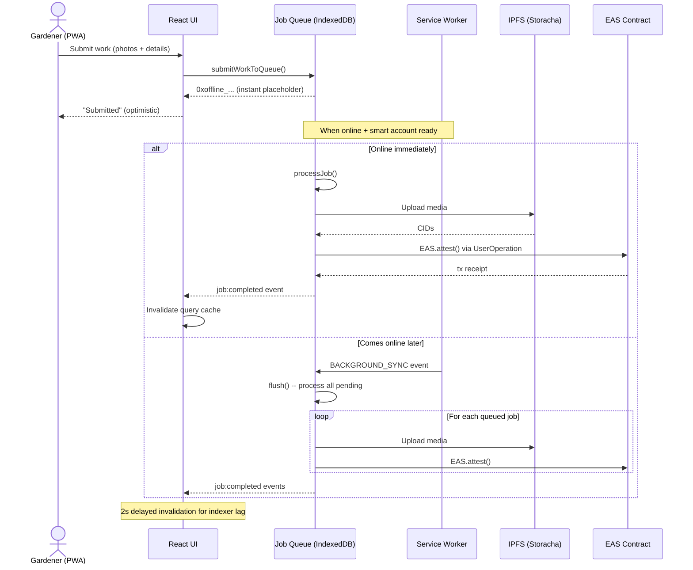
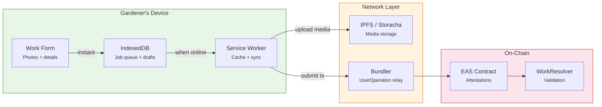
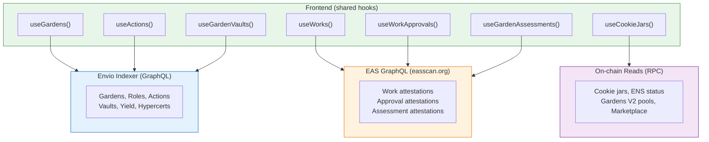

import {NextBestAction, StatusBadge} from "@site/src/components/docs";

# Local vs Global Balance

<StatusBadge status="Live" />

Green Goods is an **offline-first** application. Gardeners work in the field -- often with unreliable connectivity. The architecture must let them submit work instantly and reconcile with the chain later, without data loss or duplicate submissions.

This page explains the two mechanisms that make this possible: the **IndexedDB-backed job queue** for writes and the **two-indexer read path** for reads.

## Design philosophy

| Concern | Local (device) | Global (chain) |
| --- | --- | --- |
| **Latency** | Instant -- writes go to IndexedDB | Minutes -- EAS attestation + indexer lag |
| **Availability** | Always -- Service Worker cache | Requires connectivity |
| **Authority** | Optimistic -- can be rolled back | Canonical -- on-chain is truth |
| **Conflict resolution** | Last-write-wins with mutex | Chain ordering is final |

The user sees an optimistic "submitted" state immediately. The system reconciles in the background, updating query caches once the on-chain transaction confirms.

## Offline-first job queue lifecycle

The client PWA supports offline work submission via an IndexedDB-backed job queue. Jobs are queued instantly, then flushed when connectivity returns.

### Retry policy

Jobs use **exponential backoff**: 1 second base delay, doubling on each retry, capped at 60 seconds. A job is retried up to **5 times** before being marked as permanently failed. A mutex prevents concurrent flush operations, ensuring no duplicate submissions.

### Data flow: local to chain

### Service Worker caching strategy

The PWA uses a **cache-first** strategy for static assets and a **network-first** strategy for API calls:

- **Static assets** (JS, CSS, images): Served from cache, updated in the background.
- **GraphQL queries**: Network-first with cache fallback. Stale data is shown while fresh data loads.
- **Media uploads**: Queued in IndexedDB, uploaded when connectivity is restored.

## Two-indexer read path

The frontend queries **two separate data sources** -- a key architectural decision that avoids re-indexing standard EAS attestations.

### Why two indexers?

| Data type | Source | Rationale |
| --- | --- | --- |
| Gardens, roles, actions, vaults, yield, hypercerts | **Envio** | Custom events emitted by Green Goods contracts -- only our indexer understands them. |
| Work, approval, assessment attestations | **EAS GraphQL** | Standard EAS schema -- easscan.org already indexes every attestation. No need to duplicate. |
| Cookie jars, ENS, Gardens V2 | **Direct RPC** | Low-frequency reads for external protocol state that changes infrequently. |

### Indexer boundary

The Envio indexer covers **only core Green Goods state**. Several integrations are explicitly externalized:

- **Cookie jars** -- read via direct RPC calls to the CookieJar contract.
- **ENS lifecycle** -- resolved client-side from ENS resolver reads.
- **Gardens V2 communities/pools** -- queried from the Gardens subgraph.
- **Marketplace orders** -- read from the Hypercerts marketplace API.
- **EAS attestations** -- queried from easscan.org, not re-indexed.

This boundary keeps the indexer focused, fast, and easy to maintain.

## Query cache invalidation

When a job completes, the UI invalidates specific TanStack Query cache keys after a **2-second delay** to account for indexer propagation lag:

1. Job queue emits `job:completed` event with the job kind and payload.
2. The shared `useJobCompletionListener` hook catches the event.
3. After 2 seconds, it calls `queryClient.invalidateQueries()` with the appropriate `queryKeys.*` selector.
4. TanStack Query refetches from the relevant data source (Envio or EAS).

This ensures the user sees fresh data without manual refresh, while avoiding premature cache invalidation that would return stale results.

<NextBestAction
  title="Next best action"
  why="Understand the domain entities that flow through these data paths."
  actionLabel="Entity Relationship Diagram"
  actionHref="./erd"
  alternatives={[
    {label: "Modular Approach", href: "./modular-approach"},
    {label: "Sequence Diagrams", href: "./sequence-diagrams"},
  ]}
/>
