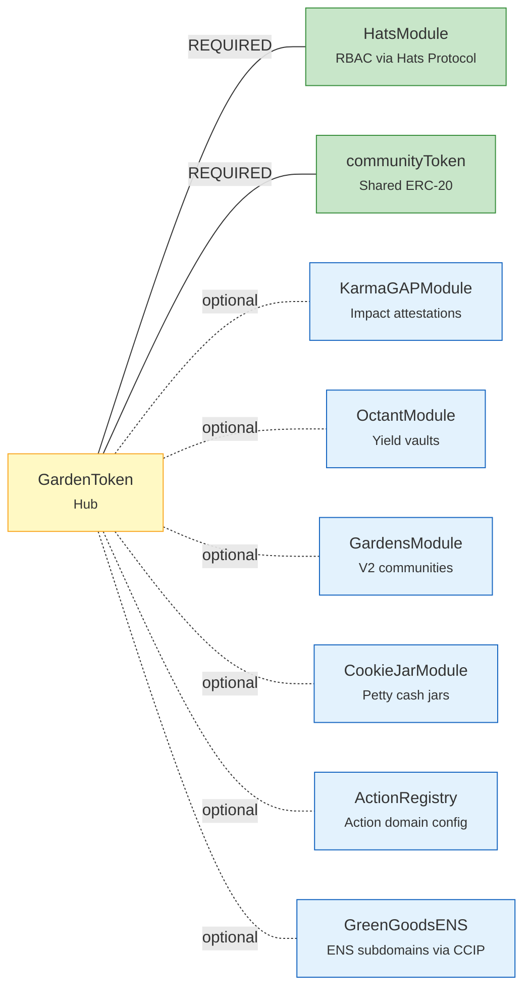
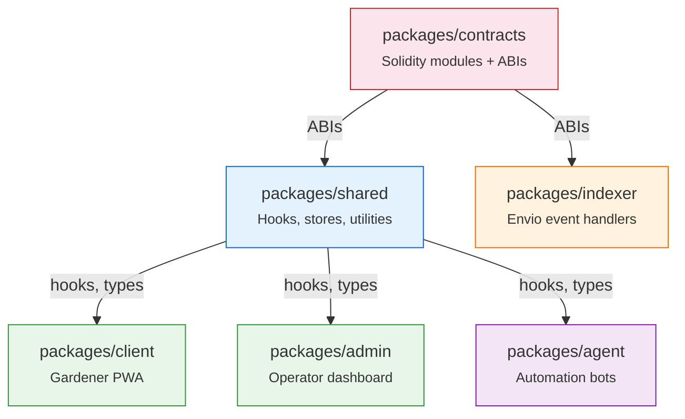
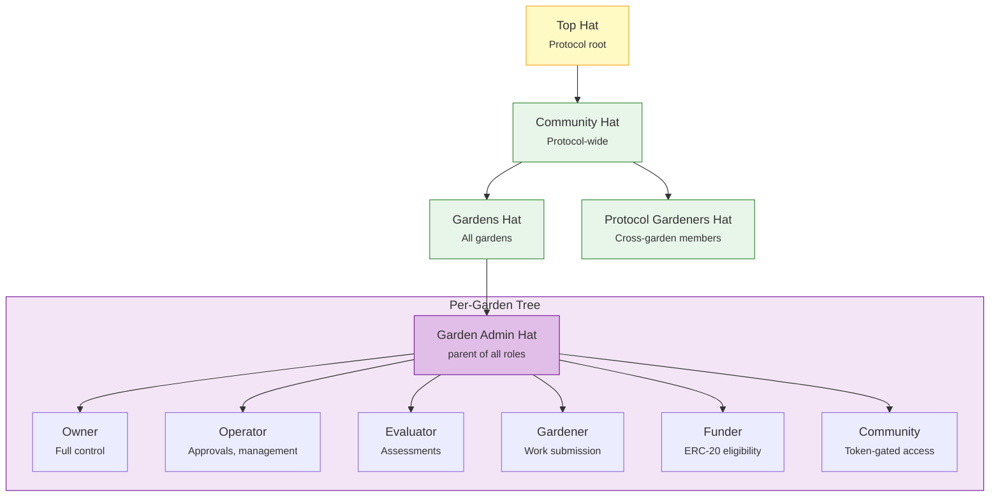

import {NextBestAction, StatusBadge} from "@site/src/components/docs";

# Modular Approach

<StatusBadge status="Live" />

Green Goods uses a modular architecture at two levels: **contract modules** (on-chain) and **package boundaries** (off-chain). This page explains both, plus the Hats Protocol role tree that governs access control across the system.

## Contract module system

GardenToken uses a **hub-and-spoke pattern** with typed module slots. Each module is a UUPS-upgradeable proxy deployed via CREATE2. Optional modules degrade gracefully -- every call is wrapped in `if (address != 0)` + `try/catch`.



### Required vs optional modules

| Module | Required | Purpose |
| --- | --- | --- |
| **HatsModule** | Yes | Role-based access control via Hats Protocol. Creates the 6-role hat tree per garden. |
| **communityToken** | Yes | Shared ERC-20 used for governance signaling and funder eligibility. |
| **KarmaGAPModule** | No | Creates impact attestations on Karma GAP when work is approved. |
| **OctantModule** | No | Deploys ERC-4626 vaults per asset, handles harvest and yield splitting. |
| **GardensModule** | No | Creates Gardens V2 communities and conviction voting signal pools. |
| **CookieJarModule** | No | Deploys per-asset cookie jars for petty cash distribution. |
| **ActionRegistry** | No | Stores action templates with domain configuration per garden. |
| **GreenGoodsENS** | No | Registers ENS subdomains via CCIP-Read for L2 resolution. |

### Adding a new module

Adding a new module type requires:

1. A new UUPS-upgradeable contract implementing the module interface.
2. A GardenToken UUPS upgrade to add one new storage slot (from the `uint256[37] __gap`).
3. A setter function on GardenToken (e.g., `setNewModule(address)`).
4. Wiring in `DeploymentBase` for CREATE2 deployment.
5. Optional: An indexer handler if the module emits events the frontend needs.

### Graceful degradation

Every optional module call follows this pattern in GardenToken:

```solidity
if (address(octantModule) != address(0)) {
    try octantModule.onGardenMinted(garden) {
        emit ModuleExecutionSuccess(MODULE_OCTANT, garden);
    } catch {
        emit ModuleExecutionFailed(MODULE_OCTANT, garden);
    }
}
```

If a module is not deployed (zero address), the call is skipped. If a deployed module reverts, the failure is logged but does not block garden minting. This ensures the core flow always succeeds.

## Package dependency graph

The monorepo has a strict build order. Each package depends only on packages above it in the chain.



### Build order

| Step | Package | Produces |
| --- | --- | --- |
| 1 | **contracts** | ABI JSON files consumed by shared hooks and indexer handlers. |
| 2 | **shared** | React hooks, TypeScript types, and utility modules consumed by all frontends. |
| 3 | **indexer** | Envio handlers that need contract ABIs for event decoding. |
| 4 | **client / admin / agent** | Final applications that import from `@green-goods/shared`. |

### Import rules

- **All React hooks** live in `@green-goods/shared`. Client and admin only contain components and views.
- **Barrel imports only**: `import { useAuth } from "@green-goods/shared"` -- never deep paths.
- **Deployment artifacts**: `import deployment from '../../../contracts/deployments/11155111-latest.json'` -- never hardcode addresses.
- **No cross-frontend imports**: Client cannot import from admin, and vice versa.

## Hats Protocol role tree

Each garden gets a **6-role hat tree** created by `HatsModule.createGardenHatTree()` during minting. Roles are hierarchical -- each parent hat is admin of its children.



### Role hierarchy

| Level | Hat | Purpose |
| --- | --- | --- |
| Protocol | **Top Hat** | Root of the entire Hats tree. Worn by the deployer. |
| Protocol | **Community Hat** | Parent of all protocol-wide hats. HatsModule needs this to create garden sub-trees. |
| Protocol | **Gardens Hat** | Parent of all per-garden admin hats. |
| Protocol | **Protocol Gardeners** | Cross-garden membership for gardeners who participate in multiple gardens. |
| Garden | **Garden Admin** | Per-garden root. Parent (admin) of all garden-specific roles. |
| Garden | **Owner** | Full control over garden configuration and membership. |
| Garden | **Operator** | Can approve/reject work submissions and manage day-to-day operations. |
| Garden | **Evaluator** | Can create garden assessments. |
| Garden | **Gardener** | Can submit work attestations against enabled actions. |
| Garden | **Funder** | Eligibility for depositing into garden vaults (ERC-20 token-gated). |
| Garden | **Community** | General community membership (token-gated). |

### Authorization model

Key points about Hats Protocol authorization:

- `isAdminOfHat(account, hatId)` checks if `account` wears any **ancestor** hat of `hatId` (transitive).
- Wearing a hat does **not** make you admin of that hat -- you need the parent.
- `createHat(parentHat, ...)` requires `isAdminOfHat(caller, parentHat)`, meaning the caller must wear the parent hat's parent.
- The HatsModule needs the **communityHat** (not the gardensHat) to create garden sub-trees under gardensHat.

<NextBestAction
  title="Next best action"
  why="See how these modules interact in real transaction flows."
  actionLabel="Sequence Diagrams"
  actionHref="./sequence-diagrams"
  alternatives={[
    {label: "Entity Relationships", href: "./erd"},
    {label: "Back to Architecture", href: "../architecture"},
  ]}
/>
