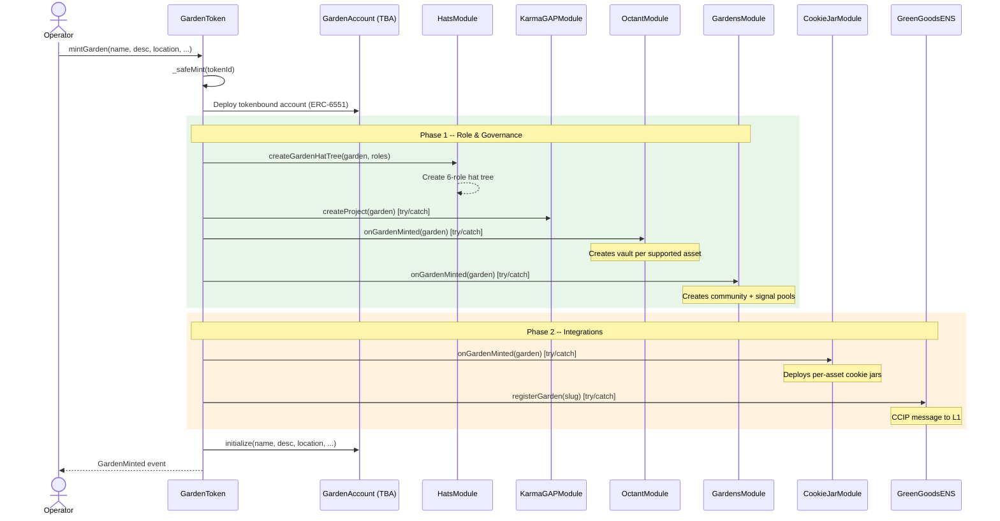
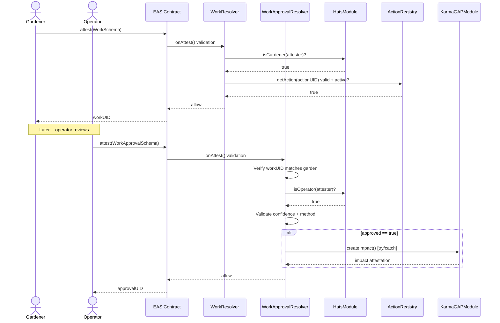
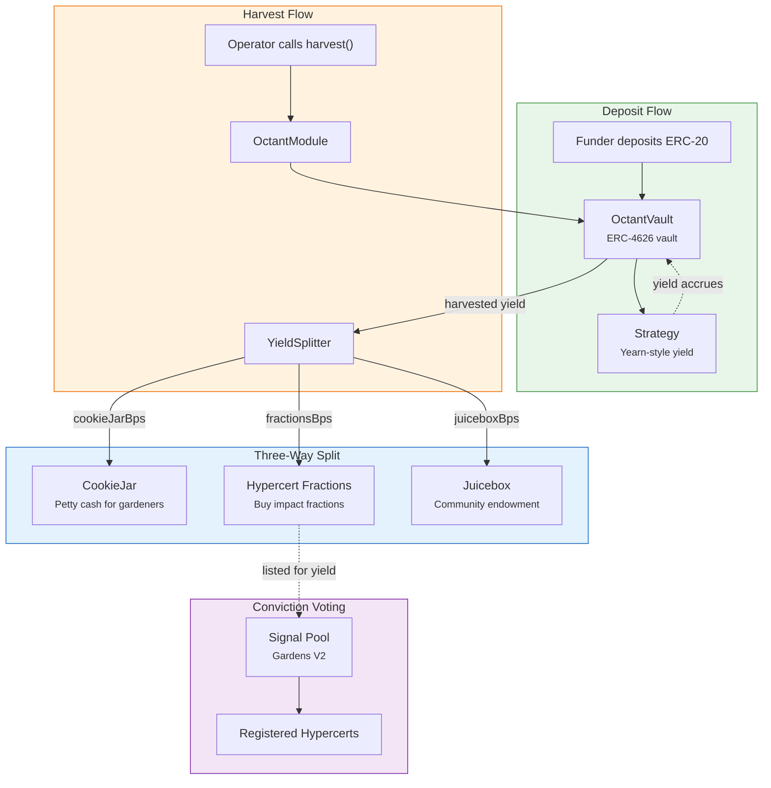
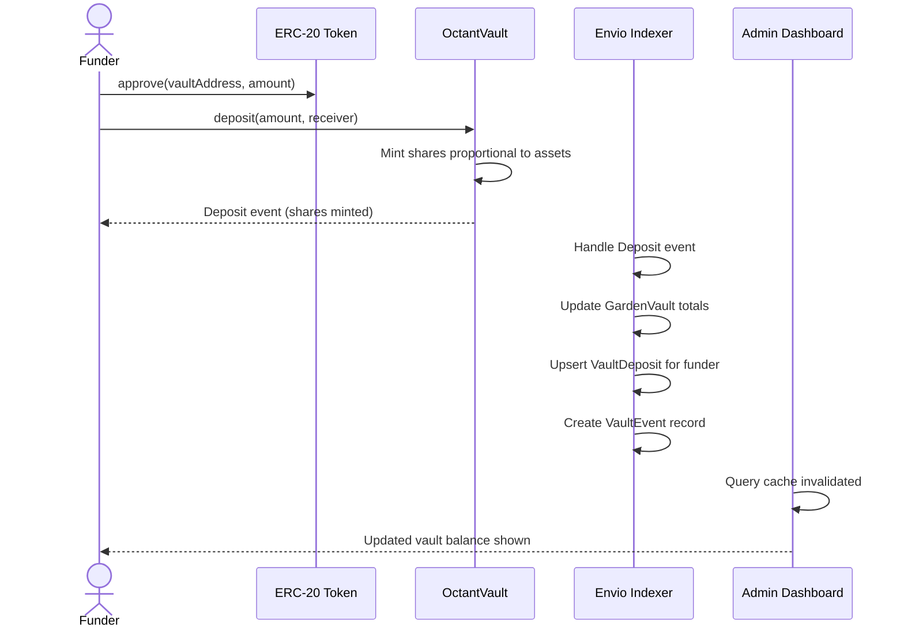
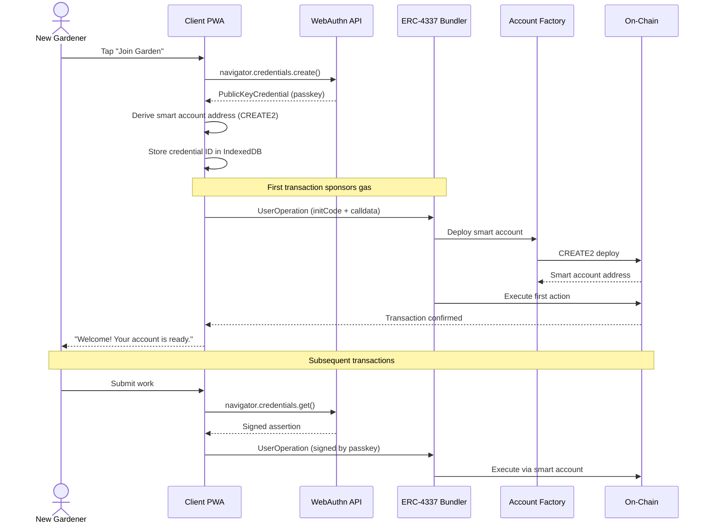
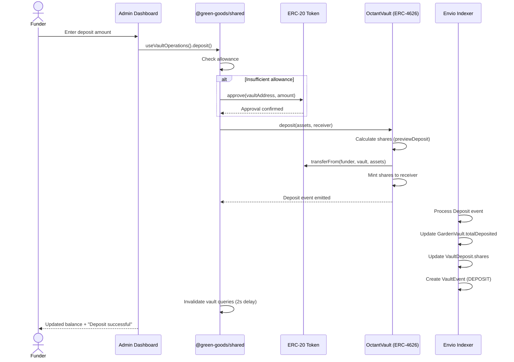
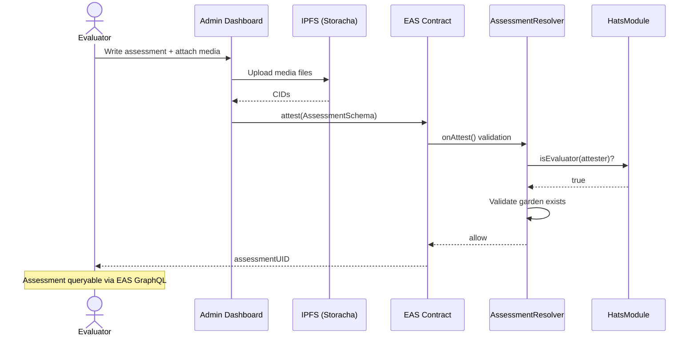

import {NextBestAction, StatusBadge} from "@site/src/components/docs";

# Sequence Diagrams

<StatusBadge status="Live" />

This page collects all major transaction flows in Green Goods, showing how participants, contracts, and off-chain services interact step by step.

## Garden minting

When an operator mints a garden, GardenToken fans out to all configured modules in two phases. Phase 1 handles role setup and governance. Phase 2 handles integration wiring. Each optional module call is wrapped in `try/catch` so failures never block the mint.

### What happens after minting

1. The Envio indexer picks up the `GardenMinted` event and creates the `Garden` entity.
2. The indexer dynamically registers the TBA address for `GardenAccount` events.
3. If OctantModule created vaults, those vault addresses are also registered for `Deposit`/`Withdraw` events.
4. The admin dashboard invalidates its garden list query and shows the new garden.

---

## Work submission and approval

The core user flow: a gardener submits work, an operator reviews it, and the attestation chain is anchored on EAS. The WorkResolver validates that the gardener has the correct hat and the action is active. The WorkApprovalResolver validates the operator role and optionally triggers a Karma GAP impact attestation.

### Validation rules

| Check | Resolver | Description |
| --- | --- | --- |
| Gardener role | WorkResolver | Attester must wear the Gardener hat for the target garden. |
| Action validity | WorkResolver | The action UID must exist in the ActionRegistry and its time window must be active. |
| Operator role | WorkApprovalResolver | Attester must wear the Operator hat for the target garden. |
| Work reference | WorkApprovalResolver | The referenced work UID must belong to the same garden. |
| Confidence range | WorkApprovalResolver | Confidence must be 0-100. |

---

## Vault and yield flow

When gardens receive deposits, the yield accrues in an ERC-4626 vault. An operator triggers harvest, and the YieldSplitter divides the yield three ways.

### Deposit flow (sequence)

### Yield split configuration

The three-way split is configured per garden in basis points (bps):

| Destination | Default | Description |
| --- | --- | --- |
| CookieJar | 3,000 bps (30%) | Petty cash distributed to gardeners for small expenses. |
| Hypercert Fractions | 4,000 bps (40%) | Used to buy fractions of impact certificates, funding verified work. |
| Juicebox | 3,000 bps (30%) | Community endowment for long-term garden sustainability. |

---

## Passkey onboarding flow

New gardeners onboard using WebAuthn passkeys -- no seed phrases, no browser extensions. The passkey creates a smart account (ERC-4337) that serves as the gardener's on-chain identity.

### Key design decisions

- **No wallet required**: Gardeners authenticate with device biometrics (fingerprint, face) via WebAuthn.
- **Counterfactual deployment**: The smart account address is derived from the passkey public key before deployment. The account is only deployed on-chain with the first real transaction.
- **Gas sponsorship**: The first transaction uses a paymaster so new users do not need to hold ETH.
- **Credential storage**: The passkey credential ID is stored locally in IndexedDB and (optionally) synced to ENS text records for cross-device recovery.

---

## Funding deposit flow

Funders deposit ERC-20 tokens into garden vaults. The deposit flow handles token approval, vault deposit, and event propagation through the indexer to the frontend.

### Withdrawal flow

Withdrawals follow the reverse path: the funder specifies an amount of assets to withdraw, the vault burns the corresponding shares, and the underlying ERC-20 tokens are transferred back to the funder. The same event pipeline (VaultEvent with `WITHDRAW` type) updates the indexer and frontend.

---

## Assessment flow

Evaluators create garden-level assessments that provide a holistic view of a garden's progress. Unlike work approvals (which reference specific work submissions), assessments evaluate the garden as a whole.

---

## Further reading

- [Local vs Global Balance](./local-vs-global) -- How the offline job queue and two-indexer path work together.
- [Entity Relationship Diagram](./erd) -- The data model these flows create and update.
- [Modular Approach](./modular-approach) -- How the hub-and-spoke module system enables graceful degradation.

<NextBestAction
  title="Next best action"
  why="Understand the data entities these flows produce."
  actionLabel="Entity Relationship Diagram"
  actionHref="./erd"
  alternatives={[
    {label: "Modular Approach", href: "./modular-approach"},
    {label: "Back to Architecture", href: "../architecture"},
  ]}
/>
