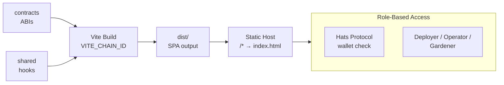

import {NextBestAction, StatusBadge} from "@site/src/components/docs";

# Admin Dashboard Deployment

<StatusBadge status="Live" />



The admin dashboard is a Vite + React SPA for garden operators. It shares the same build toolchain and dependency chain as the client but targets desktop browsers and does not include service worker or offline-first capabilities.


## Deployment Checklist

1. Verify `bun run test` passes in `packages/admin`
2. Confirm shared package is built with matching version
3. Set correct `VITE_CHAIN_ID` for the target environment in the root `.env`
4. Build with `bun run build:admin`
5. Deploy static output from `packages/admin/dist/`
6. Verify routing fallback is configured on the host (`/* -> /index.html (200)`)
7. Check role-based access works with a connected wallet

## Build Environments

### Build Dependencies

Like the client, the admin build is single-chain and depends on:

1. `packages/contracts` -- ABI JSON and deployment artifacts
2. `packages/shared` -- All React hooks, modules, and shared components

### Environment Variables

The admin uses the same root `.env` as all other packages:

| Variable | Purpose |
|----------|---------|
| `VITE_CHAIN_ID` | Target chain for deployment artifacts and RPC config |
| `VITE_WALLETCONNECT_PROJECT_ID` | WalletConnect for wallet connection |
| `VITE_ENVIO_INDEXER_URL` | Envio GraphQL endpoint for data queries |

Additional admin-specific variables may include API keys for services like Hypercerts marketplace or PostHog analytics.

### Testing

The admin workflow lane (`admin.yml`) runs on changes to `packages/admin/**`, shared dependencies, relevant contract artifacts, root dependency/config files, and validates:

- Vitest unit and component tests
- Lint checks via oxlint
- Type checking via TypeScript

E2E tests for the admin lane run in the focused `admin-ci` Playwright project, covering admin smoke and production-flow specs.

## Making A Deployment

### Build Process

```bash
# Build for production
VITE_CHAIN_ID=42161 bun run build:admin
```

### Static Build Output

The build outputs to `packages/admin/dist/`. This is a standard SPA with a single `index.html` entry point and hashed static assets.

### Hosting Configuration

Since the admin uses client-side routing (React Router), the hosting provider must serve `index.html` for all routes. Configure a fallback/rewrite rule:

```
/* -> /index.html  (200)
```

### Role-Based Access

The admin dashboard uses Hats Protocol for role-based access control. Routes are protected by the `RequireRole` component which checks if the connected wallet wears the required hat:

- **Deployer** -- Can deploy contracts and manage protocol settings
- **Operator** -- Can create/manage gardens, actions, and assessments
- **Gardener** -- Can view and submit work (primarily a client-side role)

Access checks happen client-side by querying the Hats contracts. The admin does not have its own auth backend.

### Query Persistence

The admin uses `@tanstack/react-query` persistence via the shared `createQueryPersister()` helper. This provides faster page loads on return visits without claiming full offline support.

The admin wires persistence in `packages/admin/src/main.tsx`, and the shared persistence helpers live under `packages/shared/src/config/query-persistence.ts`.

### Storybook Integration

Admin components have Storybook stories that are pulled into the shared Storybook instance. Admin stories follow the title hierarchy `Admin/Components/*` and `Admin/Views/*`.

Running admin stories locally:

```bash
cd packages/shared && bun run storybook
```

This starts the unified Storybook that includes stories from all three UI packages.

### Source Maps

Vercel runs `bun run build:deploy`, which builds `packages/admin/dist/` and then runs `scripts/ops/upload-sourcemaps.js --app admin --deploy` before Vercel publishes the artifact. This keeps PostHog source-map metadata tied to the actual deployed admin bundle.

Set these variables in the admin Vercel project:

| Variable | Purpose |
|----------|---------|
| `POSTHOG_ADMIN_ENV_ID` | PostHog environment ID for the admin app |
| `POSTHOG_CLI_TOKEN` | PostHog token with source-map upload permissions |

Production deploys fail closed if the PostHog source-map variables are missing. Preview and staging deploys skip source-map upload when those variables are not configured.

## Resources

<NextBestAction
  title="Next: Deploy the Agent Bot"
  why="The agent bot provides Telegram integration for work submission and blockchain interactions."
  actionLabel="Agent Deployment"
  actionHref="/builders/deployments/agent-deploy"
  alternatives={[
    {label: "Admin Dashboard Deployment", href: "/builders/deployments/admin-deploy"},
    {label: "Deployment Status", href: "/builders/deployments/status"},
  ]}
/>
