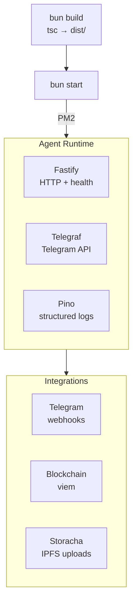

import {NextBestAction, StatusBadge} from "@site/src/components/docs";

# Agent Deployment

<StatusBadge status="Live" />



The agent package (`packages/agent/`) is a Fastify-based bot service that provides Telegram integration for the Green Goods protocol. It handles work submission via chat, blockchain interactions, and IPFS uploads.

## Deployment Checklist

1. Ensure all required environment variables are set in the root `.env` (see [Build Environments](#build-environments))
2. Build the agent: `cd packages/agent && bun build`
3. Run tests: `cd packages/agent && bun run test`
4. Start the compiled output: `cd packages/agent && bun start`
5. Verify Telegram webhook delivery status
6. Check Fastify health endpoint responds
7. Monitor process uptime and memory usage via PM2
8. Confirm blockchain RPC connectivity and error rates in Pino structured logs

## Build Environments

### Environment Variables

Key variables required for the agent service:

| Variable | Purpose |
|----------|---------|
| `TELEGRAM_BOT_TOKEN` | Telegram Bot API token |
| `DEPLOYER_PRIVATE_KEY` | Wallet key for on-chain transactions |
| `VITE_CHAIN_ID` | Target chain for contract interactions |
| `VITE_STORACHA_KEY` | Ed25519 principal for IPFS uploads |
| `VITE_PIMLICO_API_KEY` | Account abstraction bundler/paymaster |

The agent loads environment variables from the root `.env` file.

### API Key Management

Sensitive keys should be managed through environment variables or a secrets manager:

- Never commit API keys to the repository
- Rotate `TELEGRAM_BOT_TOKEN` if compromised
- `DEPLOYER_PRIVATE_KEY` controls on-chain funds -- use a dedicated bot wallet with limited balance
- `VITE_STORACHA_KEY` is an ed25519 principal -- generate with Storacha client tooling

### Architecture

The agent runs as a long-lived Node.js/Bun process:

- **Fastify** HTTP server for webhooks and health checks
- **Telegraf** for Telegram bot API interaction
- **Pino** for structured logging (with `pino-pretty` for development)
- **viem** for blockchain interactions
- **@storacha/client** for IPFS uploads
- **@xenova/transformers** for local ML inference (classification tasks)

### Testing

```bash
cd packages/agent
bun run test              # Vitest run
bun run test:watch        # Vitest watch mode
bun run test:coverage     # With V8 coverage
```

Tests cover:

- **Crypto utilities** -- Signature verification, key derivation
- **Request handlers** -- Telegram command processing, help text generation
- **Rate limiting** -- Request throttling and cooldown logic
- **Storage** -- Data persistence and retrieval

Test utilities in `packages/agent/src/__tests__/utils/` include mock factories and shared mock setup.

## Making A Deployment

### Build and Start

```bash
cd packages/agent
bun build       # TypeScript compilation
bun start       # Run compiled output from dist/
```

The build step uses `tsc` to compile TypeScript to the `dist/` directory.

### Local Development

```bash
cd packages/agent
bun run dev     # Start with --watch for hot reload
```

### Process Management

In production, the agent runs under PM2 (configured in the monorepo root):

```bash
bun dev        # Starts all services including agent via PM2
bun dev:stop   # Stops all PM2 processes
```

For standalone deployment, run the compiled output:

```bash
cd packages/agent && bun start
```

### Health Monitoring

The Fastify server exposes health check endpoints. Monitor:

- Process uptime and memory usage via PM2
- Telegram webhook delivery status
- Blockchain RPC connectivity
- Error rates in Pino structured logs

### Blockchain Integration

The agent uses `@green-goods/shared` for blockchain interactions, following the same patterns as the frontend packages:

- Import deployment artifacts for contract addresses
- Use `Address` type for Ethereum addresses
- Error handling via `parseContractError()` and `createMutationErrorHandler()`
- Logging via `logger` from shared (not `console.log`)

## Resources

- **CI Integration**: The `agent-tests.yml` workflow triggers on changes to `packages/agent/**` and runs Vitest tests with lint checks.

<NextBestAction
  title="Next: Testing with Foundry"
  why="Learn how to write and run Foundry tests for the Green Goods smart contracts."
  actionLabel="Foundry Testing"
  actionHref="/builders/testing/forge"
  alternatives={[
    {label: "Deployment Status", href: "/builders/deployments/status"},
    {label: "Vitest Testing", href: "/builders/testing/vitest"},
  ]}
/>
