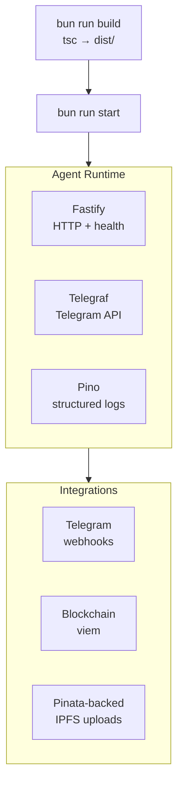

import {NextBestAction, StatusBadge} from "@site/src/components/docs";

# Agent Deployment

<StatusBadge status="Live" />



The agent package (`packages/agent/`) is a Fastify-based bot service that provides Telegram integration for the Green Goods protocol. It handles work submission via chat, blockchain interactions, and the shared Pinata-backed IPFS upload path used by the submission pipeline.

## Deployment Checklist

1. Ensure all required environment variables are set in the root `.env` (see [Build Environments](#build-environments))
2. Build the agent: `cd packages/agent && bun run build`
3. Run tests: `cd packages/agent && bun run test`
4. Start the compiled output: `cd packages/agent && bun run start`
5. Verify Telegram webhook delivery status
6. Check Fastify health endpoint responds
7. Monitor process uptime and memory usage through the selected host or process manager
8. Confirm blockchain RPC connectivity and error rates in Pino structured logs

## Build Environments

### Environment Variables

Key variables used by the current agent runtime:

| Variable | Required when | Purpose |
|----------|---------------|---------|
| `TELEGRAM_BOT_TOKEN` | Always | Telegram Bot API token; the agent fails startup if missing. |
| `ENCRYPTION_SECRET` | Production | Encrypts bot-managed secrets and wallet material; development can derive a fallback with a warning. |
| `VITE_CHAIN_ID` | Chain selection | Selects the target chain through shared `getDefaultChain()`. |
| `BOT_MODE` | Optional | `polling` or `webhook`; defaults to `webhook` in production and `polling` in development. |
| `WEBHOOK_URL` | Webhook mode | Base URL used when registering the Telegram webhook. |
| `TELEGRAM_WEBHOOK_SECRET` | Production webhook mode | Secret token used to verify Telegram webhook requests. |
| `BOT_API_TOKEN` | Routine-facing API enabled | Bearer token for protected `/api/*` routes. |
| `DB_PATH` | Optional | SQLite database path; defaults to `data/agent.db`. |
| `POSTHOG_AGENT_KEY` | Optional production analytics | Enables agent analytics when production analytics are enabled. |

The agent loads environment variables from the root `.env` file.
Shared submission code can also read `PINATA_JWT` or `VITE_PINATA_JWT` when a bot submission includes media buffers and needs the shared IPFS upload path. The current agent config does not load `DEPLOYER_PRIVATE_KEY` or `VITE_PIMLICO_API_KEY` as required service variables.

### API Key Management

Sensitive keys should be managed through environment variables or a secrets manager:

- Never commit API keys to the repository
- Rotate `TELEGRAM_BOT_TOKEN` if compromised
- Use a strong `ENCRYPTION_SECRET`; rotate it if exposed and plan for stored secret recovery before changing it in production
- Treat `BOT_API_TOKEN`, `TELEGRAM_WEBHOOK_SECRET`, and any media-upload `PINATA_JWT` as production secrets

### Architecture

The agent runs as a long-lived Node.js/Bun process:

- **Fastify** HTTP server for webhooks and health checks
- **Telegraf** for Telegram bot API interaction
- **Pino** for structured logging (with `pino-pretty` for development)
- **viem** for blockchain interactions
- **`@green-goods/shared`** for the shared Pinata-backed IPFS upload path
- **@xenova/transformers** for local ML inference (classification tasks)

### Testing

```bash
cd packages/agent
bun run test              # Vitest run
bun run test:watch        # Vitest watch mode
bun run test:coverage     # With V8 coverage
```

Tests cover:

- **Crypto utilities** -- Signature verification, key derivation
- **Request handlers** -- Telegram command processing, help text generation
- **Rate limiting** -- Request throttling and cooldown logic
- **Storage** -- Data persistence and retrieval

Test utilities in `packages/agent/src/__tests__/utils/` include mock factories and shared mock setup.

## Making A Deployment

### Build and Start

```bash
cd packages/agent
bun run build   # TypeScript compilation
bun run start   # Run compiled output from dist/
```

The build step uses `tsc` to compile TypeScript to the `dist/` directory.

### Local Development

```bash
cd packages/agent
bun run dev     # Start with --watch for hot reload
```

### Process Management

The monorepo PM2 config is a local full-stack development convenience. It starts the
agent in watch mode when `TELEGRAM_BOT_TOKEN` is present and idles the service when the
token is missing:

```bash
bun run dev       # Starts all services including agent via PM2
bun run dev:stop  # Stops all PM2 processes
```

Do not treat local PM2 as the production deployment contract. For a standalone server or
container host, build the package and run the compiled output with production env vars:

```bash
cd packages/agent && bun run start
```

### Health Monitoring

The Fastify server exposes health check endpoints. Monitor:

- Process uptime and memory usage through the selected host or process manager
- Telegram webhook delivery status
- Blockchain RPC connectivity
- Error rates in Pino structured logs

### Blockchain Integration

The agent uses `@green-goods/shared` for blockchain interactions, following the same patterns as the frontend packages:

- Import deployment artifacts for contract addresses
- Use `Address` type for Ethereum addresses
- Error handling via `parseContractError()` and `createMutationErrorHandler()`
- Logging via `logger` from shared (not `console.log`)

## Resources

- **CI Integration**: The `agent.yml` workflow triggers on changes to `packages/agent/**`, shared dependencies, and root dependency/config files. It runs Vitest coverage, lint, typecheck, and build.

<NextBestAction
  title="Next: Testing with Foundry"
  why="Learn how to write and run Foundry tests for the Green Goods smart contracts."
  actionLabel="Foundry Testing"
  actionHref="/builders/testing/forge"
  alternatives={[
    {label: "Deployment Status", href: "/builders/deployments/status"},
    {label: "Vitest Testing", href: "/builders/testing/vitest"},
  ]}
/>
