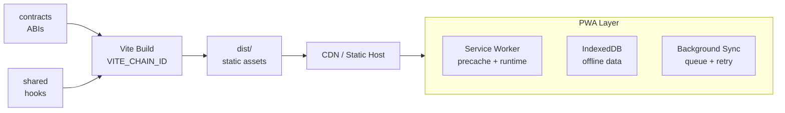

import {NextBestAction, StatusBadge} from "@site/src/components/docs";

# Client PWA Deployment

<StatusBadge status="Live" />



The client is an offline-first Progressive Web App built with Vite and React. Deployment produces a static build with service worker support for offline functionality.

<div style={{maxWidth: '280px', margin: '1rem auto'}}>
  
</div>

## Deployment Checklist

1. Ensure `packages/contracts` and `packages/shared` are built (the client depends on both)
2. Set the correct `VITE_CHAIN_ID` for the target environment in the root `.env`
3. Verify all required environment variables are configured (see [Build Environments](#build-environments))
4. Build the client: `VITE_CHAIN_ID=42161 bun run build:client`
5. Deploy static output from `packages/client/dist/` to your CDN or static hosting provider
6. Configure cache-busting headers for `index.html` and long-lived caching for hashed static assets
7. Verify the service worker registers under `/home`, preserves the Workbox precache, and serves the app shell for `/home` routes.
8. Run Lighthouse audit to check Performance, Accessibility, PWA readiness, and SEO

## Build Environments

### Build Dependencies

The client depends on packages built earlier in the dependency chain:

1. `packages/contracts` -- ABI JSON files and deployment artifacts
2. `packages/shared` -- React hooks, modules, types, and components

Both must be built before the client. The monorepo's `bun build` command handles this order automatically.

### Environment Variables

All environment variables come from the root `.env` file (never package-specific). Key variables for the client build:

| Variable | Purpose |
|----------|---------|
| `VITE_CHAIN_ID` | Target chain (e.g., `11155111` for Sepolia, `42161` for Arbitrum) |
| `VITE_WALLETCONNECT_PROJECT_ID` | WalletConnect authentication |
| `VITE_PIMLICO_API_KEY` | Pimlico bundler/paymaster for account abstraction |
| `VITE_ENVIO_INDEXER_URL` | Envio GraphQL endpoint |

### Single-Chain Build

The build is single-chain: `VITE_CHAIN_ID` determines which deployment artifact and chain configuration is baked in at build time.

## Making A Deployment

### Build Process

```bash
# Build for production
VITE_CHAIN_ID=42161 bun run build:client
```

### Static Hosting

The client build outputs to `packages/client/dist/`. This is a fully static site deployable to any CDN or static hosting provider.

For browser-origin deploys such as `www.greengoods.app`, the static asset base remains `/`, while the PWA
manifest scope and service worker scope are `/home`. Public/editorial routes remain browser-owned at `/`,
`/gardens`, `/fund`, `/impact`, and `/actions`.

### CI Build

The `client.yml` lane builds the client with test configuration:

```yaml
- name: Build client for E2E
  run: bun run build:client
  env:
    VITE_USE_HASH_ROUTER: "true"
    VITE_CHAIN_ID: "11155111"
```

`VITE_USE_HASH_ROUTER` enables hash-based routing for environments where server-side routing is not available
(e.g., IPFS hosting). In that build, app routes are represented as `./#/home`, `./#/home/garden`, and
`./#/home/profile` while assets stay relative.

### Service Worker

The PWA service worker enables offline functionality -- the core differentiator of the client app. Key behaviors:

- **Precaching** -- Static assets are cached at install time
- **App shell fallback** -- `/home` navigations fall back to the precached app shell when offline
- **Runtime caching** -- API responses are cached with stale-while-revalidate
- **Background sync** -- Work submissions queue when offline and sync when connectivity returns
- **Update detection** -- The `useServiceWorkerUpdate` hook detects new versions and prompts users

Production browser-origin builds register the service worker with scope `/home` and run one-time cleanup for older
root-scoped Green Goods registrations. The custom worker preserves Workbox precaches, clears stale runtime caches,
and forces public/editorial navigations to reload from the network so old app-shell caches do not capture browser
pages.

#### Service Worker Update Flow

The shared hook `useServiceWorkerUpdate` handles the update lifecycle:

1. Detect waiting service worker
2. Show update prompt to user
3. On accept, send `SKIP_WAITING` message
4. Reload the page with the new version

### Offline-First Architecture

The client is designed to work without internet connectivity:

- **IndexedDB** stores drafts, work submissions, and cached garden data via the job queue system
- **Draft auto-save** persists form state every few seconds
- **Background sync** processes queued mutations when connectivity returns
- **Optimistic updates** show pending changes immediately in the UI

This architecture means the deployment must ensure the service worker and precached assets are delivered correctly. Cache-busting headers should be set for `index.html` but long-lived caching for hashed static assets.

### Performance Monitoring

The `client.yml` lane has a manual Lighthouse advisory job checking:

- Performance score
- Accessibility compliance
- PWA readiness
- SEO basics

### Source Maps

The client Vercel project runs only `bun run build`. The trusted `client.yml` workflow owns source-map generation and PostHog upload on `main`, setting `GG_ENABLE_SOURCEMAPS=true` only for that upload lane.

Set these variables as GitHub repository secrets:

| Variable | Purpose |
|----------|---------|
| `POSTHOG_CLIENT_ENV_ID` | PostHog environment ID for the client app |
| `POSTHOG_CLI_TOKEN` | PostHog token with source-map upload permissions |

Production Vercel deploys do not require these variables. The GitHub Actions source-map upload job fails closed if the PostHog source-map variables are missing.

## Resources

<NextBestAction
  title="Next: Deploy the Admin Dashboard"
  why="The admin dashboard shares the same build toolchain as the client but targets garden operators with role-based access."
  actionLabel="Admin Dashboard Deployment"
  actionHref="/builders/deployments/admin-deploy"
  alternatives={[
    {label: "Client PWA Deployment", href: "/builders/deployments/client-deploy"},
    {label: "Agent Deployment", href: "/builders/deployments/agent-deploy"},
  ]}
/>
