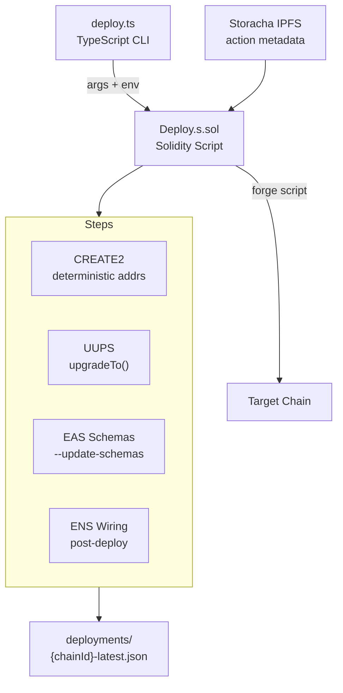

import {NextBestAction, StatusBadge} from "@site/src/components/docs";

# Contract Deployments

<StatusBadge status="Live" />



Smart contract deployment uses a two-layer system: a TypeScript CLI (`deploy.ts`) that orchestrates the process and shells out to a Solidity deploy script (`Deploy.s.sol`) via `forge script`.

## Deployment Checklist

1. Ensure all environment variables are set in the root `.env` (see [Build Environments](#build-environments))
2. Run `bun run test` and `bun build:full` in `packages/contracts` to verify tests pass and contracts compile
3. Run a dry-run simulation against the target chain: `bun script/deploy.ts core --network sepolia`
4. Broadcast the deployment: `bun run deploy:sepolia` (or the appropriate chain target)
5. If schema definitions changed, deploy with `--update-schemas` to register EAS schemas on-chain
6. Verify contracts on Etherscan: `bun run verify:etherscan:sepolia`
7. Run full post-deploy verification: `bun run verify:post-deploy:sepolia`
8. Confirm deployment artifacts are written to `packages/contracts/deployments/{chainId}-latest.json`
9. Verify the Envio indexer is tracking the new contract addresses

## Build Environments

### Environment Variables

Deployment requires these environment variables in the root `.env`:

- `DEPLOYER_PRIVATE_KEY` -- Wallet private key for deployment transactions
- `{CHAIN}_RPC_URL` -- RPC endpoint for the target chain (e.g., `SEPOLIA_RPC_URL`)
- `ETHERSCAN_API_KEY` -- For contract verification
- `VITE_STORACHA_KEY` -- Ed25519 principal key for IPFS uploads

### Release Gate

A Sepolia gate prevents accidental mainnet deployments. To deploy to chains other than Sepolia, pass `--override-sepolia-gate` to confirm intent.

### IPFS Metadata

Action metadata is uploaded to IPFS via Storacha during deployment:

```bash
# Manual IPFS upload
cd packages/contracts && bun run ipfs:upload

# Skip IPFS during broadcast (uses placeholders)
SKIP_IPFS_UPLOAD=true bun run deploy:sepolia
```

The IPFS cache at `packages/contracts/.ipfs-cache.json` prevents re-uploading unchanged metadata.

## Making A Deployment

### Deployment Architecture

#### CLI Layer (`deploy/cli.ts`)

The `DeploymentCLI` class parses arguments and delegates to specialized deployers:

- `CoreDeployer` (`deploy/core.ts`) -- Core protocol contracts
- `GardensDeployer` (`deploy/gardens.ts`) -- Garden instances
- `ActionsDeployer` (`deploy/actions.ts`) -- Action templates
- `OctantFactoryDeployer` (`deploy/octant-factory.ts`) -- Octant vault factory

#### Solidity Layer (`Deploy.s.sol`)

The Solidity script uses CREATE2 for deterministic addresses. Contracts that already exist at their computed address are skipped via `_isDeployed()`.

Key behaviors:
- `_ensureHatsTree()` mints the communityHat to the HatsModule from an existing tree
- Resolver proxies are deployed via CREATE2; implementation upgrades run unconditionally after the proxy exists
- IPFS metadata upload uses `npx tsx` (not `bun run`) due to `@storacha/client` Bun compatibility issues

### Deployment Commands

#### Dry Run (Simulation)

```bash
# Simulate against real chain state (no broadcast)
cd packages/contracts
bun script/deploy.ts core --network sepolia

# Pure simulation (no RPC state mutation)
bun run deploy:preflight:sepolia
```

#### Broadcast (Live Deploy)

```bash
# Deploy to Sepolia
bun run deploy:sepolia

# Deploy to Arbitrum
bun run deploy:arbitrum

# Deploy to Celo (includes EAS schema registration)
bun run deploy:celo
```

#### Deploy with Schema Updates

```bash
bun script/deploy.ts core --network sepolia --broadcast --update-schemas
```

This registers EAS schemas on-chain after contract deployment. Required when schema definitions change.

### CREATE2 Determinism

All core contracts use CREATE2 for deterministic addresses across chains. This means:

- The same contract gets the same address on every chain (given the same salt and bytecode)
- Re-running deployment skips already-deployed contracts
- Address changes only when constructor args or bytecode change

### Resolver Upgrade Pattern

EAS resolver proxies (Work, WorkApproval, Assessment) follow this pattern:

1. Deploy proxy via CREATE2 (skipped if already exists)
2. Deploy new implementation contract
3. Call `upgradeTo(newImpl)` unconditionally -- this runs even if the proxy existed from a prior deploy

This ensures implementation upgrades are applied regardless of proxy deployment state.

### Auto-Wiring

The TypeScript CLI handles cross-chain ENS wiring automatically:
- Pre-deploy: reads existing state from chain
- Post-deploy: sends `cast` transactions to wire ENS resolver and registrar

### Artifact Generation

Deployment artifacts are written to `packages/contracts/deployments/{chainId}-latest.json`. This file is the single source of truth consumed by all other packages.

### Verification

```bash
# Verify contracts on Etherscan
bun run verify:etherscan:sepolia

# Full post-deploy verification (state + Etherscan + indexer)
bun run verify:post-deploy:sepolia
```

## Resources

<NextBestAction
  title="Next: Deploy the Indexer"
  why="After contracts are deployed, the Envio indexer needs to be configured to track the new contract addresses and events."
  actionLabel="Indexer Deployment"
  actionHref="/builders/deployments/indexer-deploy"
  alternatives={[
    {label: "Deployment Status", href: "/builders/deployments/status"},
    {label: "Client PWA Deployment", href: "/builders/deployments/client-deploy"},
  ]}
/>
