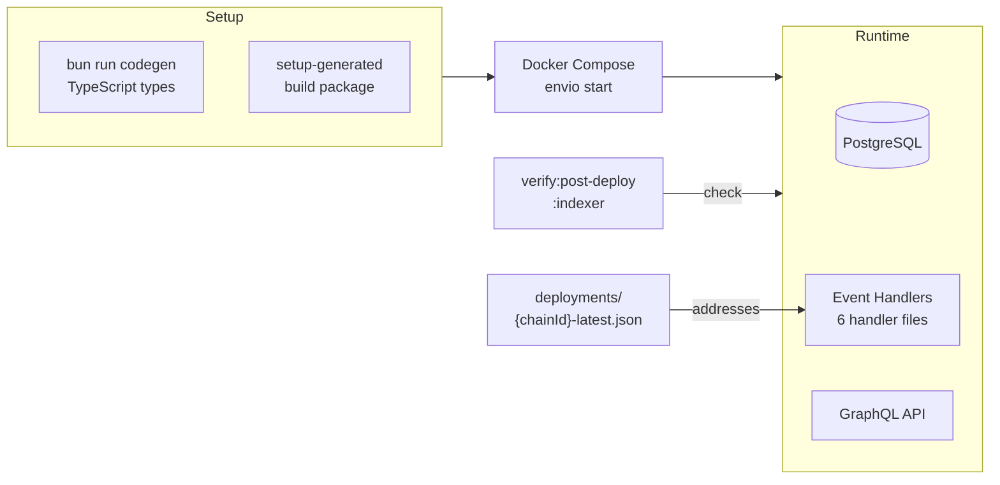

import {NextBestAction, StatusBadge} from "@site/src/components/docs";

# Indexer Deployment

<StatusBadge status="Live" />



The Green Goods indexer uses Envio (v2.32.3) to index on-chain events into a PostgreSQL-backed GraphQL API. Deployment involves codegen, Docker orchestration, and environment configuration.

## Deployment Checklist

1. Ensure contract deployment artifacts exist at `packages/contracts/deployments/{chainId}-latest.json`
2. Run codegen to generate TypeScript types: `cd packages/indexer && bun run codegen`
3. Run `bun run setup-generated` to install and build the generated package
4. Deploy to Envio hosted service: `envio start`
5. Verify the indexer is tracking the correct contract addresses: `bun run verify:post-deploy:indexer:sepolia`
6. Run diagnostics to confirm health: `bun run doctor`
7. Run tests to validate handler logic: `bun run test`

## Build Environments

### Environment Configuration

The indexer reads contract addresses from deployment artifacts. Key environment variables:

- `VITE_ENVIO_INDEXER_URL` -- GraphQL endpoint URL (consumed by frontends)
- Chain-specific RPC URLs for indexing

### Indexing Scope

The indexer package (`packages/indexer/`) indexes Green Goods core state only:

- **Action registry** events (action creation, updates)
- **Garden** events (creation, membership changes)
- **Hats module** events (role assignments)
- **Octant vault** events (deposits, withdrawals)
- **Yield splitter** events (allocation changes)
- **Hypercert** events (minimal linkage and claims)

The indexer does **not** re-index EAS attestations, Gardens V2 community/pools, marketplace activity, ENS lifecycle, cookie jars, or Hypercert display metadata. These are queried directly from their respective APIs.

### Testing

```bash
cd packages/indexer
bun run test        # Run Mocha tests
bun run test:coverage  # With c8 coverage
bun run test:full   # Codegen + setup + test
```

Tests use Mocha with Chai assertions (not Vitest -- the Envio generated package requires this).

## Making A Deployment

### Local Development

#### First-Time Setup

```bash
cd packages/indexer
bun run codegen          # Generate TypeScript types from config
bun run setup-generated  # Install and build generated package
bun run dev              # Start indexer with Docker
```

#### Development Commands

```bash
bun run dev              # Start via dev.sh script
bun run dev:docker       # Start with Docker Compose (attached)
bun run dev:docker:detach  # Start detached
bun run dev:docker:logs  # Follow indexer logs
bun run dev:docker:down  # Stop Docker services
bun run stop             # Kill all indexer processes
```

#### Diagnostics

```bash
bun run doctor           # Check indexer health
bun run doctor:fix       # Auto-fix common issues
bun run check:indexing-boundary  # Verify indexing scope
```

### Envio Hosted Deployment

Production indexers are hosted by Envio. Deployment is triggered by pushing updated configuration:

```bash
cd packages/indexer
bun run codegen
envio start
```

Envio handles PostgreSQL provisioning, scaling, and the GraphQL API layer.

### Post-Deploy Verification

After deploying new contract versions, verify the indexer is tracking the correct addresses:

```bash
# Verify indexer against deployment artifacts
cd packages/contracts
bun run verify:post-deploy:indexer:sepolia

# With local indexer already running
bun run verify:post-deploy:indexer:local:sepolia
```

### Handler Architecture

Event handlers live in `packages/indexer/src/handlers/`:

| Handler | Events Indexed |
|---------|----------------|
| `actionRegistry.ts` | Action creation, metadata updates |
| `garden.ts` | Garden creation, member joins/leaves |
| `hatsModule.ts` | Hat minting, role transfers |
| `hypercerts.ts` | Hypercert claims and linkage |
| `octantVault.ts` | Vault deposits and withdrawals |
| `yieldSplitter.ts` | Yield allocation changes |
| `shared.ts` | Common utilities across handlers |

Handlers use `console.error` for logging (Envio runtime has no logger service).

### Reset and Reindex

To force a full reindex from scratch:

```bash
cd packages/indexer
bun run reset       # Drops data and restarts from block 0
```

This is necessary when handler logic changes affect historical event processing.

## Resources

<NextBestAction
  title="Next: Deploy the Client PWA"
  why="With contracts deployed and the indexer running, the client PWA can be built and deployed to serve users."
  actionLabel="Client PWA Deployment"
  actionHref="/builders/deployments/client-deploy"
  alternatives={[
    {label: "Contract Deployments", href: "/builders/deployments/contracts-deploy"},
    {label: "Admin Deployment", href: "/builders/deployments/admin-deploy"},
  ]}
/>
