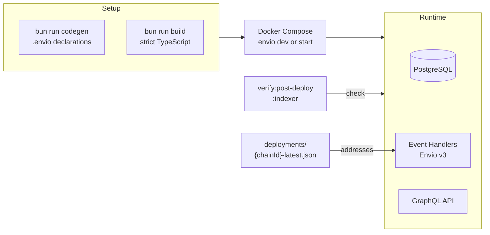

import {NextBestAction, StatusBadge} from "@site/src/components/docs";

# Indexer Deployment

<StatusBadge status="Live" />


```mermaid
graph LR
    subgraph Setup
        CG["bun run codegen\n.envio declarations"]
        SG["bun run build\nstrict TypeScript"]
    end

    Setup --> Docker["Docker Compose\nenvio dev or start"]

    subgraph Runtime
        PG[("PostgreSQL")]
        Handlers["Event Handlers\nEnvio v3"]
        GQL["GraphQL API"]
    end

    Docker --> Runtime
    Artifacts["deployments/\n{chainId}-latest.json"] -->|addresses| Handlers

    Verify["verify:post-deploy\n:indexer"] -->|check| Runtime
```

The Green Goods indexer uses Envio HyperIndex `3.2.1` to index on-chain events into a
PostgreSQL-backed GraphQL API. Local validation and hosted release are separate operations:
`envio dev` is the local runtime, `envio start` is for a production self-hosted runtime, and
Envio Cloud deploys from an approved Git branch.

## Deployment Checklist

1. Ensure contract deployment artifacts exist at `packages/contracts/deployments/{chainId}-latest.json`
2. Run codegen to generate TypeScript types: `cd packages/indexer && bun run codegen`
3. Run `bun run build` and `bun run test`
4. Verify the indexer boundary and configured start blocks: `bun run check:indexing-boundary`
5. Start locally with `bun run dev` and verify GraphQL before any hosted operation
6. Obtain release-owner approval for the Envio Cloud branch, configuration, secrets, reindex,
   cutover, and rollback plan
7. Deploy the approved Git branch through Envio Cloud; local proof is not deployment approval

## Build Environments

### Environment Configuration

The indexer reads its indexed addresses and block boundaries from `config.yaml`. Contract
deployment artifacts remain the source used to reconcile future address changes. Key environment variables:

- `VITE_ENVIO_INDEXER_URL` -- GraphQL endpoint URL (consumed by frontends)
- Chain-specific RPC URLs for indexing

### Indexing Scope

The indexer package (`packages/indexer/`) indexes Green Goods core state only:

- **Action registry** events (action creation, updates)
- **Garden** events (creation, membership changes)
- **Hats module** events (role assignments)
- **Octant vault** events (deposits, withdrawals)
- **Yield splitter** events (allocation changes)
- **Hypercert** events (minimal linkage and claims)

The indexer does **not** re-index EAS attestations, Gardens V2 community/pools, marketplace activity, ENS lifecycle, cookie jars, or Hypercert display metadata. These are queried directly from their respective APIs.

### Testing

```bash
cd packages/indexer
bun run test        # Run Mocha tests
bun run test:coverage  # With c8 coverage
bun run test:full   # Codegen + Envio v3 test indexer
```

Tests use Mocha with Chai assertions and Envio v3 `createTestIndexer`.

## Making A Deployment

### Local Development

#### First-Time Setup

```bash
cd packages/indexer
bun run codegen          # Generate TypeScript types from config
bun run build            # Strictly typecheck handlers and tests
bun run dev              # Start the Envio v3 local runtime
```

#### Development Commands

```bash
bun run dev              # Start with the local database preserved
bun run dev:restart      # Destructive: clear the local database and replay
bun run dev:docker       # Start with Docker Compose (attached)
bun run dev:docker:detach  # Start detached
bun run dev:docker:logs  # Follow indexer logs
bun run dev:docker:down  # Stop Docker services
bun run stop             # Stop (not remove) Envio-managed containers; keeps the database volume
bun run db:down          # Same volume-preserving stop as `stop`
bun run reset            # Destructive: delete the local database and stop Envio
```

`stop` and `db:down` select containers by Envio's `dev.envio.config-hash` label and only stop
them, so `envio-postgres-data` and the indexed state survive. Avoid `envio local docker down`
here: it removes that volume as well as the containers, forcing a full replay from the configured
start blocks.

#### Diagnostics

```bash
bun run doctor           # Check indexer health
bun run check:indexing-boundary  # Verify indexing scope
```

### Envio Cloud deployment

Production indexers are hosted by Envio Cloud and deployed from a configured Git branch. After
the repository proof gates pass, use the repository wrapper to pin the live organisation, indexer,
branch, full commit, monorepo root, and config file. The wrapper drives Envio's separate alpha
`envio-cloud` CLI; it never installs that tool, never falls back to `npx`, and never reads or writes
Envio credentials itself. Pushing code does not authorize deployment, reindexing, or endpoint
cutover.

```bash
cd packages/indexer
bun run codegen
bun run build
bun run test
bun run cloud:release -- --help
bun run cloud:release -- plan --org <frozen-org> --indexer <frozen-indexer> \
  --commit <40-character-commit> --previous-production-commit <rollback-commit> \
  --expected-branch <frozen-branch>
bun run cloud:release -- preflight --org <frozen-org> --indexer <frozen-indexer> \
  --commit <40-character-commit> --previous-production-commit <rollback-commit> \
  --expected-branch <frozen-branch>
```

The read-only preflight requires live `autoDeploy=false`, `rootDir=packages/indexer`,
`configFile=config.yaml`, the exact branch, and the exact commit in Envio Cloud. Deployment,
production promotion, and rollback are three distinct wrapper actions and require three distinct
Phase B authorization values. A deployment starts a full reindex but does not promote the new
endpoint. Verify the fully synced deployment and settlement execution-key/acknowledgment read-back
before separately authorizing promotion. Rollback promotes the named prior production commit; it
is not inferred from deploy or promotion approval.

`bun run start` invokes `envio start` only for a production self-hosted runtime with externally
managed PostgreSQL and Hasura. It is not the Green Goods Envio Cloud deployment command.

### Post-Deploy Verification

After deploying new contract versions, verify the indexer is tracking the correct addresses:

```bash
# Verify indexer against deployment artifacts
cd packages/contracts
bun run verify:post-deploy:indexer:sepolia

# With local indexer already running
bun run verify:post-deploy:indexer:local:sepolia
```

### Handler Architecture

Event handlers live in `packages/indexer/src/handlers/`:

| Handler | Events Indexed |
|---------|----------------|
| `actionRegistry.ts` | Action creation, metadata updates |
| `garden.ts` | Garden creation, member joins/leaves |
| `hatsModule.ts` | Hat minting, role transfers |
| `hypercerts.ts` | Hypercert claims and linkage |
| `octantVault.ts` | Vault deposits and withdrawals |
| `yieldSplitter.ts` | Yield allocation changes |
| `cookieJarFactory.ts` | Cookie Jar creation and metadata |
| `greenWill.ts` | GreenWill badge definitions and issues |

### Reset and Reindex

Envio v3 preserves the local database by default. To force a local reindex from the configured
start blocks:

```bash
cd packages/indexer
bun run dev:restart
```

`dev:restart` and `reset` are destructive to the local Envio database. `stop` and `db:down` stop
the Envio-managed containers while preserving the database volume; `clean` only removes
TypeScript build metadata. A hosted reindex is separately authorized and must include
database/schema compatibility, verification, cutover, and rollback ownership.

## Resources

<NextBestAction
  title="Next: Deploy the Client PWA"
  why="With contracts deployed and the indexer running, the client PWA can be built and deployed to serve users."
  actionLabel="Client PWA Deployment"
  actionHref="/builders/deployments/client-deploy"
  alternatives={[
    {label: "Contract Deployments", href: "/builders/deployments/contracts-deploy"},
    {label: "Admin Deployment", href: "/builders/deployments/admin-deploy"},
  ]}
/>
