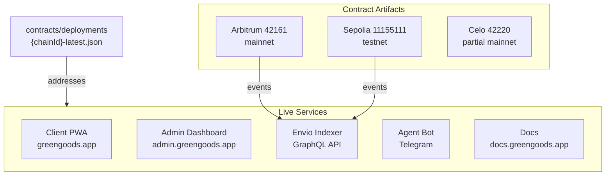

import {NextBestAction, StatusBadge} from "@site/src/components/docs";

# Deployment Status

<StatusBadge status="Live" />



Overview of deployed Green Goods services, chain artifacts, and activation boundaries. A chain can have contract artifacts without having every schema, optional module, frontend build, or indexer surface active.

## Service Endpoints

| Service | Environment | URL |
|---------|-------------|-----|
| Client PWA | Production | `greengoods.app` |
| Admin Dashboard | Production | `admin.greengoods.app` |
| Documentation | Production | `docs.greengoods.app` |
| Envio Indexer | Production | Hosted by Envio (GraphQL endpoint in `.env`) |
| Agent Bot | Production | Telegram bot service |

## Chain Deployments

Contract addresses are stored in deployment artifacts at `packages/contracts/deployments/{chainId}-latest.json`. This file is the single source of truth for all addresses.

### Chain Readiness

| Chain | Chain ID | Contract artifact | EAS schemas | Indexer coverage | Notes |
|-------|----------|-------------------|-------------|------------------|-------|
| Sepolia | 11155111 | Present | Work / WorkApproval / Assessment configured in artifact | Present in `packages/indexer/config.yaml` | Primary testnet/development chain |
| Arbitrum | 42161 | Present | Work / WorkApproval / Assessment configured in artifact | Present in `packages/indexer/config.yaml` | Primary production mainnet target |
| Celo | 42220 | Present | Work schema UID present; Assessment and WorkApproval schema UIDs are zero in artifact | Not present in `packages/indexer/config.yaml` | Partial mainnet artifact; do not describe as fully indexed/activated |

The target chain is set by `VITE_CHAIN_ID` at build time. Each frontend build is single-chain.

### Optional Module Readiness

Zero addresses in deployment artifacts mean the module is not active on that chain. Optional modules should not be described as live until the relevant module address, schema/indexer state, and UI route are all verified.

| Surface | Current docs posture | Activation signal |
| --- | --- | --- |
| Hats roles | Live | Non-zero Hats module + role events indexed for the target chain |
| Cookie Jar | Implemented, activation pending deployment | Non-zero Cookie Jar module plus active admin/shared flows |
| Octant vaults | Implemented, activation pending deployment | Non-zero vault/module addresses and indexed vault events |
| Hypercerts | Implemented, activation pending deployment | Non-zero Hypercert module/marketplace addresses and supported chain path |
| GreenWill | Implemented, activation pending deployment | Non-zero GreenWill registry in artifacts and indexer config |

### Deployment Artifact Structure

Each `{chainId}-latest.json` file contains addresses for all deployed contracts:

- `accountProxy` / `gardenAccountImpl` / `gardenToken` -- Garden TBA system
- `actionRegistry` / `deploymentRegistry` -- Protocol registries
- `assessmentResolver` / `workResolver` / `workApprovalResolver` -- EAS resolvers
- `eas.address` / `eas.schemaRegistry` -- EAS infrastructure
- `rootGarden` -- Root garden address and token ID
- `hats.*` -- Hats Protocol tree addresses

Zero addresses indicate a module has not been deployed yet. This is not a blocker for optional modules.

## Hats Protocol Trees

Each chain has a dedicated Hats tree for role management:

| Chain | Tree ID | Community Hat |
|-------|---------|---------------|
| Sepolia | 2022 | `0x000007e60002...` |
| Arbitrum | 92 | `0x0000005c0002...` |
| Celo | 31 | `0x0000001f0002...` |

## Verification

### Post-Deploy Verification

After any deployment, run the verification suite:

```bash
# Full verification (contract state + Etherscan)
cd packages/contracts && bun run verify:post-deploy:sepolia

# Etherscan verification only
cd packages/contracts && bun run verify:etherscan:sepolia

# Verify with indexer runtime check
cd packages/contracts && bun run verify:post-deploy:indexer:sepolia
```

### EAS Immutable Validation

Resolver contracts have immutable `_eas` references that must match the chain's EAS deployment:

```bash
cd packages/contracts && node script/validate-eas-immutables.mjs
cd packages/contracts && node script/validate-resolver-eas.mjs
```

## Health Monitoring

### Checking Deployment Status

```bash
cd packages/contracts && bun run status
```

This reads the deployment artifacts and reports which contracts are deployed, their addresses, and whether they are verified on Etherscan.

### Indexer Health

The indexer exposes a GraphQL endpoint. Query `_metadata` for sync status:

```graphql
{
  _metadata {
    lastProcessedBlockNumber
    lastProcessedTimestamp
  }
}
```

<NextBestAction
  title="Next: Deploy Contracts"
  why="Learn how the two-layer deployment system (TypeScript CLI + Solidity script) deploys and upgrades smart contracts."
  actionLabel="Contract Deployments"
  actionHref="/builders/deployments/contracts-deploy"
  alternatives={[
    {label: "Indexer Deployment", href: "/builders/deployments/indexer-deploy"},
    {label: "Client PWA Deployment", href: "/builders/deployments/client-deploy"},
  ]}
/>
