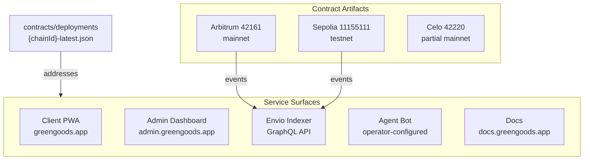

import {NextBestAction, StatusBadge} from "@site/src/components/docs";

# Deployment Status

<StatusBadge status="Live" />



Overview of deployed Green Goods services, chain artifacts, and activation boundaries. A chain can have contract artifacts without having every schema, optional module, frontend build, or indexer surface active.

## Service Endpoints

| Service | Environment | URL |
|---------|-------------|-----|
| Client PWA | Production | `greengoods.app` |
| Admin Dashboard | Production | `admin.greengoods.app` |
| Documentation | Production | `docs.greengoods.app` |
| Envio Indexer | Production | Hosted by Envio (GraphQL endpoint in `.env`) |
| Agent Bot | Operator-configured | Telegram bot runtime; package README includes deployment examples and a Fly.io hostname, but no checked-in Fly config or deployment manifest verifies an active production endpoint |

## Chain Deployments

Contract addresses are stored in deployment artifacts at `packages/contracts/deployments/{chainId}-latest.json`. This file is the single source of truth for all addresses.

### Chain Readiness

| Chain | Chain ID | Contract artifact | EAS schemas | Indexer coverage | Notes |
|-------|----------|-------------------|-------------|------------------|-------|
| Sepolia | 11155111 | Present | Work / WorkApproval / Assessment configured in artifact | Present in `packages/indexer/config.yaml` | Primary testnet/development chain |
| Arbitrum | 42161 | Present | Work / WorkApproval / Assessment configured in artifact | Present in `packages/indexer/config.yaml` | Primary production mainnet target |
| Celo | 42220 | Present | Work schema UID present; Assessment and WorkApproval schema UIDs are zero in artifact | Not present in `packages/indexer/config.yaml` | Partial mainnet artifact; do not describe as fully indexed/activated |

The target chain is set by `VITE_CHAIN_ID` at build time. Each frontend build is single-chain.

### Module Readiness By Surface

Deployment artifacts, indexer config, and UI routes are separate readiness signals. A non-zero module address means the contract surface is deployed on that chain; it does not automatically mean every event is indexed or every user-facing route is production-ready.

| Surface | Arbitrum 42161 | Sepolia 11155111 | Celo 42220 | Indexer coverage | UI/code surface |
| --- | --- | --- | --- | --- | --- |
| Hats roles | Module deployed | Module deployed | Module not deployed | `HatsModule` events configured for Arbitrum/Sepolia | Shared role hooks and admin role views |
| Cookie Jar | Module deployed | Module deployed | Module not deployed | No dedicated `CookieJarModule` contract in `config.yaml`; yield split amounts are indexed through `YieldSplitter` | Admin Hub Cookie Jar modals and shared Cookie Jar hooks |
| Octant vaults | Module/factory deployed | Module/factory deployed | Module not deployed | `OctantModule`, dynamic `OctantVault`, and `YieldSplitter` events configured for Arbitrum/Sepolia | Admin vault views and shared vault hooks |
| Hypercerts | Module and marketplace adapter deployed | Module and marketplace adapter deployed | Module not deployed | `HypercertMinter` events configured; marketplace adapter events are not currently configured | Admin Hypercert wizard/listing components and shared Hypercert hooks |
| Gardens V2 | Module deployed | Module deployed | Module not deployed | `GardensModule` events are not currently configured | Admin signal-pool view and shared conviction hooks |
| Karma GAP | Module deployed | Module deployed | Module not deployed | No dedicated `KarmaGAPModule` contract in `config.yaml`; resolver calls are not indexed as module events | Contract/resolver support; no standalone reporting UI verified |
| ENS | `greenGoodsENS` deployed; `ensReceiver` zero | `greenGoodsENS` and `ensReceiver` deployed | Not deployed | `GreenGoodsENS` events are not currently configured | Shared ENS/profile hooks |
| GreenWill | No deployment artifact field; indexer address zero | No deployment artifact field; indexer address zero | No deployment artifact field; indexer address zero | Handlers exist, but `GreenWill` address is zero in `config.yaml` | Admin/client badge surfaces are implementation-gated |

### Deployment Artifact Structure

Each `{chainId}-latest.json` file contains addresses for all deployed contracts:

- `accountProxy` / `gardenAccountImpl` / `gardenToken` -- Garden TBA system
- `actionRegistry` / `deploymentRegistry` -- Protocol registries
- `assessmentResolver` / `workResolver` / `workApprovalResolver` -- EAS resolvers
- `eas.address` / `eas.schemaRegistry` -- EAS infrastructure
- `rootGarden` -- Root garden address and token ID
- `hats.*` -- Hats Protocol tree addresses

Zero addresses or missing module keys indicate a module has not been deployed or wired for that chain yet. This is not a blocker for unrelated protocol surfaces.

## Hats Protocol Trees

Hats tree constants are defined in `packages/contracts/src/lib/Hats.sol`; module deployment determines whether they are active for a chain:

| Chain | Tree ID | Community Hat |
|-------|---------|---------------|
| Sepolia | 2022 | `0x000007e60002...` |
| Arbitrum | 92 | `0x0000005c0002...` |
| Celo | 31 | `0x0000001f0002...` |

## Verification

### Post-Deploy Verification

After any deployment, run the verification suite:

```bash
# Full verification (contract state + Etherscan)
cd packages/contracts && bun run verify:post-deploy:sepolia

# Etherscan verification only
cd packages/contracts && bun run verify:etherscan:sepolia

# Verify with indexer runtime check
cd packages/contracts && bun run verify:post-deploy:indexer:sepolia
```

### EAS Immutable Validation

Resolver contracts have immutable `_eas` references that must match the chain's EAS deployment:

```bash
cd packages/contracts && node script/validate-eas-immutables.mjs
cd packages/contracts && node script/validate-resolver-eas.mjs
```

## Health Monitoring

### Checking Deployment Status

```bash
cd packages/contracts && bun run status
```

This reads the deployment artifacts and reports which contracts are deployed, their addresses, and whether they are verified on Etherscan.

### Indexer Health

The indexer exposes a GraphQL endpoint. Query `_metadata` for sync status:

```graphql
{
  _metadata {
    lastProcessedBlockNumber
    lastProcessedTimestamp
  }
}
```

<NextBestAction
  title="Next: Deploy Contracts"
  why="Learn how the two-layer deployment system (TypeScript CLI + Solidity script) deploys and upgrades smart contracts."
  actionLabel="Contract Deployments"
  actionHref="/builders/deployments/contracts-deploy"
  alternatives={[
    {label: "Indexer Deployment", href: "/builders/deployments/indexer-deploy"},
    {label: "Client PWA Deployment", href: "/builders/deployments/client-deploy"},
  ]}
/>
