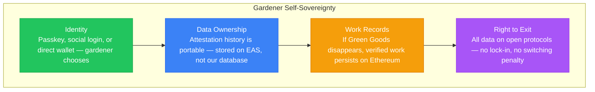

import {NextBestAction} from "@site/src/components/docs";

# Ethereum Alignment

Green Goods is built on Ethereum because Ethereum's core promises — **self-sovereignty** and **sovereignty-preserving coordination at scale** — are exactly what regenerative communities need. This page maps how Green Goods embodies the [Ethereum Foundation Mandate](https://ethereum.foundation/mandate) and tracks our ongoing alignment work.

---

## Why This Matters

The Ethereum Foundation Mandate establishes that Ethereum exists to provide two things:

1. **Self-sovereignty** — users have final say over their identities, assets, actions, and agents
2. **Sovereignty-preserving coordination at scale** — communities can organize without violating individual freedom

Green Goods extends both promises to communities that have never heard of Ethereum — waste collectors in Cape Town, agroforesters in Brazil, solar teams in Nigeria, students in Uganda. These are the "fellow travelers" the EF Mandate explicitly names:

> *"On the horizon are our friends working for clean air, and for regenerative and sustainable habitats and permaculture... for forkable technology transfer; free open source collaboration in science, software, hardware, health..."*

We don't need to retrofit alignment. Green Goods was born from these values.

---

## CROPS: Our Non-Negotiable Properties

The EF Mandate defines **CROPS** — Censorship Resistance, Open Source, Privacy, Security — as the sine qua non of all Ethereum development. Here is how Green Goods upholds each property.

### Censorship Resistance

**No actor can selectively exclude valid use or break functionality.**

| Property | How Green Goods Delivers |
|----------|--------------------------|
| **Permanent records** | Work submissions, approvals, and assessments are recorded as [EAS attestations](https://attest.org) — on-chain, immutable, and independent of any platform |
| **On-chain governance** | [Hats Protocol](https://www.hatsprotocol.xyz) roles are transparent and verifiable — no hidden admin can silently revoke a gardener's standing |
| **Offline-first** | The client PWA works without internet; submissions queue locally in IndexedDB and sync when connectivity returns. No centralized server can prevent a gardener from documenting their work |
| **Permissionless contracts** | All Green Goods smart contracts are deployed on public chains. Anyone can interact with them directly |

**Active work to strengthen:**

- Building a direct EOA submission fallback for when the Pimlico paymaster is unavailable (the "zero option" the EF demands for every intermediated function)
- Documenting self-hostable indexer configuration so communities aren't dependent on Envio
- Ensuring all contract read functions work via direct RPC, independent of any indexer

### Open Source and Free, as in Freedom

**No privileged code or hidden specifications.**

| Property | How Green Goods Delivers |
|----------|--------------------------|
| **Fully open source** | The entire monorepo — contracts, client, admin, shared libraries, indexer, agent — is publicly available and auditable |
| **Forkable** | Any community can fork Green Goods, deploy their own contracts, and run their own instance. The architecture explicitly supports this |
| **Open protocols** | We build on open standards (EAS, Hats, ERC-4626, ERC-6551, ERC-4337) rather than proprietary infrastructure |
| **Public specs** | Product specifications, architecture diagrams, and integration docs are all published in our documentation site |

All Green Goods code uses permissive licensing. We commit to never changing to a source-available or restrictive license.

### Privacy

**User data is not exposed beyond necessity or against their interests.**

| Property | How Green Goods Delivers |
|----------|--------------------------|
| **Passkey biometrics stay on-device** | Biometric data never leaves the secure enclave. No server ever sees a gardener's fingerprint or face |
| **Local-first data** | Work submissions are composed and stored locally before any network transmission |
| **No tracking** | The client PWA does not include analytics, advertising SDKs, or behavioral tracking |
| **Selective disclosure** | Gardeners choose what to submit and when. The platform does not surveil or auto-capture |

**Active work to strengthen:**

- Investigating encrypted IPFS storage for sensitive community data (photos of work sites may reveal locations of vulnerable communities)
- Exploring zero-knowledge proofs of work completion that verify impact without revealing underlying evidence to all parties
- Evaluating protocol-level privacy features as Ethereum develops them

### Security

**Things must do what they claim to do, no more and no less.**

| Property | How Green Goods Delivers |
|----------|--------------------------|
| **Schema-validated attestations** | EAS resolvers enforce that work submissions, approvals, and assessments conform to their schemas — no invalid data enters the chain |
| **On-chain role enforcement** | Smart contracts verify Hats Protocol roles before permitting actions. No UI-only access control |
| **UUPS upgradeable proxies** | Contracts are upgradeable for bug fixes, but upgrade authority is governed by the Hats tree — not a single admin key |
| **Modular architecture** | Optional modules (Octant vaults, Gardens V2, Cookie Jar, ENS) degrade gracefully. A failure in one module cannot break the core system |

---

## Self-Sovereignty in Practice

The EF Mandate's first fundamental principle is that **a user has the final say over their identities, assets, actions, and agents**. Here is how this manifests in Green Goods:

### The Walkaway Test

The EF's ultimate goal is for Ethereum to pass the **walkaway test** — functioning even if the Foundation disappeared. We hold ourselves to the same standard.

| Component | Survives Walkaway? | Notes |
|-----------|:------------------:|-------|
| EAS attestations | Yes | On-chain, permanent, schema-validated |
| Hats Protocol roles | Yes | On-chain, governed by hat tree |
| Vault deposits | Yes | ERC-4626 standard — depositors can withdraw directly via contract |
| Smart contracts | Yes | Deployed, verified, interactable by anyone |
| Client PWA | Partial | Service worker caches enable offline use, but hosting required |
| Indexer | Partial | Envio-hosted; self-host path being documented |
| Paymaster | Partial | Pimlico dependency; direct wallet submission as fallback |

**Our commitment**: Every intermediary Green Goods relies on will have a documented, functional "zero option" — a direct path that works without that intermediary. This is an ongoing engineering priority, not a future aspiration.

---

## Sovereignty-Preserving Coordination

The EF Mandate's second fundamental principle is that **self-sovereignty must scale without violating anyone else's**. Green Goods demonstrates this through community coordination that respects individual agency:

- **Gardens are voluntary** — Gardeners join and leave freely. No lock-in, no penalty for exit
- **Roles are transparent** — Every permission is visible on-chain via Hats Protocol. No hidden authority
- **Governance is participatory** — Conviction voting through Gardens V2 lets communities allocate resources without majority tyranny
- **Impact is portable** — A gardener's verified work history travels with them. It belongs to them, not to the garden or platform
- **Capital is non-extractive** — Vault deposits protect depositor claim value. Yield flows to community operations, not platform extraction

### Not a Platform — A Protocol

The EF Mandate explicitly warns against platform dynamics. Green Goods is designed as **open infrastructure**, not a walled garden:

| What We Are | What We Are Not |
|-------------|-----------------|
| Open protocol for impact verification | A platform that owns community data |
| Forkable infrastructure anyone can run | A service with vendor lock-in |
| Public goods tooling for regenerative work | A product studio extracting from users |
| Community-governed via on-chain roles | A company with centralized admin control |

---

## Right Association

The EF Mandate states: *"We prioritize working with individuals and teams who share our principles, spread them, and make their work legible."*

Green Goods builds exclusively on **commons-aligned, open-source protocols**:

| Integration | Why It Aligns |
|-------------|---------------|
| [Ethereum Attestation Service](https://attest.org) | Open, permissionless attestation infrastructure |
| [Hats Protocol](https://www.hatsprotocol.xyz) | On-chain, transparent, forkable role management |
| [Hypercerts](https://hypercerts.org) | Open standard for impact certificates |
| [Gardens V2](https://gardens.fund) | Conviction voting — governance without majority tyranny |
| [Octant](https://octant.build) | Public goods funding through yield distribution |
| [ERC-4337 (Account Abstraction)](https://eips.ethereum.org/EIPS/eip-4337) | Self-sovereign smart accounts, gasless transactions |
| [ERC-6551 (Tokenbound)](https://eips.ethereum.org/EIPS/eip-6551) | Each garden is an NFT with its own smart contract account |

None of these are proprietary, VC-gated, or extractive. All are forkable, auditable, and designed for the commons.

---

## Our Alignment Roadmap

Alignment is not a checkbox — it's ongoing work. Here is where we are and where we're headed.

### Completed

- [x] All code open source with permissive licensing
- [x] Core data (attestations, roles, vaults) stored on-chain and portable
- [x] Offline-first architecture ensuring self-sovereignty over connectivity
- [x] Passkey authentication eliminating wallet/seed phrase barriers
- [x] Modular contract design with graceful degradation
- [x] Community governance via on-chain Hats Protocol roles

### In Progress

- [ ] Direct EOA submission fallback (zero option for paymaster)
- [ ] Self-hostable indexer documentation and tooling
- [ ] Privacy-preserving evidence storage (encrypted IPFS)
- [ ] Walkaway test simulation — verify communities can operate independently

### Planned

- [ ] Zero-knowledge proofs for selective work disclosure
- [ ] Community-run infrastructure playbook ("Garden Survival Kit")
- [ ] Formal CROPS compliance audit of all contract modules
- [ ] Cross-layer analysis per EF Mandate Quandary 2 — ensuring no user chokepoints exist across the full stack

---

## Living Resources

This section links to ongoing updates, research, and community discussions about Ethereum alignment and the broader regenerative ecosystem. These are living references — they evolve as the ecosystem does.

### Ethereum Foundation

- [The Ethereum Foundation Mandate](https://ethereum.foundation/mandate) — The full mandate document that this page responds to
- [ethereum.org](https://ethereum.org) — Ethereum's community-maintained portal
- [EF Blog](https://blog.ethereum.org) — Official updates from the Ethereum Foundation
- [EF Ecosystem Support Program](https://esp.ethereum.foundation) — Grants and support for aligned projects

### Regenerative Ecosystem

- [Greenpill Network](https://greenpill.network) — The broader community of builders and gardeners
- [Hypercerts Foundation](https://hypercerts.org) — Impact certificate standard and marketplace
- [Gitcoin](https://gitcoin.co) — Public goods funding and Gitcoin Passport
- [Octant](https://octant.build) — Public goods staking and epoch funding
- [Kernel](https://kernel.community) — Web3 educational community aligned with regenerative values

### Research & Standards

- [EAS Documentation](https://docs.attest.org) — Ethereum Attestation Service technical docs
- [Hats Protocol Docs](https://docs.hatsprotocol.xyz) — Role-based access control for DAOs
- [ERC-4337](https://eips.ethereum.org/EIPS/eip-4337) — Account abstraction standard
- [ERC-6551](https://eips.ethereum.org/EIPS/eip-6551) — Token-bound accounts standard
- [ERC-4626](https://eips.ethereum.org/EIPS/eip-4626) — Tokenized vault standard

### Community Voices

*As blog posts, talks, and articles are published about Green Goods' alignment work, they will be added here.*

- *Coming soon: "CROPS and Regeneration" — How censorship resistance, open source, privacy, and security serve environmental communities*
- *Coming soon: "The Walkaway Test for Impact Platforms" — What happens when the platform disappears?*
- *Coming soon: "Beyond Crypto" — Bringing Ethereum's promises to communities that need them most*

:::note Contributing to this page
This is a living document. If you've written about Green Goods' alignment with Ethereum's mission, or if you spot an area where we can strengthen our CROPS properties, open an issue or submit a PR. The alignment work belongs to the community, not to any single team.
:::

---

<NextBestAction
  title="Next: Architecture"
  why="See how these alignment principles are reflected in Green Goods' technical architecture — from contract modules to the offline-first data layer."
  actionLabel="Architecture Overview"
  actionHref="/builders/architecture"
  alternatives={[
    { label: "Integrations", href: "/builders/integrations" },
    { label: "Why We Build", href: "/community/why-we-build" }
  ]}
/>
