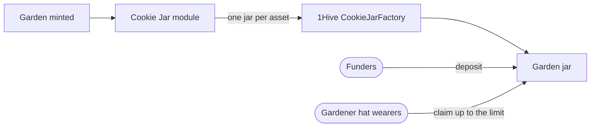

import {IntegrationProjection} from "@site/src/components/docs";

# Cookie Jar

Cookie Jars let a garden's community hand out small, capped allowances without a proposal for
every withdrawal. Where vaults hold an endowment, a jar holds spending money; it's the difference
between a treasury and a kitchen tin everyone trusts each other to dip into.

The jars come from [1Hive's Cookie Jar](https://github.com/1Hive/cookie-jar) protocol. When a
garden is minted, the Green Goods Cookie Jar module deploys one jar per supported asset through
1Hive's `CookieJarFactory`. Only people wearing the garden's gardener [hat](./hats) can claim;
hats are ERC-1155 tokens, so the jar checks them directly. Each asset also has its own per-claim
limit.

## How it flows

Jars are created with the garden, filled by funders, and emptied a little at a time by the people
doing the work.

## Where it lives in the code

| Layer | Source |
|---|---|
| Module | `packages/contracts/src/modules/CookieJar.sol` |
| Factory interface | `packages/contracts/src/interfaces/ICookieJarFactory.sol` |
| Data access | `packages/shared/src/modules/data/campaign-cookie-jars.ts` |
| Hooks | `packages/shared/src/hooks/cookie-jar` |

The jars themselves are 1Hive's contracts. The module above is the Green Goods side that creates
and configures them.

<IntegrationProjection id="cookie-jar" />

## Working with it locally

The [fork mode](../getting-started#other-modes) (`bun run dev -- fork`) runs a local fork of
Arbitrum One with the factory and module present, so jar creation and claim flows run locally
without real funds.

## Canonical upstream docs

- [1Hive Cookie Jar](https://github.com/1Hive/cookie-jar) is the upstream protocol behind every
  jar.
- [1hive.org](https://1hive.org) for the community that maintains the protocol.
- [ERC-1155](https://eips.ethereum.org/EIPS/eip-1155), the multi-token standard behind a jar's
  membership gating.

## Next steps

- [Hats Protocol](/builders/integrations/hats) explains the gardener hat that decides who can claim.
- [Octant](/builders/integrations/octant) covers the vault's endowment, the long-term money next to a jar's spending money.
- [`CookieJar.sol`](https://github.com/greenpill-dev-guild/green-goods/blob/develop/packages/contracts/src/modules/CookieJar.sol)
  shows how the module sets up a garden's jars.
- The public [Cookies page](https://greengoods.app/cookies) shows jars in the product.
