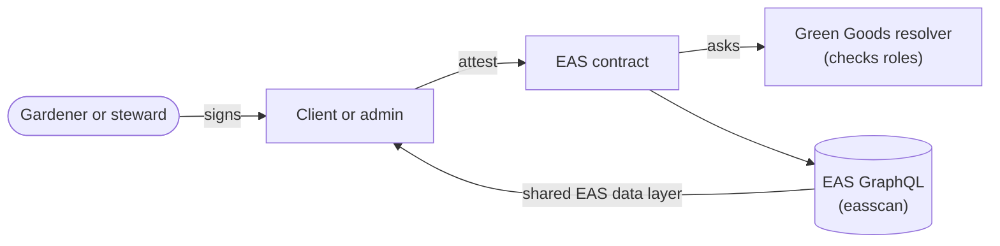

# EAS (Attestation Service)

The [Ethereum Attestation Service](https://docs.attest.org/docs/welcome) is where Green Goods
records its claims about work. Work submitted, work approved, and an assessment authored are all
EAS attestations, and that's a deliberate choice: attestations are portable, signed, inspectable
records that outlive any app Green Goods ships. (Commitments are the exception; they live in their
own contracts.)

What makes the integration more than "we write attestations" is the resolver pattern. Each Green
Goods schema is bound to a resolver contract that validates authorization at write time, so an
approval signed by someone without steward authority cannot be recorded at all. Meaning is enforced,
not implied.

## The records

- A **Work** attestation records submitted evidence for a garden and action.
- A separate **Work Approval** attestation records the steward's decision, referencing the work it
  judges.
- An **Assessment** attestation records evaluation strategy and its content reference.

The [Anatomy of a Work Submission](../architecture/anatomy) follows one record through the whole
stack, and the [Data Model](../architecture/data-model) shows how they relate.

## How it flows

Here's the path one record takes, from a signature to the pages that show it. The resolver can
refuse the write, so any record you can read has already passed its role check.

## Where it lives in the code

| Layer | Source |
|---|---|
| Resolvers | `packages/contracts/src/resolvers/` (Work, WorkApproval, Assessment) |
| Schema definitions | `packages/contracts/src/Schemas.sol` and `packages/contracts/config/schemas.json` |
| Client-side encode, query, decode | `packages/shared/src/modules/data/eas.ts` |

Schema UIDs and EAS endpoints are different on every chain, so read them from their source
instead of copying them into code or prose. Each chain's deployment artifact lists its schema UIDs
under `schemas` (for Arbitrum One, `packages/contracts/deployments/42161-latest.json`), and the EAS
GraphQL endpoints the apps query live in `packages/shared/src/config/blockchain.ts`.

## Working with it locally

The [fork mode](../getting-started#other-modes) (`bun run dev -- fork`) runs a local fork of
Arbitrum One, so the EAS contracts and Green Goods resolvers are present with real state and no
real gas cost. A successful query with no records is different from an unavailable source;
preserve that distinction in anything you build.

## Canonical upstream docs

- [EAS welcome](https://docs.attest.org/docs/welcome) for the mental model.
- [Schemas](https://docs.attest.org/docs/core--concepts/schemas) for UIDs, resolvers, and
  revocability.
- [The EAS SDK](https://docs.attest.org/docs/developer-tools/eas-sdk), which the shared data layer
  builds on.
- [Per-chain contracts](https://docs.attest.org/docs/quick--start/contracts) for official EAS
  addresses.
- [arbitrum.easscan.org](https://arbitrum.easscan.org) to browse Green Goods records live.

## Next steps

- [Anatomy of a Work Submission](/builders/architecture/anatomy) follows one attestation from a phone to the chain.
- [Hats Protocol](/builders/integrations/hats) explains the roles the resolvers check.
- [Data Model & Ontology](/builders/architecture/data-model) shows how work, approvals, and assessments relate.
