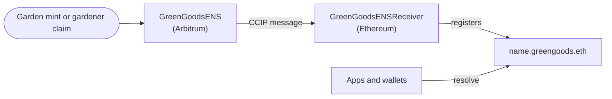

import {IntegrationProjection} from "@site/src/components/docs";

# ENS

[ENS](https://ens.domains) gives gardens and gardeners names under `greengoods.eth`. A garden gets
its name when it's minted, and a gardener can claim one for their profile. Instead of an address,
each carries a human-readable identity that resolves across the ecosystem. The module wires the
registry, the cross-chain receiver, and the resolution paths that make those names work.

## How it flows

Names are registered on Arbitrum and settled on Ethereum, where `greengoods.eth` lives.

## Where it lives in the code

| Layer | Source |
|---|---|
| Registry | `packages/contracts/src/registries/ENS.sol` |
| Resolution hooks | `packages/shared/src/hooks/ens` |
| Recorded components | The `greenGoodsENS` and `ensReceiver` fields in the [deployment record](/builders/reference/deployments) |

<IntegrationProjection id="ens" />

## Working with it locally

The [fork mode](../getting-started#other-modes) (`bun run dev -- fork`) runs a local fork of
Arbitrum One, so recorded name state resolves locally; registering new names against mainnet ENS
needs the real chain.

## Canonical upstream docs

- [ENS documentation](https://docs.ens.domains) for names, resolvers, and cross-chain resolution.
- [ens.domains](https://ens.domains) for the app.
- [Offchain and L2 resolvers](https://docs.ens.domains/resolvers/ccip-read) for CCIP Read, which
  the Green Goods resolver relies on to answer from its own registry.
- [ens-contracts](https://github.com/ensdomains/ens-contracts) for the core protocol contracts.

## Next steps

- [Tokenbound Accounts](/builders/integrations/tokenbound) covers the garden accounts a name stands for.
- [Architecture](/builders/architecture) shows where names fit next to the other modules.
- [Deployment Status](/builders/reference/deployments) lists the recorded ENS contracts per chain.
