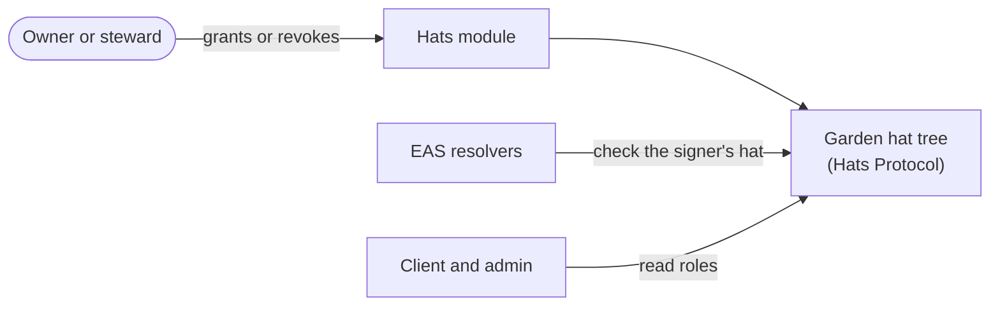

import {IntegrationProjection} from "@site/src/components/docs";

# Hats Protocol

[Hats Protocol](https://docs.hatsprotocol.xyz) provides the on-chain role hierarchy that decides
who may do what in a garden. Gardeners submit work, evaluators attest assessments, and stewards
approve work. Roles stack, so stewards can also do what the roles below them do, and the garden's
owner can do all of it. Because hats are tokens, the
[EAS resolvers](./eas) check them directly at write time, and because each garden's hats form a
tree, its whole authority structure is inspectable at once.

## How it flows

Stewards and the garden's owner manage the tree through the Hats module. Everything else only reads
it.

## Where it lives in the code

| Layer | Source |
|---|---|
| Module | `packages/contracts/src/modules/Hats.sol` |
| Role helpers | `packages/shared/src/utils/blockchain/garden-roles.ts` |
| Persona mapping | The [ontology](../architecture/data-model), which binds each persona to its hat |

## A gotcha worth knowing early

Hats has no on-chain wearer enumeration, and revoking a hat is a transfer. Never build a guard on
hat supply; when you need "who wears this hat", the answer comes from
[the Hats subgraph](https://docs.hatsprotocol.xyz/for-developers/v1-sdk/subgraph), not a contract
call.

<IntegrationProjection id="hats" />

## Working with it locally

The [fork mode](../getting-started#other-modes) (`bun run dev -- fork`) runs a local fork of
Arbitrum One, so the Hats contract and every existing garden tree are available locally without
real gas.

## Canonical upstream docs

- [Hats for developers](https://docs.hatsprotocol.xyz/for-developers/hats-protocol-for-developers)
  for the concepts: hats, trees, wearers, eligibility.
- [The Hats SDK](https://docs.hatsprotocol.xyz/for-developers/v1-sdk/core/getting-started), built
  on viem like this repo.
- [The subgraph](https://docs.hatsprotocol.xyz/for-developers/v1-sdk/subgraph) for wearer queries.
- [Supported chains](https://docs.hatsprotocol.xyz/using-hats/hats-protocol-supported-chains) for
  official addresses.
- [app.hatsprotocol.xyz](https://app.hatsprotocol.xyz) to view a garden's tree.

## Next steps

- [EAS](/builders/integrations/eas) shows where these roles are checked: in the resolvers, at the moment a record is written.
- [Tokenbound Accounts](/builders/integrations/tokenbound) covers the garden account that wears the tree.
- [Anatomy of a Work Submission](/builders/architecture/anatomy) puts the roles to work in one real flow.
