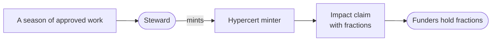

import {IntegrationProjection} from "@site/src/components/docs";

# Hypercerts

[Hypercerts](https://hypercerts.org) turn a body of approved work into a certified impact claim
with ownable fractions. When a steward mints an impact certificate for a garden's season of work,
funders can hold a piece of that claim; it's how verified work becomes something the funding side
can actually own and retro-fund.

## How it flows

In the admin wizard a certificate starts from work that's already approved, so a claim minted
there traces back to real records. The contract does not enforce that rule: `registerHypercert`
checks operator authority, pause state, and that the claim is minted, and
`createAllowlistAndRegister` takes a metadata URI with no Work or Work Approval UID, so an operator
calling the module directly can register any minted claim. Treat approved work as the
application's constraint, not the contract's.

  <figure className="gg-figure">
    
    <figcaption>A steward's view: the Hub's Hypercerts tab, where a garden's certificates are minted and listed.</figcaption>
  </figure>
  <figure className="gg-figure">
    
    <figcaption>The public Impact page, where certificates and the records behind them are read by anyone.</figcaption>
  </figure>

## Where it lives in the code

| Layer | Source |
|---|---|
| Module | `packages/contracts/src/modules/Hypercerts.sol` |
| Data access | `packages/shared/src/modules/data/hypercerts*.ts` (fetch, metadata, repository, attestations) |
| Hooks | `packages/shared/src/hooks/hypercerts` |

The steward-facing flow lives in the community docs'
[minting guide](/community/steward-guide/creating-impact-certificates); these sources are the
machinery under it.

<IntegrationProjection id="hypercerts" />

## Working with it locally

The [fork mode](../getting-started#other-modes) (`bun run dev -- fork`) runs a local fork of
Arbitrum One with the minter and exchange contracts present, so mint flows run locally without
real funds.

## Canonical upstream docs

- [hypercerts.org](https://hypercerts.org) for the standard and its ecosystem.
- [The Hypercerts docs](https://hypercerts.org/docs) for minting, metadata, and fraction
  mechanics.
- [app.hypercerts.org](https://app.hypercerts.org) to browse minted hypercerts and their
  fractions.

## Next steps

- [Anatomy of a Work Submission](/builders/architecture/anatomy) shows the approved work a hypercert bundles.
- [Octant](/builders/integrations/octant) covers the vaults that fund gardens.
- [Karma GAP](/builders/integrations/karma) reports the same progress to grant programs.
