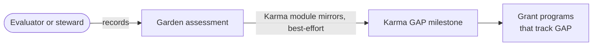

import {IntegrationProjection} from "@site/src/components/docs";

# Karma GAP

[Karma GAP](https://gap.karmahq.xyz) (the Grantee Accountability Protocol) connects garden
activity to project reporting and milestone records. When the module is active, the assessment
resolver tries to mirror each assessment to a GAP milestone, so grant programs that already track
accountability through GAP see Green Goods work in the format they trust. The mirror is
best-effort: a GAP failure is caught so the assessment still succeeds, which means a valid
assessment can exist without its milestone, and anything that correlates the two has to tolerate
or reconcile the missing record.

## How it flows

Evaluators and stewards (and the garden's owner, through the inclusive role checks) record the
assessment once in Green Goods, and the module carries it over to GAP when it can.

## Where it lives in the code

| Layer | Source |
|---|---|
| Module | `packages/contracts/src/modules/Karma.sol` |
| Data access | `packages/shared/src/modules/data/karma.ts` |

<IntegrationProjection id="karma" />

## Working with it locally

The [fork mode](../getting-started#other-modes) (`bun run dev -- fork`) runs a local fork of
Arbitrum One with the module state present; mirroring to the live GAP registry needs the real
chain.

## Canonical upstream docs

- [Karma GAP documentation](https://docs.gap.karmahq.xyz) for projects, grants, and milestones.
- [gap.karmahq.xyz](https://gap.karmahq.xyz) to browse live records.
- [karma-gap-sdk](https://github.com/show-karma/karma-gap-sdk) for reading and writing GAP
  records from code.

## Next steps

- [Making an assessment](/community/steward-guide/making-an-assessment) shows the steward flow that feeds a GAP milestone.
- [Hypercerts](/builders/integrations/hypercerts) turns the same body of work into a claim funders can hold.
- [Deployments & Addresses](/builders/reference/deployments) lists where the Karma module is recorded.
