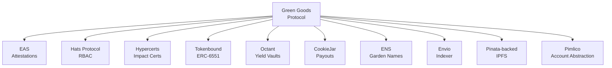

import {FeatureState, NextBestAction, StatusBadge} from "@site/src/components/docs";

# Integrations

<StatusBadge status="Live" />

## Integration surfaces

<FeatureState
  title="Indexer GraphQL"
  status="Live"
  summary="Use for gardens/actions/membership entities and chain-scoped metadata."
/>

<FeatureState
  title="EAS GraphQL"
  status="Live"
  summary="Use for work/approval/assessment attestations and cryptographic traceability."
/>

<FeatureState
  title="Pinata-backed IPFS uploads"
  status="Live"
  summary="Shared hooks and deployment scripts use the Pinata-backed IPFS upload path for media and metadata."
/>

<FeatureState
  title="v1 module integrations"
  status="Implemented (activation pending deployment)"
  summary="Some integrations require non-zero module addresses + indexer updates before production use."
/>

## Reference

- [API Index](../packages/api-index)
- [Agent/MCP Guide](../agentic/mcp-guide)
- [Deployment Status](../deployments/status)

## Entity Matrix

A cross-protocol mapping of Green Goods domain entities to their equivalents across 12 partner protocols. See the [full Entity Matrix](./entity-matrix) for the complete table, protocol notes, and usage guidance.

<NextBestAction
  title="Next best action"
  why="Use canonical endpoint and activation references before implementing or debugging integrations."
  actionLabel="Open API index"
  actionHref="../packages/api-index"
  alternatives={[
    {label: "Deployment status", href: "../deployments/status"},
  ]}
/>
