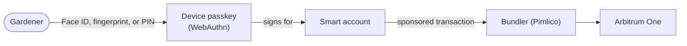

# Passkeys

Gardeners should never need a seed phrase to plant trees. Passkey authentication signs people in
with the platform authenticator they already have (Face ID, a fingerprint, a device PIN) and backs
their identity with a smart account, so field workers get real on-chain records without wallet
onboarding. Wallets remain available for stewards and power users; passkeys are the default path.

## How it flows

A gardener signs with their device, and Green Goods sponsors the gas, so there's no wallet to set
up.

## Where it lives in the code

| Layer | Source |
|---|---|
| Auth hooks and providers | `packages/shared/src/hooks/auth` |
| Runtime wiring and the dev bypass | `packages/client/src/routes/WalletRuntimeProviders.tsx` |

Authentication branches through the shared auth APIs everywhere; no surface implements its own
sign-in. One behavior worth knowing: signing in is not the same as joining a garden, and the two
recover independently.

## Working with it locally

You rarely need a real passkey ceremony in development. The dev-only bypass from
[Getting Started](../getting-started#path-a-run-against-hosted-services)
(`?mockAuth=steward&presentation=pwa`) signs you in as a test identity; real passkey flows are
exercised in the Playwright authentication projects.

## Canonical upstream docs

- [passkeys.dev](https://passkeys.dev) for the practical, platform-by-platform guidance.
- [The WebAuthn specification](https://www.w3.org/TR/webauthn-2/) when you need the exact
  ceremony semantics.

## Next steps

- [Getting Started](/builders/getting-started) lets you try the app with mock auth.
- [Anatomy of a Work Submission](/builders/architecture/anatomy) follows a gardener from sign-in to a recorded submission.
- [Testing Guide](/builders/testing) lists the Playwright projects that exercise sign-in.
