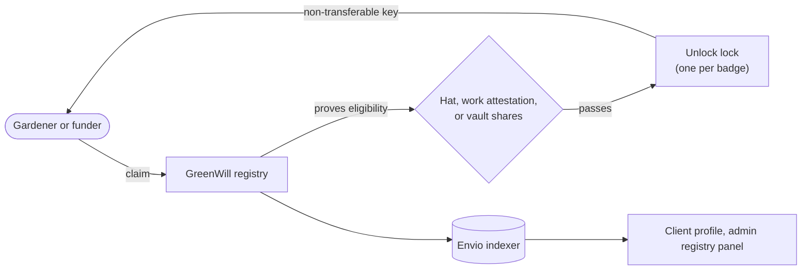

import {IntegrationProjection} from "@site/src/components/docs";

# Unlock Protocol

[Unlock Protocol](https://unlock-protocol.com) is integrated through GreenWill, Green Goods' badge
registry. GreenWill decides who has earned a badge by reading on-chain state at claim time; Unlock
holds the badge itself, as a non-transferable key in a lock. The split is deliberate: the rule
lives in Green Goods, and the credential lives in a standard any wallet or explorer can read.

Three badges exist today, each with its own lock on Arbitrum One: Genesis, First Work, and First
Support. A gardener or funder claims them from their profile in the client app, and stewards can
read the registry's definitions, grants, and holders from the Actions workspace in the admin
cockpit.

## How it flows

A badge is proved, not handed out. The registry checks the claim against the rule configured for
that badge and only then asks the lock for a key.

The three rule kinds read three other parts of the protocol: a [hat](./hats) proves membership, a
work attestation on [EAS](./eas) proves approved work, and vault shares through
[Octant](./octant) prove support. The registry also lets an authorized issuer grant a badge
directly, for the cases a rule cannot express.

## Where it lives in the code

| Layer | Source |
|---|---|
| Registry | `packages/contracts/src/registries/GreenWill.sol` |
| Lock deployment | `packages/contracts/script/deploy/badge-locks.ts` and `script/DeployBadgeLocks.s.sol` |
| Unlock interfaces | `packages/contracts/src/interfaces/IUnlock.sol` |
| Indexer handlers | `packages/indexer/src/handlers/greenWill.ts` |
| Data access | `packages/shared/src/modules/data/greenwill.ts` |
| Hooks | `packages/shared/src/hooks/greenwill` |
| Surfaces | `packages/client/src/views/Profile/Badges.tsx` and `packages/admin/src/views/Actions/GreenWillPanel.tsx` |

The locks are Unlock's own `PublicLock` contracts (version 15), created through the Unlock factory
with lifetime, non-transferable keys. When a claim passes, the registry calls the lock's
`grantKeys` with the claimant as the key's manager, so each lock has to grant the registry that
right. An older `UnlockModule` that granted badges from the work resolver is still in the source
tree but is not deployed; GreenWill replaced it.

<IntegrationProjection id="unlock" />

## Working with it locally

The [fork mode](../getting-started#other-modes) (`bun run dev -- fork`) runs a local fork of
Arbitrum One with the registry and the three locks present, so claims can be exercised without
real funds. `bun run contracts -- deploy badge-locks` and `bun run contracts -- deploy greenwill`
are the [contract operations](../packages/contract-operations) that put them on a network.

## Canonical upstream docs

- [Unlock Protocol documentation](https://docs.unlock-protocol.com/) for the protocol as a whole:
  on-chain memberships as NFTs.
- [Unlock smart contracts](https://docs.unlock-protocol.com/core-protocol/) for the factory and
  `PublicLock`, the two contracts Green Goods talks to.
- [PublicLock Solidity API](https://docs.unlock-protocol.com/core-protocol/smart-contracts-api/PublicLock)
  for `grantKeys`, the call the registry makes when a claim passes.

## Next steps

- [Hats Protocol](/builders/integrations/hats), [EAS](/builders/integrations/eas), and
  [Octant](/builders/integrations/octant) are the three sources a badge rule can read.
- [Deployments & Addresses](/builders/reference/deployments) lists the registry and the three locks
  on Arbitrum One.
- [`GreenWill.sol`](https://github.com/greenpill-dev-guild/green-goods/blob/develop/packages/contracts/src/registries/GreenWill.sol)
  is the registry itself.
