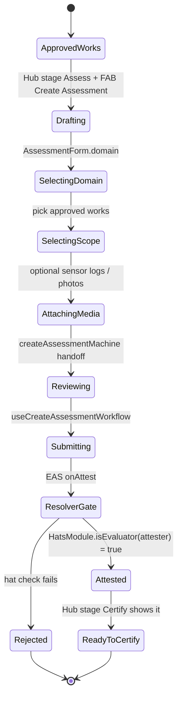

import {StatusBadge} from "@site/src/components/docs";

# Evaluation Journey

<StatusBadge status="Live" />

How approved work is bundled and assessed by the people who can vouch for it. The authority boundary is on-chain: `AssessmentResolver` calls `HatsModule.isEvaluator(attester)` before permitting an EAS attestation. Operators draft and evaluators (hat-holders) attest from the **same admin Garden + Hub surfaces** — visibility and permission are role-permissioned per garden, not split into a separate workspace.

## Personas

- **B: Operator** — drives the Hub Assess stage; bundles approved works into an assessment.
- **C: Evaluator** — domain expert who signs the assessment with the Evaluator hat. Currently has no dedicated UI; evaluators with the hat use the same admin surface as operators.

## State machine

## Entry points

| Entry | Surface | Trigger |
| --- | --- | --- |
| Admin Hub Assess stage | `packages/admin/src/views/Hub/index.tsx` (stage `assess`) | Operator/Evaluator selects garden, clicks FAB "Create Assessment" |
| Garden detail | `packages/admin/src/views/Garden/Assessment.tsx` | Operator opens a specific garden's assessment surface |
| Direct route | `/hub/{garden}/assess/create` (via `adminRoutes.hubAssessCreate`) | Deep link from notification or shared URL |

## Steps

| # | State | Persona | Surface (package + view) | Hook / Service | Side effects | Status |
| --- | --- | --- | --- | --- | --- | --- |
| 1 | ApprovedWorks | B | `admin` / `views/Hub` (stage `assess`) | `useReviewerWorks`, `HubAssessmentQueue` | Read approved Works + WorkApprovals from EAS via `eas.ts` | shipped |
| 2 | Drafting | B / C | `admin` / `views/Hub/CreateAssessment.tsx` | `useCreateAssessmentController`, `useCreateAssessmentForm` (RHF + Zod) | IndexedDB draft via `useAssessmentDraft` | shipped |
| 3 | SelectingDomain | B / C | same | `useCreateAssessmentForm.domain` | Domain mapped to contract enum (`AssessmentSchema.domain` uint8) | shipped |
| 4 | SelectingScope | B / C | same | `useCreateAssessmentForm.workSelection` | Pulls approved work UIDs via `useGardenDerivedState` | shipped |
| 5 | AttachingMedia | B / C | same | shared media upload | IPFS pin via Pinata | shipped |
| 6 | Reviewing | B / C | same | `createAssessmentMachine` (xstate-style state) | UI handoff before submit | shipped |
| 7 | Submitting | B / C | same | `useCreateAssessmentWorkflow` | EAS `attest(AssessmentSchema)` | shipped |
| 8 | ResolverGate | (chain) | `AssessmentResolver` (contracts) | onchain | Calls `HatsModule.isEvaluator(attester)`. **The hat check is the actual evaluator gate, not a UI gate.** | shipped |
| 9 | Attested | C | EAS | indexed via EAS GraphQL → `getGardenAssessments` | Available to Hub Certify stage | shipped |
| 10 | ReadyToCertify | B | `admin` / `views/Hub` (stage `certify`) → `HubCertificationInspector` | `useGardenAssessments`, `useCreateHypercertWorkflow` | Inspector shows the assessment with "Ready to certify" badge when `canMint = true` | shipped |

## Evaluator surface: served by Garden workspace via role-permissioned visibility

Persona C does not have a dedicated workspace and does not need one. Evaluators operate inside the existing **admin Garden workspace** (`packages/admin/src/views/Garden/`) and the **Hub Assess / Certify stages**. What an evaluator sees is gated by their hat membership, not by a separate route or a different UI shell.

The authority boundary is the **on-chain hat check** at `AssessmentResolver.onAttest()` → `HatsModule.isEvaluator(attester)`. That is the gate that decides whether an assessment attestation succeeds; the UI does not enforce a parallel gate. Evaluators with the hat can attest from the same form an operator uses to draft.

In practice that means:

- An evaluator visits a Garden they hold the Evaluator hat on; admin renders the Garden + Hub views with the role-permissioned slots `useEffectiveToolbarPermissions` and `useHasRole` resolve for them.
- The same `useCreateAssessmentWorkflow` produces the EAS attestation regardless of whether the caller is an operator or an evaluator — the resolver is the gate.
- There is no separate evaluator inbox and no public evaluator profile. The fact that an attestation came from a hat-holding evaluator is recoverable from the EAS attestation itself (attester address + on-chain hat membership at attestation time).

## Failure / recovery paths

- **Operator without Evaluator hat tries to submit.** Resolver reverts at `HatsModule.isEvaluator(attester)`. UI surfaces user-friendly text via `parseContractError`. The form draft remains in IndexedDB.
- **No approved works available.** Hub Assess queue renders empty state; FAB still appears but the assessment will fail Zod validation (no `workSelection` items).
- **IPFS pin fails.** `useCreateAssessmentWorkflow` retries via the standard mutation pipeline. Job queue persists the draft.
- **Assessment EAS GraphQL lag.** Newly attested assessments may not appear in `useGardenAssessments` immediately. UI uses delayed invalidation pattern (`useDelayedInvalidation`) — nominal lag is ~2s.

## Connections

- Upstream: [Work Submission](./work-submission) — assessments bundle approved works.
- Downstream: [Harvest](./harvest) — Hub Certify stage takes attested assessments and mints hypercerts. Certification handoff is operator-driven today (`HubCertificationInspector` `canMint` boolean).
- Sequence diagram: [Assessment flow](../architecture/sequence-diagrams#assessment-flow).

## Notes for builders

- Hat tree is set up at garden creation by `HatsModule`; see `packages/contracts/src/modules/HatsModule.sol`. Evaluator hat ID is the third position in the canonical garden hat tuple (Owner / Operator / Evaluator / Gardener / Funder / Community).
- `useEffectiveToolbarPermissions` reads `garden.evaluators[]` as part of the "has any role" check that gates the Work toolbar slot. The Evaluator role grants visibility into the same Garden / Hub surfaces an operator sees; it does not route the user into a separate workspace.
- `useHasRole("evaluator")` (see `packages/shared/src/hooks/roles/`) is the standard hook to gate an evaluator-only affordance inside an existing surface — use it inline in Garden / Hub views, not to fork a new route.
- EAS attestations are queried from `easscan.org`, **not** from the Envio indexer. See the indexer `schema.graphql` comment block at lines 259-264. The attester address on each assessment is the audit trail for which hat-holder signed.
