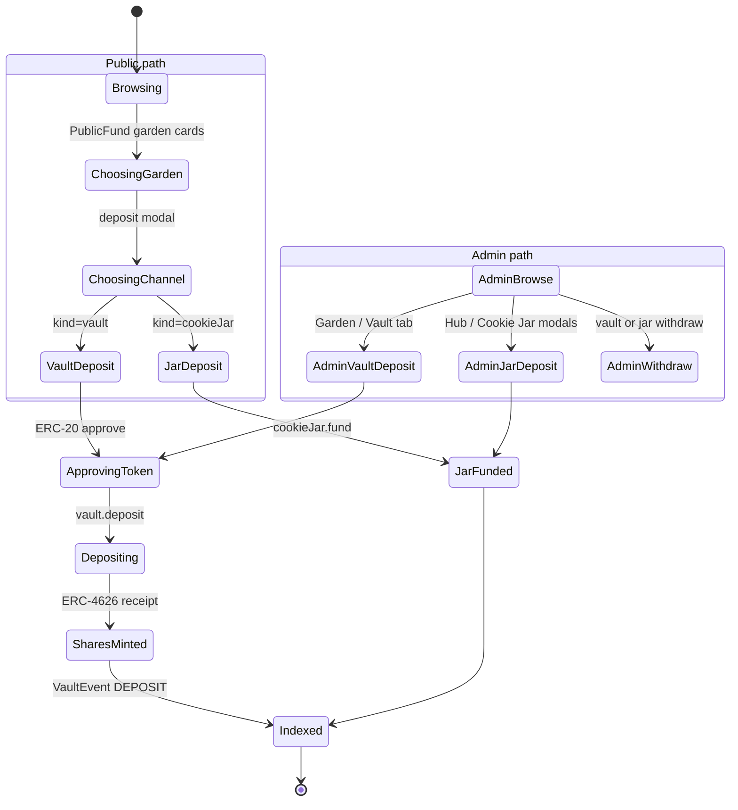

import {StatusBadge} from "@site/src/components/docs";

# Funding Journey

<StatusBadge status="Live" />

How capital enters the Green Goods system. Two parallel mechanisms — the **principal-preserving Octant Vault** (yield-bearing ERC-4626) and the **Cookie Jar** (direct grant pool with on-chain access policy) — and one cross-cutting binding to **Hypercerts** for impact-purchase markets.

## Personas

- **D: Funder (Capital Provider)** — primary subject. Either a public supporter (Public Fund page) or an operator-funder hybrid using the admin dashboard.
- **B: Operator** — administers vault parameters, cookie jar policies, yield split config; does not deposit on behalf of funders.

## State machine

## Entry points

| Entry | Surface | Trigger |
| --- | --- | --- |
| Public PWA | `packages/client/src/views/Public/Fund.tsx` | Anyone visiting `/fund` (no login required to browse; AppKit modal on deposit click) |
| Admin Garden / Vault | `packages/admin/src/views/Garden/Vault.tsx` | Operator-funder picks a garden, opens Vault tab |
| Admin Hub / Cookie Jar | `packages/admin/src/views/Hub/components/CookieJarDepositModal.tsx`, `CookieJarManageModal.tsx`, `CookieJarPayoutPanel.tsx` | Operator opens cookie jar modals from Hub workspace |
| Admin Garden / Strategies | `packages/admin/src/views/Garden/Strategies.tsx`, `SignalPool.tsx` | Operator configures yield split + conviction strategy |

## Steps

### Vault deposit (Persona D)

| # | State | Persona | Surface (package + view) | Hook / Service | Side effects | Status |
| --- | --- | --- | --- | --- | --- | --- |
| 1 | Browsing | D | `client` / `views/Public/Fund` | `useGardens`, `useUser` | Aggregate stats: gardens count, gardener count | shipped |
| 2 | ChoosingGarden + ChoosingChannel | D | `client` / `views/Public/Fund` | local state `activeDialog` | Wallet not yet connected — `useAppKit().open()` if no `primaryAddress` | shipped |
| 3 | ApprovingToken (if needed) | D | `client` / `components/Dialogs/VaultDepositDialog` | `useVaultDeposit`, `useMarketplaceApprovals` (for hypercerts) | ERC-20 `approve(vault, amount)` | shipped |
| 4 | Depositing | D | same | `useVaultDeposit`, `useVaultOperations` | `vault.deposit(assets, receiver)` — vault is ERC-4626 (`OctantVault`) | shipped |
| 5 | SharesMinted | (chain) | EVM | n/a | Vault mints shares to receiver, emits `Deposit` event | shipped |
| 6 | Indexed | (system) | Envio | event handlers | Updates `GardenVault.totalDeposited`, `VaultDeposit.shares`, creates `VaultEvent { eventType: DEPOSIT }` | shipped |
| 7 | UI invalidation | D | client/admin | `useDelayedInvalidation` (~2s) | Funder sees updated balance + success toast | shipped |

### Cookie jar (Persona B configures, Persona D funds)

| # | State | Persona | Surface (package + view) | Hook / Service | Side effects | Status |
| --- | --- | --- | --- | --- | --- | --- |
| 8 | Configure jar | B | `admin` / `views/Hub/components/CookieJarManageModal` | `useCookieJarAdmin` | Sets payout policy, allowlist, and amounts | shipped |
| 9 | Fund jar | D | `client` / `views/Public/Fund` (`CookieJarDepositDialog`) or `admin` / `views/Hub/components/CookieJarDepositModal` | `useCookieJarDeposit` | Funder transfers assets into the jar contract | shipped |
| 10 | Withdraw / payout | B | `admin` / `views/Hub/components/CookieJarPayoutPanel`, `CookieJarWithdrawModal` | `useCookieJarWithdraw`, `useUserCookieJars`, `useAccessibleCookieJars` | Triggers an authorized withdraw against the jar policy | shipped |

### Yield split + conviction (Persona B)

| # | State | Persona | Surface (package + view) | Hook / Service | Side effects | Status |
| --- | --- | --- | --- | --- | --- | --- |
| 11 | Set split config | B | `admin` / `views/Garden/Strategies` | `useSplitConfig`, `useSetConvictionStrategies` | Three-way split between `cookieJarAmount` / `fractionsAmount` / `juiceboxAmount` | shipped |
| 12 | Set decay / points-per-voter | B | same | `useSetDecay`, `useSetPointsPerVoter` | Conviction parameters tracked on-chain via Gardens V2 | shipped |
| 13 | Surface yield to funder | D | `admin` / `views/Garden/Vault` (PositionCard), `admin` / `views/Community/Payouts` | `useFunderLeaderboard`, `useGardenYieldSummary`, `usePendingYield`, `useHarvestableYield` | Read from `YieldAllocation` indexer entity | shipped |

### Hypercert listing (impact purchase market)

| # | State | Persona | Surface (package + view) | Hook / Service | Side effects | Status |
| --- | --- | --- | --- | --- | --- | --- |
| 14 | Operator lists hypercert for yield | B | (no dedicated view yet — workflow lives in shared hook) | `useCreateListing`, `useBatchListForYield`, `useMarketplaceApprovals` | Marketplace approval + listing tx | shipped |
| 15 | Octant Vault auto-buys | D / system | n/a | aspirational | Spec § 3.3 calls for Octant Vault to use yield to purchase listed hypercerts; **automation not in codebase** | aspirational |
| 16 | Karma GAP report | D | partial — `Garden.gapProjectUID` field on indexer | manual linkage | Spec § 3.1 calls for "automated Karma GAP report showing yield utilization" — automated reporting not built | partial |

## Failure / recovery paths

- **Allowance insufficient.** `useVaultOperations.deposit()` checks allowance first (see sequence diagram). Triggers ERC-20 `approve` before deposit. If the user rejects approval, deposit aborts cleanly.
- **Vault paused.** `useEmergencyPause` flips `paused` flag on the indexer entity. UI surfaces "Vault paused" alert via `useGardenVaults`.
- **Cookie jar policy reject.** Withdraw call reverts when the requester is not in the allowlist or the rate-limit clock has not elapsed. `parseContractError` extracts the resolver-defined revert reason.
- **Public path: wallet not connected.** `Fund.tsx` `handleOpenDialog` opens AppKit modal first; deposit dialog only opens once `primaryAddress` is present.
- **Tx submitted offline.** Funding deposits do **not** go through the gardener job queue. Funders must be online; otherwise wallet returns a connection error directly.
- **Indexer lag.** `useDelayedInvalidation` (~2s) hides the lag for the depositor's own row. Cross-user views may show stale TVL until the indexer catches up.

## Connections

- Upstream: [Onboarding](./onboarding) — Persona D arrives via wallet connect (AppKit), reuses the same `useAuth` flow. No passkey path for funders today.
- Downstream: [Harvest](./harvest) — vault yield is the substrate that feeds hypercert minting and yield distribution.
- Sequence diagram: [Funding deposit flow](../architecture/sequence-diagrams#funding-deposit-flow).

## Notes for builders

- Vault is **ERC-4626**; never assume 1:1 share-to-asset. Always use `previewDeposit` / `previewWithdraw` (see `useVaultPreview`).
- Cookie Jar is **not indexed by Envio** — cookie jar reads come directly from RPC via `useGardenCookieJars` / `useUserCookieJars`. Do not add cookie jar entities to `schema.graphql`.
- Public fund page is **deposit-only** by ADR D37. Withdraws happen in the admin surface; the public page intentionally does not surface them to keep the funder JTBD focused.
- The yield 3-way split is configured per-garden, not per-vault. See `useSplitConfig` and `YieldAllocation` indexer entity (`cookieJarAmount` / `fractionsAmount` / `juiceboxAmount`).
- Octant Vault auto-buy and automated Karma GAP reports are spec-level requirements without shipped automation — flag explicitly in any PR that claims "completes funding journey."
