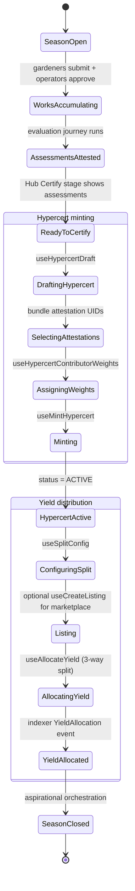

import {StatusBadge} from "@site/src/components/docs";

# Harvest Journey

<StatusBadge status="In progress">In progress (Season-close orchestration aspirational)</StatusBadge>

How a Season's accumulated impact gets converted into hypercerts, distributed yield, and a publishable record. The component primitives are shipped — hypercert mint, yield split config, vault harvest — but the **end-to-end "close the Season" orchestration is not yet a single workflow**. Today operators run the steps individually from the Hub Certify stage and the Community workspace.

## Personas

- **B: Operator** — primary subject. Runs hypercert mint, configures split, allocates yield.
- **C: Evaluator** — assessment attestation must be in place before certification (see [Evaluation](./evaluation)).
- **D: Funder** — beneficiary of vault harvest; conviction outcomes affect distribution.

## State machine

## Entry points

| Entry | Surface | Trigger |
| --- | --- | --- |
| Admin Hub Certify stage | `packages/admin/src/views/Hub/index.tsx` (stage `certify`) | Operator selects garden, opens FAB "Mint Hypercert" |
| Admin Community Strategies | `packages/admin/src/views/Garden/Strategies.tsx` | Operator configures yield split + decay |
| Admin Community Payouts | `packages/admin/src/views/Community/index.tsx` (mode `payouts`) | Operator surfaces yield allocation history |
| Vault harvest | `packages/admin/src/components/Vault/PositionCard.tsx` (via `useVaultOperations` → `useHarvest`) | Operator triggers harvest of accrued yield |

## Steps

### Hypercert minting (Persona B)

| # | State | Persona | Surface (package + view) | Hook / Service | Side effects | Status |
| --- | --- | --- | --- | --- | --- | --- |
| 1 | ReadyToCertify | B | `admin` / `views/Hub` (stage `certify`) | `useGardenAssessments`, `HubCertificationQueue`, `HubCertificationInspector` | Reads attested assessments via EAS | shipped |
| 2 | DraftingHypercert | B | `admin` / `views/Hub/CreateHypercert.tsx` | `useCreateHypercertController`, `useHypercertDraft`, `useCreateHypercertWorkflow` | IndexedDB draft persistence | shipped |
| 3 | SelectingAttestations | B | same | `useHypercertAllowlist` | Bundles work + assessment attestation UIDs into `Hypercert.attestationUIDs` | shipped |
| 4 | AssigningWeights | B | same | `useHypercertContributorWeights` | Per-contributor unit allocation | shipped |
| 5 | Minting | B | same | `useMintHypercert` | Mints hypercert via Hypercerts contract; emits Transfer event | shipped |
| 6 | HypercertActive | (system) | Envio | event handlers | Creates `Hypercert` entity (status `ACTIVE`), tokenId, totalUnits | shipped |

### Yield split + distribution (Persona B + system)

| # | State | Persona | Surface (package + view) | Hook / Service | Side effects | Status |
| --- | --- | --- | --- | --- | --- | --- |
| 7 | ConfiguringSplit | B | `admin` / `views/Garden/Strategies.tsx` | `useSplitConfig`, `useSetConvictionStrategies` | On-chain split params: `cookieJarAmount` / `fractionsAmount` / `juiceboxAmount` | shipped |
| 8 | (optional) Listing | B | (no dedicated view) | `useCreateListing`, `useBatchListForYield`, `useMarketplaceApprovals` | Lists hypercert on marketplace; Octant Vault auto-buy is aspirational (spec § 3.3) | partial |
| 9 | AllocatingYield | B / system | `admin` / `views/Community/Payouts` | `useAllocateYield`, `usePendingYield`, `useHarvestableYield` | On-chain allocation across the 3-way split; emits `YieldAllocation` event | shipped |
| 10 | YieldAllocated | (system) | Envio | event handlers | Creates `YieldAllocation` entity with per-channel amounts | shipped |
| 11 | Vault harvest | B | `admin` / `components/Vault/PositionCard` | `useHarvest`, `useVaultOperations` | Realizes accrued vault yield; emits `VaultEvent { eventType: HARVEST }` | shipped |

### Season close (aspirational)

| # | State | Persona | Surface (package + view) | Hook / Service | Side effects | Status |
| --- | --- | --- | --- | --- | --- | --- |
| 12 | Finalize Season | B | (not built) | `usePublicVolume` exists for read; no `useCloseSeason` orchestration hook | Spec § 1.5 "Season One" + § 6.3 reference a Season primitive but there is no admin UI to declare a Season closed and freeze the work / assessment / hypercert set | aspirational |
| 13 | Publish Season record | B | (not built) | `usePublicVolume` returns Volume data shape but is not wired to a publish mutation | Read path exists; the write path (operator declares Season N closed → Volume record minted) is not in the codebase | aspirational |

## Failure / recovery paths

- **Hypercert mint reverts.** `parseContractError` extracts the Hypercerts contract revert reason. `useMintHypercert` retries via the standard mutation pipeline. Draft persists in IndexedDB.
- **Indexer lag after mint.** `useDelayedInvalidation` (~2s) hides nominal lag. New hypercerts may not appear in `Hub` Certify queue immediately after mint.
- **Yield allocation reverts.** Most common cause: split config sums to less than 100%. `useSplitConfig` validates client-side; the contract enforces on-chain.
- **Marketplace listing without approval.** `useMarketplaceApprovals` runs first; UI surfaces the approval step before the listing tx.
- **Vault harvest with no accrued yield.** `useHarvestableYield` returns zero; UI disables the harvest button. Calling `harvest` on a zero balance reverts cleanly.
- **No assessments attested in Season.** Hub Certify queue is empty; FAB still appears but the mint workflow validates `attestationUIDs.length > 0` and rejects empty bundles.
- **Season close attempted (aspirational).** No code path exists. Operators currently cannot mark a Season closed; works keep accumulating.

## Connections

- Upstream: [Evaluation](./evaluation) — assessments must be attested before they enter the Hub Certify queue.
- Upstream: [Work Submission](./work-submission) — the works bundled into a hypercert come from the approved-work pool.
- Upstream: [Funding](./funding) — vault deposits + cookie jar funds are the substrate that yield distribution operates on.
- Sequence diagram: [Vault and yield flow](../architecture/sequence-diagrams#vault-and-yield-flow).

## Notes for builders

- The 3-way split (`cookieJarAmount` / `fractionsAmount` / `juiceboxAmount`) is per-garden and lives on the `YieldAllocation` indexer entity. Always read aggregated yield via `useGardenYieldSummary` and `useProtocolYieldSummary`, not by re-summing individual events client-side.
- `Hypercert.attestationUIDs` is the canonical link from a hypercert back to its EAS work + assessment attestations. The hypercert is the bundle; the attestations are the evidence. Don't deep-link from hypercerts to individual works without going through this field.
- Octant Vault auto-buy of listed hypercerts is described in spec § 3.3 but there is no automation in this codebase. If you build it, model it as an off-chain bot that watches `useHypercertListings` and submits buy transactions when funded — not as a contract change.
- A "Season close" primitive does not exist in the contract surface today. If you scope the orchestration: use `usePublicVolume` shape as the read model, and define a write path (operator-callable, gated by Owner hat) that snapshots the works + assessments + hypercerts set and emits a Season event the indexer can materialize.
- `usePublicVolume` returns Volume data — name kept canonical inside the hook because the hook predates the harness. When wiring a Season-close UI, surface the user-facing label as "Season" and keep "Volume" as the hook-internal data shape name.
