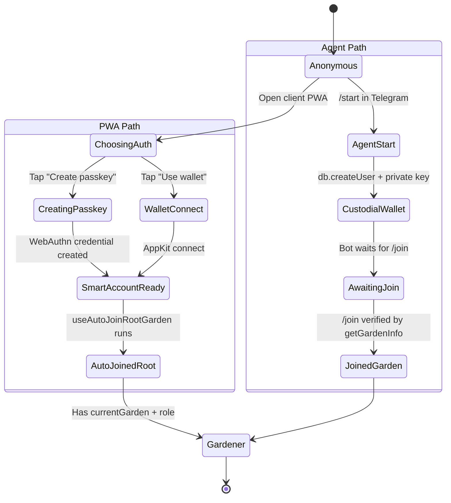

import {StatusBadge} from "@site/src/components/docs";

# Onboarding Journey

<StatusBadge status="Live" />

How a new participant arrives, gets an on-chain identity, and joins their first garden. Two parallel entry paths converge on the same `Gardener` smart account: the **client PWA passkey path** for users with smartphones, and the **agent (Telegram/SMS) path** for low-bandwidth field workers.

## Personas

- **A: Gardener** — primary subject. Either path delivers a smart account, a `gardener` role, and a current-garden assignment.
- **B: Operator** — separate path. Operators authenticate via wallet (AppKit) directly into the admin dashboard and gain operator role from on-chain hat membership; they do not pass through the gardener onboarding flow.

## State machine

## Entry points

| Entry | Surface | Trigger |
| --- | --- | --- |
| Client PWA | `packages/client/src/views/Login/index.tsx` | User opens the PWA URL. `useInstallGuidance` decides whether to prompt install. |
| Telegram bot | `packages/agent/src/handlers/start.ts` | User sends `/start` in Telegram (or any first message). |
| Admin dashboard | `packages/admin/src/views/Profile/index.tsx` | Operator opens admin URL, connects wallet via AppKit. |

## Steps

| # | State | Persona | Surface (package + view) | Hook / Service | Side effects | Status |
| --- | --- | --- | --- | --- | --- | --- |
| 1 | ChoosingAuth | A | `client` / `views/Login` | `useAuth`, `useInstallGuidance`, `useApp` | None — UI only | shipped |
| 2a | CreatingPasskey | A | `client` / `views/Login` | `useAuth.createPasskey()` | `navigator.credentials.create()`; credential ID written to IndexedDB | shipped |
| 2b | WalletConnect | A or B | `client` / `views/Login`, `admin` / `views/Profile` | `useAppKit`, `useAuth.connect()` | Wallet connection event from AppKit | shipped |
| 3 | SmartAccountReady | A | `client` (cross-cutting) | `useAuth`, internal smart account derivation | CREATE2 address derived; ERC-4337 account deployed lazily on first tx | shipped |
| 4 | AutoJoinedRoot | A | `client` (cross-cutting) | `useAutoJoinRootGarden` | Reads `VITE_ROOT_GARDEN`, queues a join via `JoinGarden` flow when address present and not yet joined | shipped |
| 5 | AgentStart | A | `agent` / `handlers/start.ts` | `db.createUser` (custodial private key generated by `generatePrivateKey`) | DB row created; address returned to user via Telegram message | shipped |
| 6 | AwaitingJoin → JoinedGarden | A | `agent` / `handlers/join.ts` | `blockchain.getGardenInfo`, `db.updateUser` | `currentGarden` written to user row; no on-chain tx at this stage | shipped |
| 7 | Gardener | A | `client` / `views/Home` (after PWA path), Telegram chat (after agent path) | `useGardens`, `useGardener` | First on-chain interaction (work submission) deploys the smart account via paymaster | shipped |

## Failure / recovery paths

- **Passkey unavailable on device.** `Login/index.tsx` detects via `getFriendlyErrorMessage` and falls back to "Login with wallet" guidance. No retry loop — user must explicitly choose the wallet path.
- **In-app browser scenario.** `useInstallGuidance` returns `scenario: "in-app-browser"` (Telegram, Twitter, etc. embedded webview). UI surfaces "Open in Chrome/Safari" with a copy-link affordance. Passkey creation in an in-app browser will silently fail on iOS — the guidance prevents the attempt.
- **Garden address invalid (`/join` agent path).** `blockchain.getGardenInfo` returns `{exists: false}`. Bot replies with "Garden not found" and does not mutate user record.
- **Custodial key compromise (agent path).** No automated rotation today. The bot holds the private key; recovery is operationally manual. Spec § 3.1 calls out this limitation as accepted for the field-worker JTBD ("low bandwidth submission") — the trade-off is that gardeners do not manage keys themselves.
- **Smart account first-tx failure.** Paymaster funds exhausted, RPC unavailable, or bundler rejects the UserOp. Tx is retried via the standard mutation pipeline (`useTransactionSender`). PWA does not deploy the smart account until needed (counterfactual deployment).

## Connections

- **Work submission** (`./work-submission`) — the next journey after onboarding for Persona A. The first work submission also deploys the smart account on-chain via the paymaster.
- **Funding** (`./funding`) — Persona D's onboarding to garden depositing reuses the same wallet-connect flow at `Public/Fund.tsx`.
- See also: the [Passkey onboarding sequence diagram](../architecture/sequence-diagrams#passkey-onboarding-flow).

## Notes for builders

- Hook boundary: all auth hooks live in `@green-goods/shared` (`hooks/auth/`). Client and admin only consume them.
- Single chain: the chain is fixed at build time by `VITE_CHAIN_ID`. There is no chain-switching UX during onboarding.
- IndexedDB is the canonical local store for the passkey credential ID. ENS text-record sync for cross-device recovery is partial (see `packages/shared/src/hooks/ens/`).
