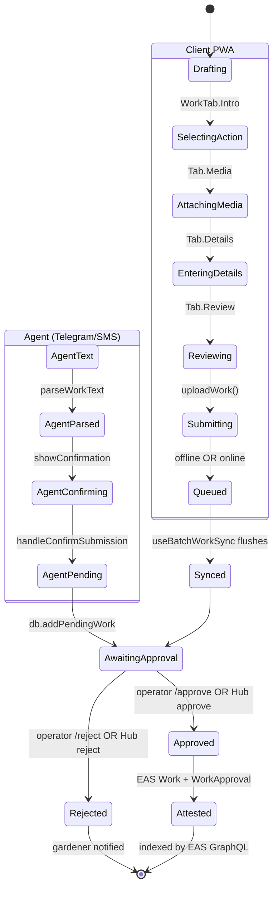

import {StatusBadge} from "@site/src/components/docs";

# Work Submission Journey

<StatusBadge status="Live" />

How a piece of regenerative work moves from a gardener's phone to an EAS attestation, surviving offline conditions and operator review along the way. This is the **highest-volume journey** in Green Goods and the offline-first mechanic that drives the rest of the architecture.

## Personas

- **A: Gardener** — submits the work via PWA wizard or via the agent.
- **B: Operator** — reviews queued submissions and signs the approval attestation.

## State machine

## Entry points

| Entry | Surface | Trigger |
| --- | --- | --- |
| Client PWA | `packages/client/src/views/Garden/index.tsx` | Gardener taps "Submit work" on Home or deep-links from a notification |
| Telegram bot | `packages/agent/src/handlers/submit.ts` | Free-text or voice message in Telegram (no command needed) |
| Admin Hub (operator review) | `packages/admin/src/views/Hub/index.tsx` (stage `work`) | Operator opens Hub workspace, selects garden |

## Steps

### Submission (Persona A)

| # | State | Persona | Surface (package + view) | Hook / Service | Side effects | Status |
| --- | --- | --- | --- | --- | --- | --- |
| 1 | SelectingAction | A | `client` / `views/Garden/Intro` | `useWorkSelection` | UI state only | shipped |
| 2 | AttachingMedia | A | `client` / `views/Garden/Media` | `useWorkFlowStore.audioNotes`, `useAudioRecording` | Media held in-memory + IndexedDB until upload | shipped |
| 3 | EnteringDetails | A | `client` / `views/Garden/Details` | `useWorkFormContext` (RHF + Zod) | Form state | shipped |
| 4 | Reviewing | A | `client` / `views/Garden/Review` | `useOffline` (gates queue messaging) | None until tap "Upload Work" | shipped |
| 5 | Submitting | A | `client` (cross-cutting) | `useWorkMutation`, `useWorkMutationWithProgress` | IPFS pin via shared services; EAS `attest(WorkSchema)`; emits `workMutation.isPending` | shipped |
| 6 | Queued (offline) | A | `client` (cross-cutting) | Job queue (`packages/shared/src/modules/job-queue`) | Mutation persisted to IndexedDB; UI surfaces `pendingCount` | shipped |
| 7 | Synced | A | `client` (cross-cutting) | `useBatchWorkSync`, `useDraftAutoSave` | Job queue flushes when online; toast on success/failure | shipped |
| 5a | AgentText / AgentParsed | A | `agent` / `handlers/submit.ts` | `parseWorkText`, locale-aware | None — confirmation step held in session | shipped |
| 6a | AgentPending | A | `agent` (db) | `db.addPendingWork`, `db.getOperatorForGarden`, `notifyOperator` | DB row + Telegram message to operator with `/approve <id>` button | shipped |

### Review (Persona B)

| # | State | Persona | Surface (package + view) | Hook / Service | Side effects | Status |
| --- | --- | --- | --- | --- | --- | --- |
| 8 | AwaitingApproval (admin Hub) | B | `admin` / `views/Hub` (stage `work`) | `useHubWorkbenchController`, `useReviewerWorks`, `HubWorkQueue` | Read EAS WorkApprovals + Envio Works via `eas.ts` and `usePlatformStats` | shipped |
| 9 | Approved | B | `admin` / `views/Hub/components/HubWorkCard` | `useWorkApproval`, `useBatchWorkApproval`, `useWorkApprovalActions` | EAS `attest(WorkApprovalSchema)`. Resolver checks `HatsModule.isOperator(attester)` | shipped |
| 9b | Approved (agent) | B | `agent` / `handlers/approve.ts` | `blockchain.submitWork` (gardener key), `blockchain.submitApproval` (operator key) | Two attestations: work uses gardener custodial key, approval uses operator key — prevents self-attestation. `auditLog("operator:approve", ...)` | shipped |
| 10 | Rejected | B | `admin` (Hub) or `agent` / `handlers/reject.ts` | `useWorkApprovalActions`, `db.removePendingWork` | Gardener notified via Telegram; no on-chain attestation. `auditLog("operator:reject", ...)` | shipped |
| 11 | Attested | (system) | EAS GraphQL | `packages/shared/src/modules/data/eas.ts` (`getWorkApprovals`, `getGardenAssessments`) | Work + WorkApproval indexed by `easscan.org`. **Not** indexed by Envio (per indexer schema comment lines 259-264) | shipped |

## Failure / recovery paths

- **Network drop mid-submit.** `Garden/index.tsx` reads `isOnline` from `useOffline`. Failed mutation is captured by `useWorkMutation` → enqueued via job queue. Review tab surfaces queue status: "You're offline. Your work will sync when you're back online." On reconnect, `useBatchWorkSync` flushes.
- **Draft persistence.** `useDraftAutoSave` writes the in-progress form to IndexedDB on exit. `useDraftResume` re-prompts on next entry. The `DraftDialog` lets the gardener continue or start fresh.
- **Self-attestation guard (agent path).** `agent/handlers/approve.ts` lines 82-106 explicitly use the gardener's custodial private key for the work attestation and the operator's key for the approval attestation. The on-chain resolver rejects work attested by the same address that signs the approval (`work.attester != approval.attester`).
- **EAS attest revert.** `parseContractError` extracts the revert reason; mutation surfaces user-friendly text via `USER_FRIENDLY_ERRORS`. Job queue retains the job until the user explicitly discards.
- **AI parsing failure (agent path).** `parseWorkText` returns `tasks: []`. Bot responds with examples and does not create a draft. No retries — gardener resubmits.
- **Operator permission denied (agent path).** `blockchain.isOperator(garden, user.address)` returns `{verified: false}`. Bot replies with reason; no DB mutation.
- **Operator approves work for gardener with no account.** `db.getUser(pendingWork.gardenerPlatform, pendingWork.gardenerPlatformId)` returns `null`. Bot replies "Gardener account not found. They may need to run /start first." This is a real failure mode in mixed-channel onboarding.

## Connections

- Upstream: [Onboarding](./onboarding) — Persona A must have a gardener role + currentGarden before this journey runs.
- Downstream: [Evaluation](./evaluation) — approved work is the input to garden-level assessments (Hub Assess stage).
- Downstream: [Harvest](./harvest) — bundled approved works become the basis for hypercert minting.
- Storage: see [`packages/shared/src/modules/job-queue/`](https://github.com/greenpill-dev-guild/green-goods/tree/main/packages/shared/src/modules/job-queue) for the offline mechanic and [Local vs Global Balance](../architecture/local-vs-global) for design rationale.
- Sequence diagram: [Work submission and approval](../architecture/sequence-diagrams#work-submission-and-approval).

## Notes for builders

- The indexer **does not** index EAS attestations directly. `Work` and `WorkApproval` data is fetched from EAS GraphQL via `packages/shared/src/modules/data/eas.ts`. Do not add EAS schemas to the Envio config.
- Gardener custodial keys (agent path) are stored in the agent's database, not on the blockchain. Treat them as secrets (audit-logged on every use).
- The `Hub` stage `work` filters to **pending submissions** for the selected garden. A garden must be selected (via `CanvasWorkspaceSelectionState`) before the queue renders.
- Hub FAB (`buildHubFabConfig`) gates the "Submit Work" action on `canManage` — operators can submit on behalf of a gardener via the admin Hub when needed.
