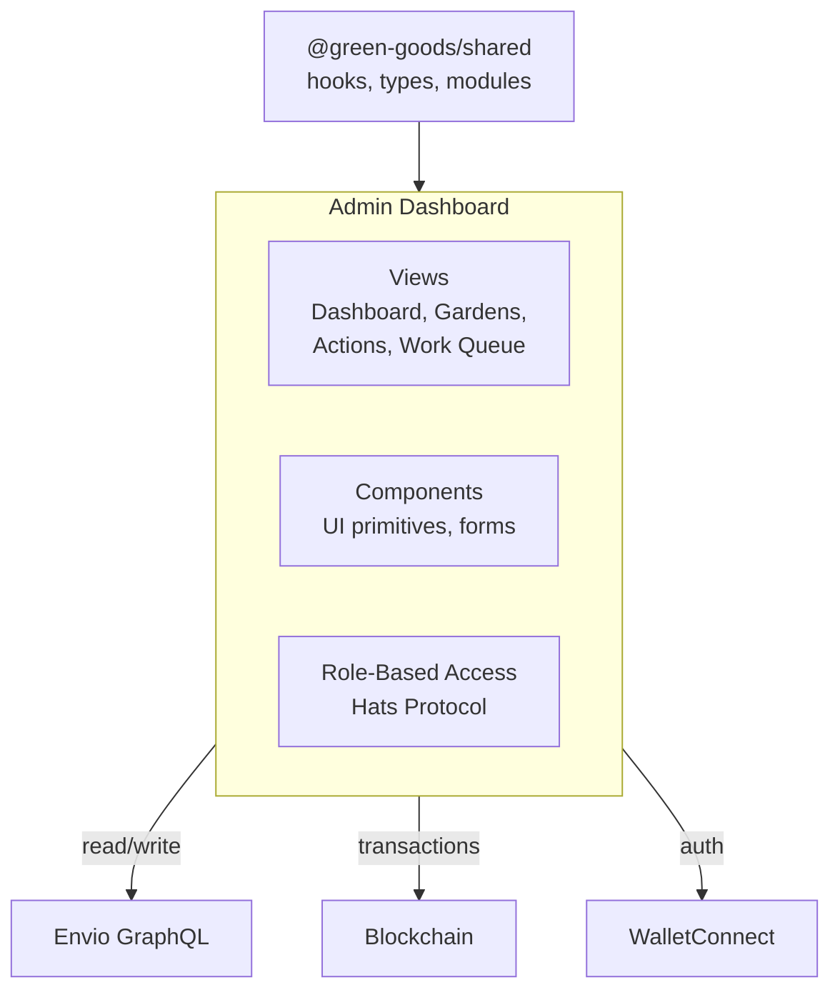

# Admin Dashboard

:::info Coming Soon
This page is under development. Check back soon for full content.
:::

## Overview
React admin dashboard for operators and evaluators to manage gardens.

## What to Expect
- Dashboard architecture
- Component library and patterns
- State management with TanStack Query
