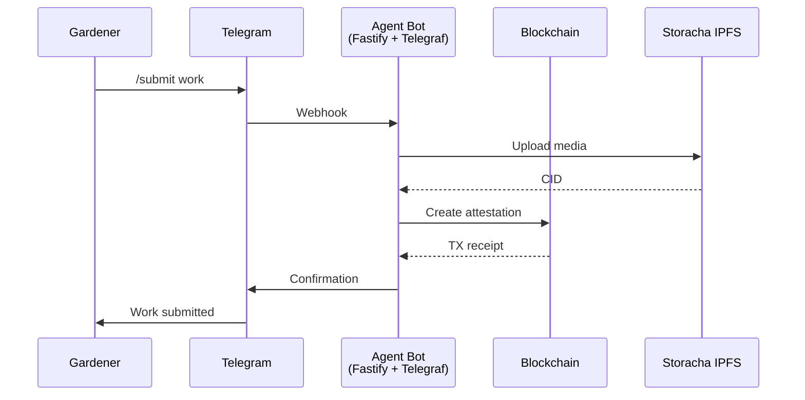
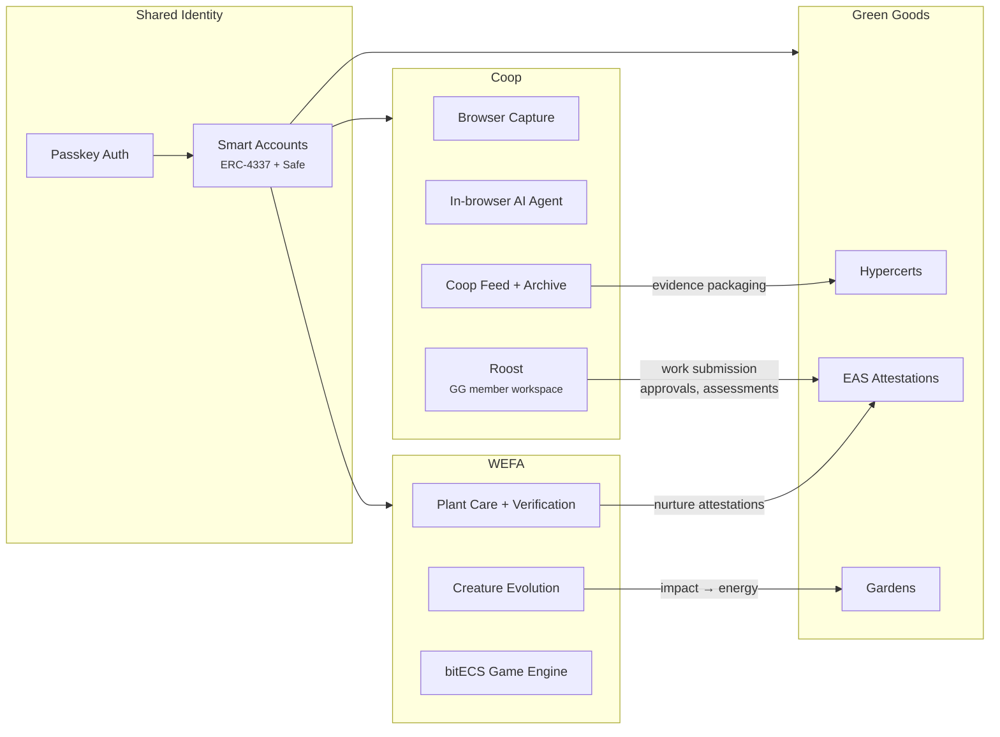

# Agent Package

## Overview

Platform-agnostic bot for Green Goods. Currently supports Telegram, with architecture designed for Discord and WhatsApp. Gardeners can submit work via text or voice, operators can approve/reject, and the bot coordinates attestation creation on-chain.

### Current capabilities

- Wallet creation and garden membership via `/start` and `/join`
- Natural language work submission (text and voice via Whisper transcription)
- Operator approval/rejection workflows
- On-chain attestation creation and media upload to Storacha IPFS
- Rate limiting, encrypted key storage, and analytics (PostHog)

## Sibling projects

Green Goods is one of three sibling projects in the Greenpill ecosystem. Each occupies a distinct surface and audience, but they share infrastructure, identity, and the attestation chain.

| Project | Surface | Audience | Core loop |
| --- | --- | --- | --- |
| **Green Goods** | Offline-first PWA + admin dashboard | Gardeners, operators, evaluators, funders | Document work → verify → certify → fund |
| **[Coop](https://coop.town)** | Browser extension + companion PWA | Groups, research teams, contributor circles | Capture → refine → review → share |
| **[WEFA](https://wefa.app)** | Mobile-first game PWA | Young learners (4-12), eco-conscious adults | Nurture plants → evolve creatures → play games → expand |

### How they connect

**Coop → Green Goods**: Coop's `Roost` tab is a full Green Goods member workspace embedded in the extension. Members submit work, operators approve and assess, and Hypercerts are packaged — all from within the browser extension. Coop's shared feed and archive also serve as evidence packaging for impact certificates. The `greengoods` shared module in Coop handles garden maintenance, member provisioning, and GAP reconciliation.

**WEFA → Green Goods**: WEFA turns real-world plant care into game progression (plant → reward → creature → game). Plant verification through Plant.ID creates attestation-grade evidence of nurture activities. WEFA's energy economy (earned through care, spent on creatures) provides a gamified onramp to the same impact documentation pipeline Green Goods tracks on-chain.

**Shared foundations**: All three projects use passkey-first identity (no wallet extensions required), ERC-4337 smart accounts, offline-first architecture, local-first data, and EAS attestations. They share the Greenpill philosophy that impact should equal profit, and they target the same chain (Arbitrum in production).

### The knowledge compounding pattern

Each project captures a different kind of knowledge about regenerative work:

- **Green Goods** captures structured impact evidence (attestations, assessments, Hypercerts)
- **Coop** captures contextual knowledge (research, links, discussions, evidence packages)
- **WEFA** captures engagement and learning (plant care records, game progression, skill development)

Together they form a compounding knowledge base: raw field work feeds into structured attestations, contextual research enriches impact certificates, and gamified engagement brings new participants into the documentation pipeline. Each layer makes the others more valuable over time.

## What to expect

- Ports and adapters architecture for multi-platform support
- Integration with Claude and other LLMs for natural language parsing
- Automation workflows for attestation lifecycle
- Cross-project agent coordination with Coop and WEFA
