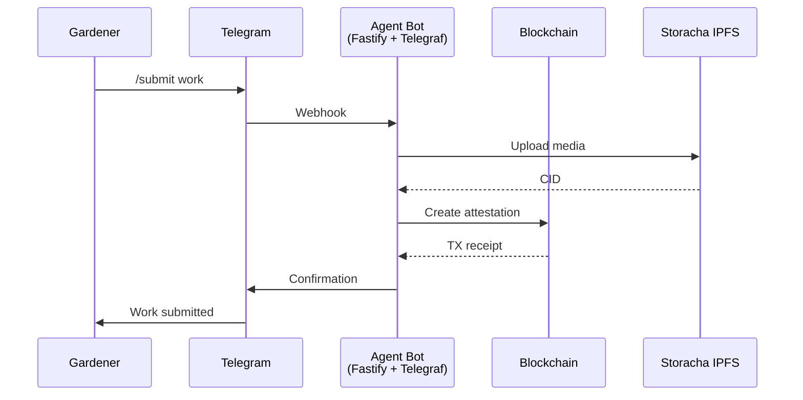

# Agent Package

:::info Coming Soon
This page is under development. Check back soon for full content.
:::

## Overview
AI agent service for automated workflows and community interaction.

## What to Expect
- Agent architecture
- Integration with Claude and other LLMs
- Automation workflows
