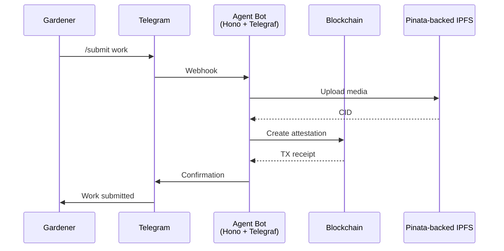

import {NextBestAction, StatusBadge} from "@site/src/components/docs";

# Agent Package

<StatusBadge status="Live" />


```mermaid
sequenceDiagram
    participant G as Gardener
    participant TG as Telegram
    participant Bot as Agent Bot<br/>(Hono + Telegraf)
    participant Chain as Blockchain
    participant IPFS as Pinata-backed IPFS

    G->>TG: /submit work
    TG->>Bot: Webhook
    Bot->>IPFS: Upload media
    IPFS-->>Bot: CID
    Bot->>Chain: Create attestation
    Chain-->>Bot: TX receipt
    Bot->>TG: Confirmation
    TG->>G: Work submitted
```

## Overview

Bot, webhook, and limited public API service for Green Goods. The current package centers on Telegram, Hono, AI-assisted media/text handling, rate limiting, upload signing, persistence, analytics, and blockchain initialization paths.

### Current capabilities

- Telegram bot startup and webhook handling through the package entrypoint.
- Hono HTTP server support around the bot runtime, public browser APIs, and upload signing.
- AI-assisted transcription/photo/text processing paths.
- Rate limiting, database integration, analytics, and structured logging.
- Blockchain service initialization for Green Goods transaction flows.
- A versioned, read-only public garden impact aggregation route.

## Public garden impact route

```http
GET /public/gardens/11155111/0x1111111111111111111111111111111111111111/impact?recentLimit=3
```

The response contains the public garden identity, nullable source-aware totals, domain and action
breakdowns, recent protocol-approved Work, and provenance. It excludes gardener, steward,
evaluator, assessor, and other role addresses.

`garden.url` is the canonical impact-resource URL for the resolved chain and checksummed Garden
address. It is not derived from the Garden name, so duplicate names and cross-chain Gardens remain
distinct.

The route behaves as follows:

- `GET` and `OPTIONS` allow any origin without credentials. This wildcard policy is local to the
  impact route; other public APIs keep their configured origin allowlist.
- Requests are limited to 120 per 10 minutes using origin-independent IP and garden material
  buckets. Cache hits count toward the limit; preflight requests do not.
- Successful snapshots use a five-minute, 100-garden in-process LRU cache. The Agent loads up to 12
  recent items once and slices the cached result for each request.
- A 200 response uses
  `public, max-age=60, s-maxage=300, stale-while-revalidate=86400`. Errors use `no-store`.
- Invalid or unsupported targets return 400, hidden and missing gardens share a generic 404,
  exhausted rate limits return 429, and an unsafe provider result returns 503.

`provenance.status: "partial"` means at least one source is unavailable. Fields that depend on that
source are `null`; successful empty sources remain zero. Arbitrum and Sepolia are supported. Celo is
rejected until its Garden, Action, and Hypercert sources are indexed. The implementation does not
deploy the Agent or provide production URL proof.

## What to expect

- Keep platform claims tied to implemented handlers in this package.
- Keep analytics privacy boundaries aligned with the package README.
- Validate agent changes through package tests before claiming bot behavior is live.

## Commands

```bash
cd packages/agent
bun run test
bun run build
```

<NextBestAction
  title="Next best action"
  why="The agent package depends on deployment artifacts and shared data paths for on-chain work."
  actionLabel="Open API index"
  actionHref="./api-index"
  alternatives={[
    {label: "Agent deploy", href: "../deployments/agent-deploy"},
    {label: "MCP guide", href: "../agentic/mcp-guide"},
  ]}
/>
