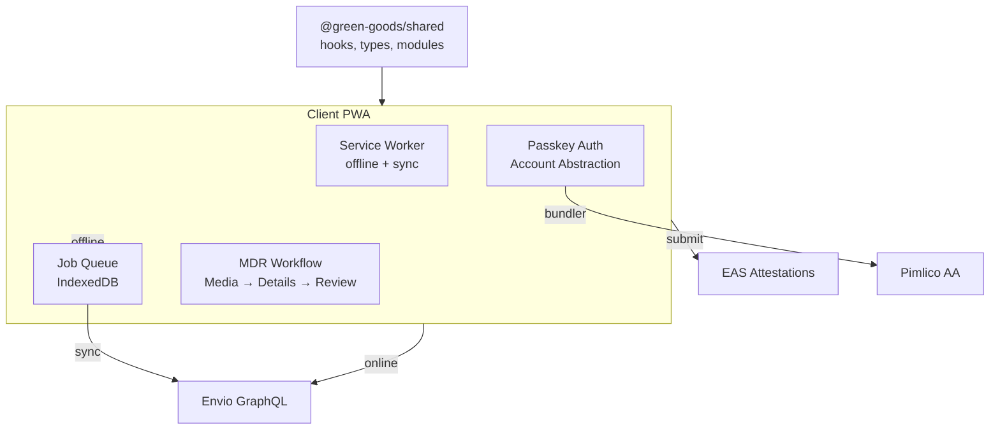

# Client PWA

:::info Coming Soon
This page is under development. Check back soon for full content.
:::

## Overview
Progressive Web App for gardeners to document and submit work.

  

## What to Expect
- Offline-first architecture
- Passkey authentication flow
- Job queue and background sync

## Testing on a real device

The client is a mobile-first PWA — testing on a real phone is part of the dev workflow. When `bun dev` is running, a cloudflared tunnel automatically creates a temporary public HTTPS URL pointing to your local client on port 3001.

**How it works:**

1. Run `bun dev` — the `tunnel` PM2 service starts alongside the client
2. Open `https://localhost:3001` on your laptop
3. The landing page QR code automatically shows the tunnel URL
4. Scan the QR code with your phone — full PWA with service worker, install prompt, and passkey auth

If cloudflared is not installed, the tunnel service exits silently and the QR code falls back to `window.location.origin`. Install it with `brew install cloudflared`.

### Service worker update behavior

The client uses `vite-plugin-pwa` with `registerType: "prompt"` — users control when updates apply. When a new service worker is detected:

1. A persistent "Update available" toast appears (stays until acted on)
2. User taps "Update now" → the waiting SW calls `skipWaiting()` → page reloads
3. On activation, the new SW clears stale runtime caches (`js-cache`, `indexer-cache`, `graphql-cache`) to prevent serving old content
4. React Query's IndexedDB cache is busted via `VITE_APP_VERSION` to prevent stale data hydration

The `ipfs-cache` and `image-cache` are preserved across updates since IPFS CIDs are immutable and images are static.
