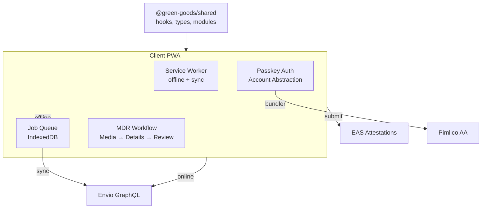

# Client PWA

:::info Coming Soon
This page is under development. Check back soon for full content.
:::

## Overview
Progressive Web App for gardeners to document and submit work.

  

## What to Expect
- Offline-first architecture
- Passkey authentication flow
- Job queue and background sync
