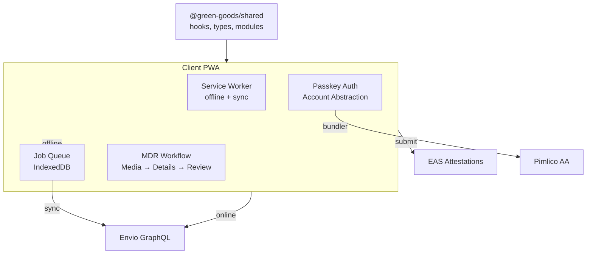

import {NextBestAction, StatusBadge} from "@site/src/components/docs";

# Client PWA

<StatusBadge status="Live" />



The client package is the end-user Green Goods web app. It owns browser/public routes and the installed PWA shell, while hooks, providers, stores, auth helpers, domain logic, and shared components come from `@green-goods/shared`.

## What this package owns

- Public/browser routes through the public shell path.
- Installed/authenticated PWA routes through the protected app shell and bottom app bar.
- Mobile-first work submission surfaces, offline queue UX, install guidance, profile/settings, and route composition.
- Package-local views and components only when the behavior is client-specific.

<div style={{maxWidth: '320px', margin: '1rem auto'}}>
  
</div>

## Builder contract

- Keep reusable hooks and providers in `@green-goods/shared`; do not add client-local copies.
- Preserve the offline-first queue flow for work submissions, including passkey users.
- Use shared auth APIs and app defaults; do not treat wallet chain state as the app source of truth.
- Manage media object URLs through shared media utilities so preview blobs are cleaned up.
- Add any user-facing string to `en`, `es`, and `pt`.

## Commands

```bash
cd packages/client
bun run test
bun run build
bun run lint
```

Run repo-level quick verification when a client change reaches into `packages/shared`.

## Testing on a real device

The client is a mobile-first PWA — testing on a real phone is part of the dev workflow. When `bun run dev:full` is running, a cloudflared tunnel automatically creates a temporary public HTTPS URL pointing to your local client on port 3001.

**How it works:**

1. Run `bun run dev:full` — the `tunnel` PM2 service starts alongside the client
2. Open `https://localhost:3001` on your laptop
3. The landing page QR code automatically shows the tunnel URL
4. Scan the QR code with your phone — full PWA with service worker, install prompt, and passkey auth

If cloudflared is not installed, the tunnel service exits silently and the QR code falls back to `window.location.origin`. Install it with `brew install cloudflared`.

### Service worker update behavior

The client uses `vite-plugin-pwa` with `registerType: "prompt"` — users control when updates apply. When a new service worker is detected:

1. A persistent "Update available" toast appears (stays until acted on)
2. User taps "Update now" → the waiting SW calls `skipWaiting()` → page reloads
3. On activation, the new SW clears stale runtime caches (`js-cache`, `indexer-cache`, `graphql-cache`) to prevent serving old content
4. React Query's IndexedDB cache is busted via `VITE_APP_VERSION` to prevent stale data hydration

The `ipfs-cache` and `image-cache` are preserved across updates since IPFS CIDs are immutable and images are static.

<NextBestAction
  title="Next best action"
  why="Most client behavior depends on shared hooks and app-wide domain models."
  actionLabel="Open shared package"
  actionHref="./shared"
  alternatives={[
    {label: "Client deployment", href: "../deployments/client-deploy"},
    {label: "Authentication integration", href: "../integrations/passkey"},
  ]}
/>
