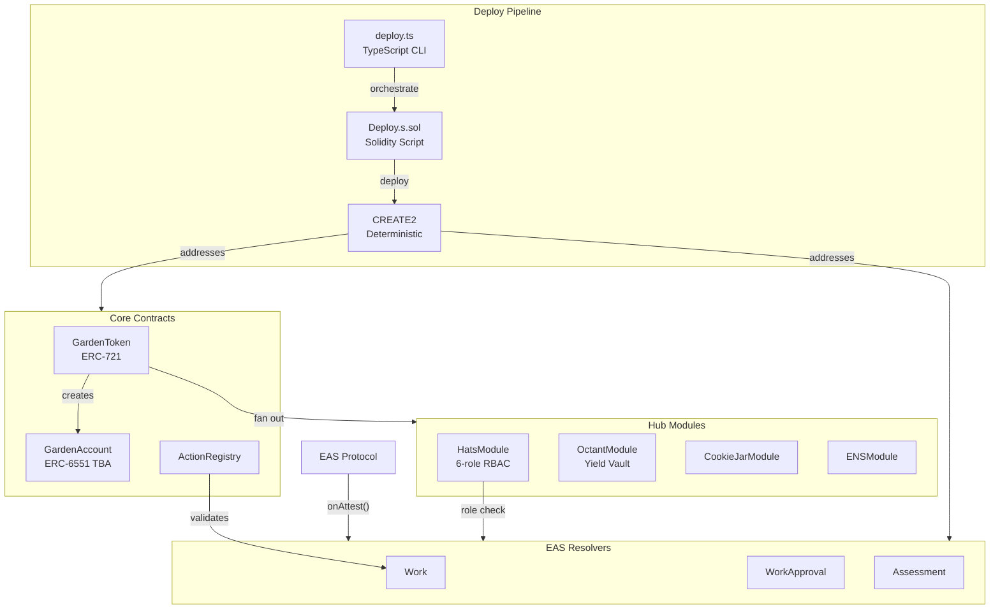

import {NextBestAction, StatusBadge} from "@site/src/components/docs";

# Contracts

<StatusBadge status="Live" />



Solidity smart contracts for the Green Goods protocol: resolver contracts for on-chain attestation validation, garden NFTs with tokenbound accounts, an action registry, and role-based access via Hats Protocol. Includes TypeScript deploy scripts that orchestrate CREATE2 deterministic deployment across multiple chains.

## Overview

```
packages/contracts/
  src/            # Solidity contracts
    core/         # GardenToken, GardenAccount, ActionRegistry
    modules/      # HatsModule, OctantModule, CookieJarModule, etc.
    resolvers/    # Work, WorkApproval, Assessment EAS resolvers
    libraries/    # HatsLib (per-chain constants), shared helpers
  script/         # TypeScript deploy CLI + Solidity deploy scripts
    deploy/       # core.ts, actions.ts, hats.ts, goods.ts, etc.
    utils/        # build-adaptive.ts, envio-integration.ts, ipfs-uploader.ts
  test/           # Forge tests (unit, integration, fork, E2E, fuzz, gas)
  deployments/    # Deployment artifacts ({chainId}-latest.json)
  abis/           # Exported ABI JSON files
```

- **Resolver contracts** (Work, WorkApproval, Assessment) validate EAS attestations on-chain, enforcing role checks and action validity before attestations are stored
- **GardenToken** (ERC-721) mints garden NFTs and fans out to all configured modules (Hats, Octant, CookieJar, ENS, etc.) during minting
- **GardenAccount** (ERC-6551 Tokenbound) gives each garden a smart account that owns assets and stores metadata
- **ActionRegistry** publishes and manages garden action definitions with domain categorization
- **HatsModule** creates per-garden 6-role hat trees (Owner, Operator, Evaluator, Gardener, Funder, Community) for hierarchical RBAC
- **OctantModule + OctantVault** manage ERC-4626 yield vaults with three-way yield splitting (CookieJar, Hypercert fractions, endowment)
- **Deploy scripts** (TypeScript CLI + Solidity) handle CREATE2 deployment, UUPS upgrades, EAS schema registration, and cross-chain ENS wiring

## Features & Functionality

### Key Patterns

- **CREATE2 deterministic deployment** -- contracts deploy to the same address across chains. Existing addresses are skipped via `_isDeployed()` check.
- **Hub-and-spoke modules** -- GardenToken uses typed module slots. Optional modules degrade gracefully with `if (address != 0)` + `try/catch` guards.
- **`via_ir=true`** only for GardenAccount and GardenToken (complex multi-module contracts). All other contracts compile without the Yul IR pipeline.
- **Adaptive build system** -- `bun build` defaults to fast mode (~2s cached), detecting what changed. Only `bun build:full` triggers the slow full build (~180-400s).
- **Two-layer deploy** -- TypeScript CLI (`deploy/core.ts`) orchestrates environment and parameters, then shells out to Solidity (`Deploy.s.sol`) for on-chain execution.

### Deployment Artifacts

Deployment artifacts are the source of truth for all contract addresses:

```typescript
import deployment from '@green-goods/contracts/deployments/11155111-latest.json';

// deployment.gardenToken, deployment.actionRegistry, deployment.workResolver, etc.
// Zero addresses mean the module hasn't been deployed yet (not a blocker)
```

### HatsLib Constants

Per-chain hat tree IDs:
- Sepolia: Tree 2022, communityHat = `0x000007e60002...`
- Arbitrum: Tree 92, communityHat = `0x0000005c0002...`
- Celo: Tree 31, communityHat = `0x0000001f0002...`

### EAS Resolver Interface

Each resolver implements `onAttest()` to validate attestation data. Resolvers check role membership via HatsModule and action validity via ActionRegistry.

### Development Commands

```bash
# Build
bun build                    # Adaptive fast build (~2s cached)
bun build:full               # CI/deploy only (skip test/script, ~180-400s)
bun build:target -- src/...  # Single-target compile

# Test (never use raw `forge test`)
bun run test                 # Unit tests (excludes E2E and fork)
bun run test:fast            # Unit tests (excludes fork)
bun run test:fork            # Fork tests (needs RPC URLs in .env)
bun run test:e2e             # Full E2E suite

# Deploy
bun script/deploy.ts core --network sepolia                     # Dry run
bun script/deploy.ts core --network sepolia --broadcast         # Deploy
bun script/deploy.ts core --network sepolia --broadcast --update-schemas  # Deploy + register schemas

# Upgrade
bun script/upgrade.ts all --network sepolia --broadcast         # UUPS upgrades

# Verify
bun run verify:post-deploy:sepolia                              # Post-deploy checks
bun run verify:etherscan:sepolia                                # Etherscan verification
```

## How It Relates To Other Packages

The contracts package is the foundation that other packages depend on:

- **shared** — Imports ABI JSON files from `abis/` and deployment artifacts from `deployments/` to build typed contract interactions (hooks, encoders, query functions)
- **indexer** — Reads contract ABIs and deployment addresses to configure Envio event handlers that index on-chain state into the GraphQL API
- **client / admin** — Consume contract addresses and ABIs indirectly through shared hooks; never import from contracts directly
- **agent** — Uses deployment artifacts for on-chain transaction construction

Build order: contracts must build first so ABIs and deployment artifacts are available for downstream packages.

## Resources

- [Architecture](/builders/architecture) -- system diagrams and module relationships
- [EAS Integration](/builders/integrations/eas) -- attestation schemas and resolver validation
- [Contract Deployment Guide](/builders/deployments/contracts-deploy) -- full deployment walkthrough
- [Forge Testing](/builders/testing/forge) -- contract test patterns and configuration

<NextBestAction
  title="Next best action"
  why="After understanding the contract layer, see how on-chain events are indexed into the GraphQL API that frontends consume."
  actionLabel="Open Indexer package"
  actionHref="/builders/packages/indexer"
  alternatives={[
    {label: "EAS integration details", href: "/builders/integrations/eas"},
    {label: "System architecture", href: "/builders/architecture"},
  ]}
/>
