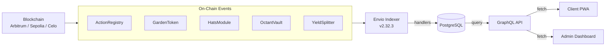

# Indexer Package

:::info Coming Soon
This page is under development. Check back soon for full content.
:::

## Overview
Envio-based event indexer that powers the GraphQL API.

## What to Expect
- Event handler architecture
- GraphQL schema and queries
- Deployment and monitoring
