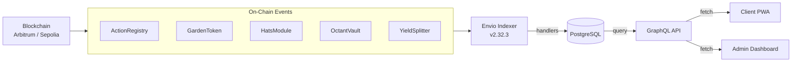

import {NextBestAction, StatusBadge} from "@site/src/components/docs";

# Indexer Package

<StatusBadge status="Live" />



The indexer package runs the Envio indexing pipeline for Green Goods protocol events. It indexes protocol entities such as gardens, roles, actions, vault events, Hypercert transfers, and GreenWill badge events. It does not index EAS attestations; those stay in shared's EAS data layer.

## Current chain coverage

`packages/indexer/config.yaml` currently defines indexed networks for:

| Chain | Chain ID | Notes |
| --- | --- | --- |
| Arbitrum | 42161 | Production mainnet indexer configuration |
| Sepolia | 11155111 | Testnet/development indexer configuration |

Celo may have contract deployment artifacts, but it is not currently listed as an indexed network in `config.yaml`.

## Builder contract

- Keep EAS attestation reads out of the indexer; use shared EAS data modules for work, approval, and assessment attestations.
- Every persisted entity must include `chainId`.
- Use composite IDs that include `chainId` to avoid cross-chain collisions.
- When schema or config changes, regenerate and rebuild generated code before trusting tests.
- Update both sides of relationships when entity links change.

## Commands

```bash
cd packages/indexer
bun run check:indexing-boundary
bun run test
bun run build

# After schema/config changes:
bun run codegen
bun run setup-generated
```

<NextBestAction
  title="Next best action"
  why="Deployment status explains which chain surfaces are active across contracts, frontend builds, EAS, and indexer coverage."
  actionLabel="Open deployment status"
  actionHref="../deployments/status"
  alternatives={[
    {label: "API index", href: "./api-index"},
    {label: "EAS integration", href: "../integrations/eas"},
  ]}
/>
