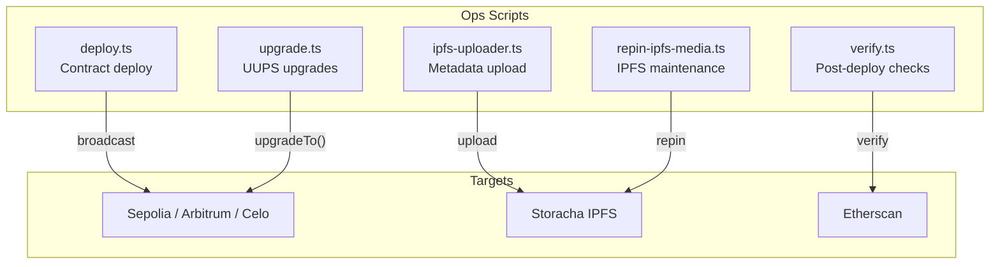

# Ops Package

:::info Coming Soon
This page is under development. Check back soon for full content.
:::

## Overview
Infrastructure and operations tooling for the Green Goods platform.

## What to Expect
- CI/CD pipeline configuration
- Monitoring and alerting
- Infrastructure as code
